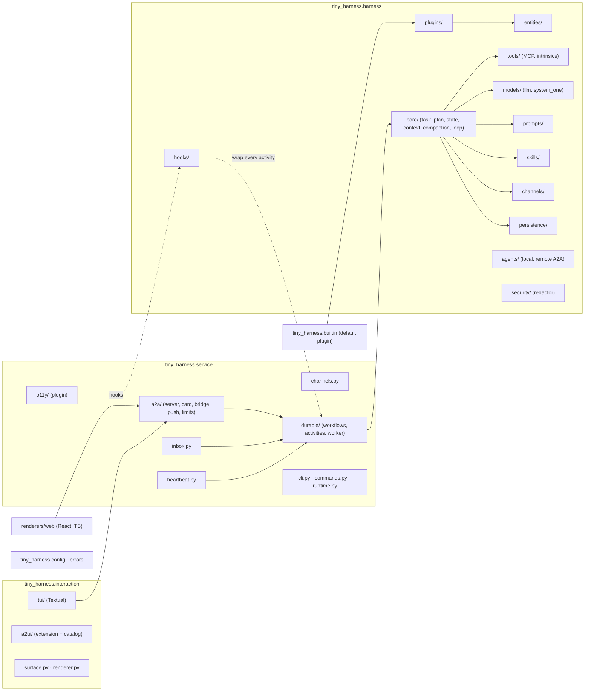
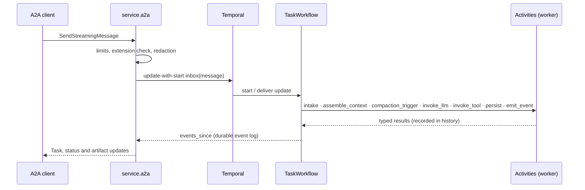

# Architecture — tiny-harness

The top-level architecture index. The full design of the harness is
[issue-3's design](../specs/issue-3/design.md); this page is the map.

## What tiny-harness is

An opinionated, production-grade agent harness for customer-facing agentic workflows.
Four ideas carry it:

- **Everything is an entity in one registry**, so any piece can be replaced, versioned or
  served remotely ([entities-and-registry](../capabilities/entities-and-registry.md)).
- **Everything the harness does is a hooked operation**, and everything the model makes
  it do is a tool call, so the core loop stays five lines
  ([hooks](../capabilities/hooks.md), [decision-004](../decisions/decision-004.md)).
- **Temporal owns the whole request lifecycle**: one workflow per task, every side effect
  an activity ([durable-execution](../capabilities/durable-execution.md),
  [decision-002](../decisions/decision-002.md)). Temporal is remote (Cloud or
  self-hosted) or embedded: a dev server the process owns, reached through the same
  `durable/temporal.py` client ([decision-005](../decisions/decision-005.md)).
- **A2A 1.0 in and out**, with the harness's own protocols as advertised extensions
  ([a2a-server](../capabilities/a2a-server.md), [A2A extensions](../a2a/extensions)).

## Layers and modules



| Column | Modules | Capabilities |
|--------|---------|--------------|
| Interaction | `interaction/surface.py`, `renderer.py`, `a2ui/`, `tui/`; `renderers/web` | [surfaces-and-renderers](../capabilities/surfaces-and-renderers.md) |
| Service | `service/a2a/`, `inbox.py`, `heartbeat.py`, `channels.py`, `o11y/`, `durable/`, `cli.py`, `commands.py`, `process.py`, `runtime.py` | [a2a-server](../capabilities/a2a-server.md), [heartbeat](../capabilities/heartbeat.md), [observability](../capabilities/observability.md), [durable-execution](../capabilities/durable-execution.md), [configuration](../capabilities/configuration.md) |
| Harness | `harness/entities/`, `hooks/`, `plugins/`, `prompts/`, `skills/`, `tools/`, `models/`, `core/`, `persistence/`, `channels/`, `agents/`, `security/` | [entities-and-registry](../capabilities/entities-and-registry.md), [hooks](../capabilities/hooks.md), [plugins](../capabilities/plugins.md), [prompts-and-skills](../capabilities/prompts-and-skills.md), [tools](../capabilities/tools.md), [models](../capabilities/models.md), [tasks-and-plans](../capabilities/tasks-and-plans.md), [context-window](../capabilities/context-window.md), [persistence](../capabilities/persistence.md), [participants-and-channels](../capabilities/participants-and-channels.md), [remote-agents](../capabilities/remote-agents.md) |
| Cross-cutting | `builtin/`, `config.py`, `errors.py`, `jsontypes.py` | [plugins](../capabilities/plugins.md), [configuration](../capabilities/configuration.md) |
| Not built | Memory, Sandbox, Self-improvement | out of scope for issue-3; `tools/` leaves a `ToolKind` slot |

## A request's life



Every activity body is the hook-wrapped operation runner, so the hooks of every plugin
(observability included) run on the worker, never in workflow code.

## Repository layout and tooling

```text
tiny_harness/         the package: interaction/, service/, harness/, builtin/, config.py, errors.py
renderers/web/        the web renderer (Vite, React 19, TypeScript)
examples/demo/        the demo plugin and configuration
tests/unit            per entity, run by the pre-commit hook
tests/integration     per layer boundary, Temporal's time-skipping test server; run in CI
tests/contract        public API snapshots, the agent card, the extension schemas
tests/security        one negative test per abuse case
tests/ui              TUI snapshots and keys
tests/e2e             the demo on Temporal Cloud + OpenAI, embedded Temporal, or a local
                      Ollama; each skips with the reason when its environment is absent
docs/                 VitePress site + the-loop's specs, capabilities, decisions
.github/workflows/    ci.yml (PRs), release.yml (PyPI), docs.yml (Pages)
```

The tools, and how checks flow from the pre-commit hooks into CI and releases, are in the
[tech stack guide](../guide/tech-stack) and the
[repo-tooling capability](../capabilities/repo-tooling.md);
[decision-001](../decisions/decision-001.md) has the reasoning.
