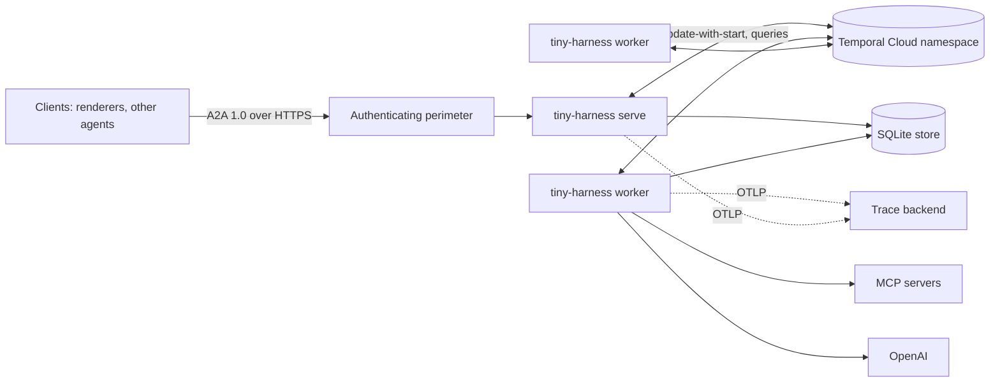

# Deployment

tiny-harness is two kinds of process on one Temporal namespace: the **A2A server**, which
clients talk to, and **workers**, which run the task workflows and the activities (model
calls, tools, persistence). Both read the same TOML configuration; every secret comes
from the environment.



## The perimeter is required

The server declares no security scheme and authenticates nothing
([decision-003](../decisions/decision-003)). It MUST sit behind an authenticating
reverse proxy or gateway and MUST NOT be exposed directly. The perimeter may set the
`X-Participant-Id` header; the server uses it only to scope `GetTask`, `ListTasks` and
subscriptions to a participant, and a task the caller is not a participant of is
reported as not found. Participant identity in message metadata is self-asserted until
authentication is added through the A2A SDK's security schemes. A deployment without a
perimeter is insecure by construction.

A renderer hosted elsewhere, such as the one on this site at
[`/ui/`](https://madarauchiha-314.github.io/tiny-harness/ui/), reaches a harness only if
that harness lists the renderer's origin in `server.cors_origins`
(`https://madarauchiha-314.github.io` for the hosted one), and the browser then talks A2A
to the harness directly, through the perimeter.

What the harness does enforce at the edge: a request body limit (`max_request_bytes`,
413), a per-client token bucket (`rate_limit_per_minute`, 429), the extension check on
`A2A-Extensions`, schema validation of every A2UI action against the surfaces the task
created, and redaction of every configured secret from logs, traces and persisted
messages.

## Processes

```sh
uv run tiny-harness --config /etc/tiny-harness/config.toml serve      # one or more, behind the perimeter
uv run tiny-harness --config /etc/tiny-harness/config.toml worker     # as many as the load needs
```

`serve --with-worker` runs both in one process, as the demo does. The worker ensures the
heartbeat schedule (`tiny-harness-heartbeat`) exists on the namespace; its tick polls the
channels, writes the monitor snapshot behind `/_monitor` and runs the retention sweep.
`tiny-harness schedules delete` removes the schedule; `tiny-harness tasks purge <task-id>`
deletes one task's rows and terminates its workflow for a deletion request that cannot
wait for the TTL.

The server needs the namespace and the store; it holds no model key. The worker needs the
namespace, the store and the provider keys. MCP subprocesses receive only `PLUGIN_ROOT`,
`PLUGIN_DATA`, the `env` their manifest declares and the MCP SDK's minimal defaults
(`HOME`, `PATH`, `USER`, `SHELL`, `TERM`, `LOGNAME`): never a key. Renderers hold no secret.

The SQLite store is a single-writer file: server and workers that share it run on one
host. A multi-host deployment replaces the store (the `Store` port) and the polling event
bridge; both are ports of the service layer, not of the core.

## Configuration

One TOML file, validated into typed models; unknown keys are rejected. The demo's
`examples/demo/config.toml` is a complete example. Durations are ISO 8601 (`PT30S`).

| Section | Keys | Notes |
|---------|------|-------|
| top level | `plugins = ["path", …]`, `agents = [{id, url, version}]` | plugin directories (Agent Plugins manifests) and remote A2A agents registered at startup |
| `[temporal]` | `address`, `namespace`, `task_queue`, `tls`, `search_attributes` | `search_attributes = true` only after `A2AContextId`, `A2ATaskState` and `TinyHarnessAgent` are registered on the namespace (`tcld`); otherwise every workflow fails its first task |
| `[openai]` | `model`, `timeout`, `max_output_tokens` | the Responses API |
| `[anthropic]` | `model` | optional; the Messages API, not exercised end to end |
| `[server]` | `bind`, `base_url`, `max_request_bytes`, `rate_limit_per_minute`, `bridge_interval`, `cors_origins`, `ui_dir` | `base_url` is what the agent card advertises; `ui_dir` serves a built web renderer under `/ui` |
| `[heartbeat]` | `interval` | the schedule's tick |
| `[store]` | `sqlite_path` | the plugin data root is `plugin-data/` beside it |
| `[o11y]` | `otlp_endpoint`, `langfuse_host`, `service_name`, `log_level`, `trace_file` | OTLP/HTTP export; Langfuse when its keys are set; `trace_file` appends one JSON span per line |
| `[retries]` | `default`, `per_activity.<name>` | Temporal retry fields; workflow-managed, so `activity.failed`/`activity.retried` hooks run between attempts |
| `[context]` | `turn_budget_tokens`, `compaction_fraction`, `history_event_bound` | the per-turn budget, when compaction triggers, when the workflow continues as new |
| `[retention]` | `tasks`, `plans`, `state`, `channel_messages`, `inbox_audit`, `compactions`, `push_configs` | TTL per record kind, 30 days by default |

### Secrets

| Variable | Used by | Required |
|----------|---------|----------|
| `TEMPORAL_API_KEY` | server, worker | yes |
| `OPENAI_API_KEY` | worker | yes |
| `TINY_HARNESS_PUSH_KEY` | server, worker | yes; 16, 24 or 32 bytes, base64; AES-GCM key for push-notification tokens at rest |
| `ANTHROPIC_API_KEY` | worker | when `[anthropic]` is configured |
| `LANGFUSE_PUBLIC_KEY`, `LANGFUSE_SECRET_KEY` | server, worker | when exporting to Langfuse |

Keep them in a keyring or a secret manager and export them into the process environment.
The project's own lookups are:

```sh
export TEMPORAL_API_KEY="$(secret-tool lookup service temporal project tiny-harness)"
export OPENAI_API_KEY="$(secret-tool lookup service openai project tiny-harness)"
```

Every configured secret value is redacted from log lines, span attributes, persisted
messages and the context window; a secret never appears in a workflow payload.

## Retention: what lives where, for how long

| Data | Where | Retention |
|------|-------|-----------|
| Task state, plans, channel messages, inbox audit rows, compaction summaries, push configs | the SQLite store | `[retention]` TTLs, swept on every heartbeat tick; `tasks purge` for an immediate deletion |
| Workflow histories (every activity input and result, including model requests and tool results) | Temporal Cloud | the namespace's history retention setting (the demo namespace keeps the default 30 days); set it on the namespace, not in tiny-harness |
| Spans (redacted attributes: operation, attempt, token usage, tool names) | the OTLP backend, Langfuse, or `trace_file` | the backend's project retention; a `trace_file` grows until rotated |
| Logs (JSON lines, redacted) | stdout of each process | the log shipper's retention |

The personal data in a task is the participants' identifiers and what they wrote. All of
it is covered by the rows above; nothing else persists it.

## Observability

Logs are JSON lines with the task, correlation id, operation and attempt. Spans follow
the OpenTelemetry GenAI conventions (`invoke_agent tiny-harness`, `chat gpt-6.1-sol`,
`execute_tool orders.get_order`) and nest under Temporal's workflow and activity spans, so one trace spans the
request, the workflow, every retry and the tools. `GET /_monitor` returns the last
heartbeat snapshot: the running tasks and their states.
