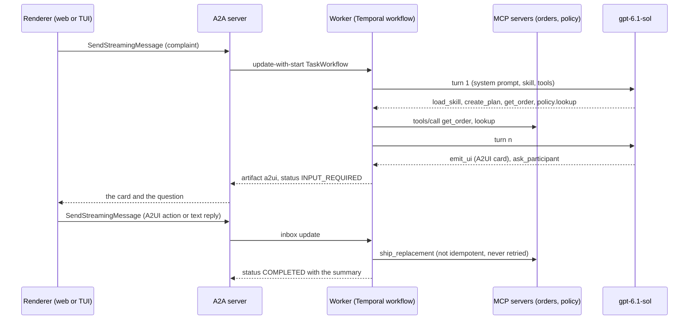

# Getting started

The quickest way to see tiny-harness work is the demo under `examples/demo`: one harness
instance on Temporal Cloud, the `gpt-6.1-sol` model, two MCP servers, a skill, and both
renderers on one task: *"Refund order #48213: the customer says the blender arrived
cracked. Check the order and propose a resolution."*

## What you need

- The [local development](local-development) setup (`uv sync`), plus Bun for the web
  renderer.
- A Temporal Cloud namespace reachable with an API key, and an OpenAI key. The demo reads
  both from the environment only; nothing is read from a file. The project keeps them in
  the GNOME keyring:

```sh
export TEMPORAL_API_KEY="$(secret-tool lookup service temporal project tiny-harness)"
export OPENAI_API_KEY="$(secret-tool lookup service openai project tiny-harness)"
export TINY_HARNESS_PUSH_KEY="$(openssl rand -base64 32)"   # encrypts push-config tokens at rest
```

A missing variable stops the process at startup with the variable's name; there is no
anonymous or local fallback.

## Run the demo

```sh
bun install --cwd renderers/web && bun run --cwd renderers/web build   # the web renderer
uv run python -m examples.demo                                         # server + worker
```

The process prints the two surfaces:

- **Web renderer** at `http://127.0.0.1:8080/ui/`: type the complaint in the composer and
  watch the stream.
- **TUI** in another terminal: `uv run tiny-harness tui --url http://127.0.0.1:8080`.

Both are A2A clients of the same server, so a task started in one shows up in the other.

## What happens



1. The task is **SUBMITTED** then **WORKING**; the agent loads the `support-agent` skill,
   creates a plan and calls the `orders` and `policy` MCP tools.
2. An **A2UI card** arrives as an artifact: the resolution options and a *Confirm* button
   rendered by the official A2UI renderer in the web renderer and mapped to Textual widgets
   in the TUI.
3. The agent asks the reporter (`ask_participant`) and the task waits in
   **INPUT_REQUIRED**. Press the button or answer in text.
4. The agent ships the replacement or issues the refund and the task reaches
   **COMPLETED** with a two-sentence summary.

Every span of the run is appended to `examples/demo/.state/trace.jsonl` (one JSON object
per line, secrets redacted) and the SQLite store sits beside it. Delete `.state/` to start
over.

## Run the same flow as a test

```sh
uv run pytest tests/e2e -q -m e2e                      # the demo, then the two crash scenarios
uv run pytest tests/e2e -q -m e2e -k crash_recovery    # only the kill -9 scenarios
```

`tests/e2e/test_demo.py` drives the conversation through the A2A client (it presses the
card's button for the first question) and asserts the states, the ledger of the orders
server and the trace. `tests/e2e/test_crash_recovery.py` runs the server and the worker
as separate processes, kills the worker with `SIGKILL` during an idempotent tool call and
again while the task waits for input, restarts it, and reads Temporal's history to prove
no LLM call ran twice. Each run gets its own task queue, port and state directory under
`~/.cache/tiny-harness-logs/e2e/`. Set `TINY_HARNESS_E2E_EVIDENCE=<dir>` to also copy the
redacted transcript, final task, trace and history summaries there. Without the secrets,
the tests skip with the missing variable's name.

## Next

- [Deployment](deployment): running the server and workers for real, the perimeter they
  need, and what is retained where.
- [Capabilities](../capabilities/capabilities): the current behaviour, one page per
  requirement group.
- [The A2A extensions](../a2a/extensions): what the task and channel data parts carry.
