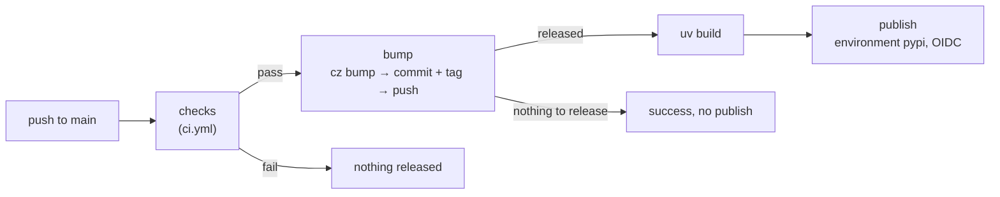

# Releasing

Every merge to `main` releases itself. You choose the version through the commit message
— with squash merges, the pull request title.

| Commits since the last release include | Next version (while on 0.x) |
|----------------------------------------|------------------------------|
| only `docs:`, `test:`, `ci:`, `chore:`, … | no release |
| a `fix:` | patch — `0.1.0` → `0.1.1` |
| a `feat:` | minor — `0.1.0` → `0.2.0` |
| a breaking change (`feat!:` or a `BREAKING CHANGE:` footer) | minor — `0.1.0` → `0.2.0` |

While the version is `0.x`, a breaking change bumps the minor version
(`major_version_zero = true`). Set it to `false` in `pyproject.toml` when the API is
stable; breaking changes then bump the major version.

## What `release.yml` does



1. **checks** runs the whole CI workflow. If anything fails, nothing is released.
2. **bump** runs `cz bump`, which writes the new version into `pyproject.toml` and
   `uv.lock`, commits `bump: version X → Y` and tags `vY`. The commit and the tag are
   pushed to `main` together. The distribution is built from that commit.
3. **publish** uploads the distribution to [PyPI](https://pypi.org/project/tiny_harness/)
   as `tiny_harness`, authenticating with
   [Trusted Publishing](https://docs.pypi.org/trusted-publishers/) — no token is stored
   anywhere.

The first release seeds a local baseline tag from the version in `pyproject.toml`
(`0.0.0`), so it is computed from the merged commits only: the first `feat:` merge
publishes `0.1.0`.

## Repository settings the workflows rely on

These live in GitHub and PyPI settings, not in files.

| Setting | Value |
|---------|-------|
| PyPI trusted publisher for `tiny_harness` | owner `MadaraUchiha-314`, repository `tiny-harness`, workflow `release.yml`, environment `pypi` |
| GitHub environment | `pypi` (Settings → Environments) |
| GitHub Pages source | GitHub Actions (Settings → Pages) |
| Branch protection on `main`, if added | allow `github-actions[bot]` to push, or the bump push is rejected |

## Preview a release locally

```sh
uv run cz bump --dry-run --yes
```

This prints the version the next release would get, without changing anything. It needs
the release tags: `git fetch --tags` first.
