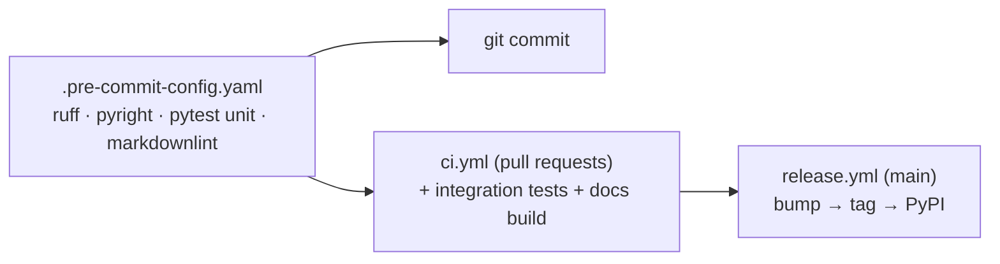

# Tech stack

tiny-harness is a Python package. Every tool below is configured in the repository and
pinned, so a check that passes on your machine passes in CI.

| Concern | Tool | Configured in |
|---------|------|---------------|
| Language | [Python](https://www.python.org/) 3.14 | `.python-version`, `pyproject.toml` (`requires-python`) |
| Package manager and virtualenv | [uv](https://docs.astral.sh/uv/) | `pyproject.toml`, `uv.lock` |
| Build backend | [uv_build](https://docs.astral.sh/uv/concepts/build-backend/) | `pyproject.toml` (`[build-system]`) |
| Lint and format | [Ruff](https://docs.astral.sh/ruff/) | `pyproject.toml` (`[tool.ruff]`) |
| Type check | [Pyright](https://microsoft.github.io/pyright/), strict mode | `pyproject.toml` (`[tool.pyright]`) |
| Tests | [pytest](https://docs.pytest.org/) | `pyproject.toml` (`[tool.pytest.ini_options]`) |
| Commit messages and versioning | [Commitizen](https://commitizen-tools.github.io/commitizen/) ([Conventional Commits](https://www.conventionalcommits.org/)) | `pyproject.toml` (`[tool.commitizen]`) |
| Git hooks | [pre-commit](https://pre-commit.com/) | `.pre-commit-config.yaml` |
| Markdown lint | [markdownlint-cli2](https://github.com/DavidAnson/markdownlint-cli2) | `.markdownlint-cli2.jsonc` |
| Docs site | [VitePress](https://vitepress.dev/) on [Bun](https://bun.sh/) | `docs/.vitepress/config.mts`, `docs/package.json` |
| CI/CD | GitHub Actions | `.github/workflows/` |
| Package registry | [PyPI](https://pypi.org/project/tiny_harness/), Trusted Publishing | `.github/workflows/release.yml` |
| Docs hosting | GitHub Pages | `.github/workflows/docs.yml` |

## How the checks fit together

The pre-commit hooks are the one definition of the checks. CI runs the same hooks, and the
release workflow runs CI before it publishes.



## Repository layout

```text
tiny_harness/         the package — import as `from tiny_harness import ...`
tests/unit/           fast tests, run by the pre-commit hook
tests/integration/    slower tests (build and install the wheel), run in CI
docs/                 this site, and the-loop's specs, capabilities and decisions
.github/workflows/    ci.yml, release.yml, docs.yml
```
