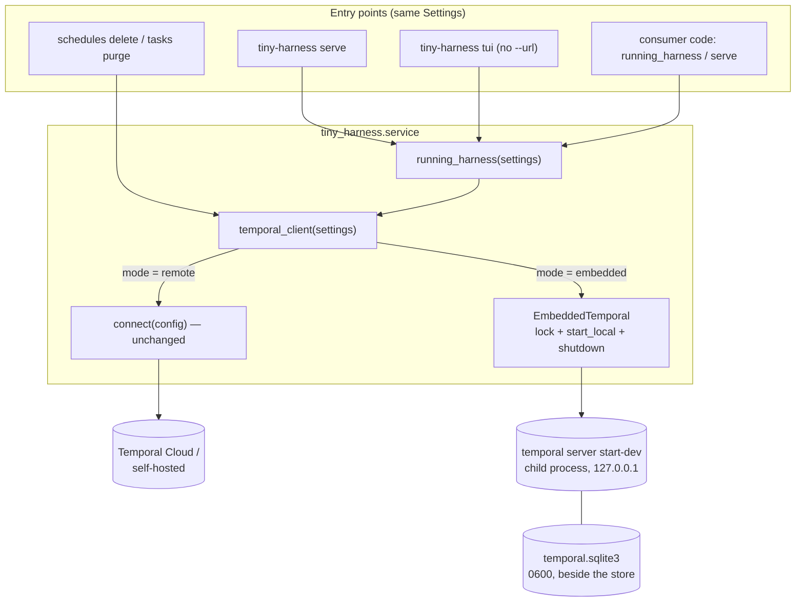
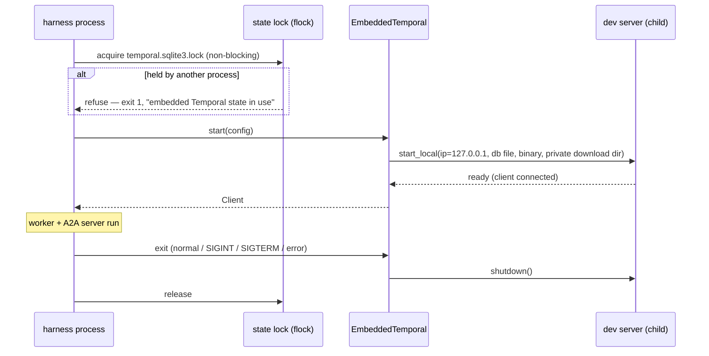

<!-- Written per the `the-loop:writing` skill: front-load each section's
     conclusion, draw it rather than describe it (3+ named parts -> a mermaid
     diagram), and keep the formal registers formal (EARS, abuse cases,
     RFC-2119, API contracts, schema descriptions). No length limit — length
     follows the change; the test is whether a sentence can come out without
     losing information. A gated section stays even when it is empty. -->

# Design: Support embedded Temporal mode

> Phase 2 of 3 (requirements → design → tasks). Derives from the approved
> [requirements](requirements.md). MUST be reviewed and approved before moving to tasks
> breakdown.

## Overview

Every place that opens a Temporal client today calls `connect(settings.temporal)`. This
design replaces those calls with **one async context manager, `temporal_client`**, which
connects to a remote Temporal in `remote` mode, or starts the Temporal CLI dev server in
`embedded` mode (through `WorkflowEnvironment.start_local` from the `temporalio` SDK
already in use), yields its client, and shuts the server down on exit. The `Settings`
model gains a `mode` key and an optional `[temporal.embedded]` table. `load_settings`
stops requiring `TEMPORAL_API_KEY` in embedded mode, and refuses it there.

The process wiring in `commands.serve` moves into a second context manager,
`running_harness`, which yields once the A2A server is listening. That gives the CLI
(`serve`, and `tui` hosting its own server) and a consumer's Python program the same
code path, driven by the same `Settings` (R5, R6).

What does not change: workflows, activities, the worker, the A2A server and the
renderers. Remote mode behaves byte-for-byte as today; the only difference is the
`TemporalConfig` fields that become optional at the type level. Remote mode still
validates them as required.

What it costs: one new module (about 150 lines), a refactor of `commands.py`, a change
to `config.py`, and one new runtime behaviour: a child process the harness owns. It adds
no new dependency.

## Architecture



Lifecycle in embedded mode — every exit path runs the `finally` that stops the server:



`docs/architecture/architecture.md` gains one line under *Service* naming
`durable/temporal.py` and embedded mode.

## Components & interfaces

### `tiny_harness/config.py` — the mode and the embedded table

`TemporalConfig` becomes:

```python
class EmbeddedTemporalConfig(_Strict):
    """The local Temporal dev server of embedded mode (issue-17 R2–R4)."""

    persist: bool = True                      # False: in-memory, for tests (R3.4)
    database_path: Path | None = None         # default: <store dir>/temporal.sqlite3 (R3.1, R3.2)
    binary_path: Path | None = None           # an existing `temporal` CLI; no download (R4.1)
    download_dir: Path | None = None          # default: the user cache dir (Security design)
    port: int | None = None                   # default: an OS-chosen free port

class TemporalConfig(_Strict):
    mode: Literal["remote", "embedded"] = "remote"        # R1.1, R1.2
    address: str | None = None                            # required when remote
    namespace: str | None = None                          # required when remote; "default" when embedded
    api_key: SecretStr | None = None                      # TEMPORAL_API_KEY; required when remote
    task_queue: str = "tiny-harness"
    tls: bool = True                                      # remote only
    search_attributes: bool = False
    embedded: EmbeddedTemporalConfig | None = None        # embedded only
```

A `model_validator(mode="after")` enforces the per-mode rules (R1.3–R1.5), using
`model_fields_set` so that a default is never mistaken for an explicit setting:

| Key | `remote` | `embedded` |
|-----|----------|------------|
| `address` | required | forbidden |
| `namespace` | required | optional, default `default` |
| `TEMPORAL_API_KEY` | required | forbidden |
| `tls` | optional, default `true` | forbidden if set (the server is plaintext loopback) |
| `[temporal.embedded]` | forbidden | optional, every key defaulted |
| `embedded.binary_path` | — | must name an executable file (`os.access(X_OK)`) |

Properties `TemporalConfig.effective_namespace` and
`TemporalConfig.database_path(store: StoreConfig) -> Path | None` resolve the defaults in
one place, so the CLI and the programmatic path cannot disagree.

`load_settings` changes in one place. Before the secret loop it reads the raw
`temporal.mode`:

- Any value other than `remote`/`embedded` raises `ConfigError("invalid configuration:
  temporal.mode must be 'remote' or 'embedded'", variable="temporal.mode")` (R1.6). This
  happens before the secret check, so a typo is reported as a typo and not as a missing
  key.
- With `embedded`, a set `TEMPORAL_API_KEY` raises `ConfigError("must not be set when
  temporal.mode is embedded", variable="TEMPORAL_API_KEY")` (R1.5). Otherwise the
  variable is skipped, not required.
- With `remote` (or absent), behaviour is unchanged.

`SECRET_VARIABLES` keeps its shape. Only the `required` decision for
`TEMPORAL_API_KEY` is computed from the mode. `runtime.secret_values` skips a `None`
`api_key`.

### `tiny_harness/service/durable/temporal.py` (new) — `temporal_client` and `EmbeddedTemporal`

```python
@asynccontextmanager
async def temporal_client(settings: Settings) -> AsyncIterator[Client]:
    """A connected client for the configured mode; stops what it started on exit (R6.3)."""

class EmbeddedTemporal:
    """Owns one dev server: the state lock, start_local, and shutdown."""
    async def __aenter__(self) -> Client: ...
    async def __aexit__(self, *exc: object) -> None: ...
```

`EmbeddedTemporal.__aenter__`:

1. When persisting, creates the database's parent directory, then **acquires an
   exclusive, non-blocking `fcntl.flock` on `<database>.lock`**. If another process
   holds it, it raises `EmbeddedTemporalError("embedded Temporal state <path> is in use
   by another tiny-harness process")`. Two dev servers on one SQLite file would corrupt
   it, and this is also what makes `tasks purge` safe beside a running `serve` (R5.5).
2. Creates the database file with `os.open(..., O_CREAT, 0o600)` if absent, or
   `chmod 0o600` if present (abuse case 7). SQLite accepts an empty file as a new
   database, and creates its `-wal`/`-shm` side files with the main file's mode.
3. Resolves the download directory: `embedded.download_dir`, else
   `$XDG_CACHE_HOME/tiny-harness/temporal` (falling back to `~/.cache/…`), created
   `0o700`. Never the system temp directory (Security design).
4. Calls

   ```python
   await WorkflowEnvironment.start_local(
       namespace=config.effective_namespace,
       data_converter=pydantic_data_converter,
       interceptors=[TracingInterceptor()],
       ip="127.0.0.1",                                   # R2.2 — not configurable
       port=embedded.port,
       ui=False,                                         # Q3: no Web UI
       download_dest_dir=str(download_dir),
       dev_server_existing_path=str(embedded.binary_path) if embedded.binary_path else None,
       dev_server_database_filename=str(database) if embedded.persist else None,
       dev_server_log_level="warn",
   )
   ```

   with the same converter and interceptor `connect()` uses, so payloads and traces are
   identical across modes.
5. Logs the INFO line (mode, `127.0.0.1:<port>`, namespace, database path or
   `in-memory`) and the WARNING line (R2.5). It logs at INFO before the call when no
   binary is cached and `binary_path` is unset (R4.4).

Any exception from `start_local` is re-raised as `EmbeddedTemporalError(<cause>)` after
releasing the lock (R2.4). `__aexit__` calls `env.shutdown()`, which stops the child,
then releases the lock. Both run in a `finally`, so cancellation and errors take the
same path (R2.3).

**Search attributes (R2.6):** no new mechanism. `ensure_search_attributes(client)`
already runs before the worker starts, and in embedded mode the worker always runs, so
the attributes are registered through the operator service on every start. That is
idempotent across restarts of a persisted server, where passing `--search-attribute`
flags to `start-dev` again may not be.

**Heartbeat (R2.7):** unchanged. `ensure_heartbeat_schedule` runs against whatever client
it is given.

### `tiny_harness/service/process.py` (new) — `running_harness` and `serve`

The body of today's `commands.serve` moves here, split at "the server is listening":

```python
@dataclass(frozen=True)
class RunningHarness:
    base_url: str
    client: Client          # the Temporal client, for consumers that want it
    settings: Settings

@asynccontextmanager
async def running_harness(
    settings: Settings, *, with_worker: bool = True
) -> AsyncIterator[RunningHarness]:
    """Start Temporal (per mode), the runtime, the worker and the A2A server; yield once
    the server is listening; on exit stop all of them in reverse order (R6.1, R6.2)."""

async def serve(settings: Settings, *, with_worker: bool = False) -> int:
    """Run until the process is asked to stop. Embedded mode always runs the worker."""
```

- `running_harness` runs `uvicorn.Server.serve()` as a task and waits until
  `server.started` is true, or until the task ends, in which case its exception is
  re-raised. On exit it sets `server.should_exit`, awaits the task, leaves the worker's
  `async with`, then leaves `temporal_client`.
- In embedded mode, `with_worker=False` is overridden to `True`, with an INFO log line
  "embedded mode: the worker runs in this process" (R5.1).
- `serve` is `async with running_harness(...): await <server task>`. uvicorn's own
  SIGINT/SIGTERM handling ends the server task, and the context managers unwind.

`tiny_harness.service` re-exports `running_harness`, `serve`, `RunningHarness` and
`temporal_client` as the documented programmatic API (R6.1, R6.3). `commands.serve`
becomes a one-line call into it.

### `tiny_harness/service/commands.py` and `cli.py` — per-command behaviour

| Command | `remote` (unchanged) | `embedded` |
|---------|----------------------|------------|
| `serve [--with-worker]` | as today | worker always in-process (R5.1) |
| `worker` | as today | exit 2: "in embedded mode the worker runs inside `serve`" (R5.2) |
| `tui --url U` | pure client of U | pure client of U, no Temporal started (R5.4) |
| `tui` (no URL) | pure client of `server.base_url` | `async with running_harness(settings) as h: await run_tui(h.base_url)` (R5.3) |
| `schedules delete`, `tasks purge` | as today | exit 2 if `embedded.persist` is false; else `async with temporal_client(settings)` against the persisted state (R5.5) |

The checks that exit with status 2 live in `cli.dispatch`, beside the existing
config-error path, so they happen before anything starts. `cli.main` also installs a
`SIGTERM` handler that raises `KeyboardInterrupt` in the main thread. The `tui` and admin
commands have no uvicorn handler of their own, and a SIGTERM must still unwind the
`finally` that stops the dev server (R2.3). `EmbeddedTemporalError` maps to exit status 1
with `embedded Temporal failed to start: <cause>` on stderr (R2.4).

### `examples/demo` — runnable without Temporal (R6.4)

`examples/demo/config.embedded.toml` is the demo configuration with
`[temporal] mode = "embedded"` and no address. `examples.demo.__main__` accepts an
optional config path (`uv run python -m examples.demo examples/demo/config.embedded.toml`),
defaulting to today's `config.toml`. It calls `service.serve`, the same API a consumer
calls.

## UI/UX design

N/A. No new screen or visual state. The TUI is unchanged; only the process behind it
differs (R5.3). The CLI's new error messages are listed under Error handling.

## Data models

Configuration only; no store schema, workflow or payload changes.

```toml
# Embedded — the whole Temporal configuration a consumer needs:
[temporal]
mode = "embedded"
task_queue = "tiny-harness-demo"     # optional, as today
# namespace = "default"              # optional in embedded mode

[temporal.embedded]                  # optional; every key has a default
persist = true                       # false: in-memory (tests, throwaway runs)
database_path = ".state/temporal.sqlite3"   # default: beside store.sqlite_path
binary_path = "/usr/local/bin/temporal"     # default: download once to download_dir
download_dir = "~/.cache/tiny-harness/temporal"
port = 7233                          # default: OS-chosen free port
```

New on-disk state in embedded mode, all owned by the running user:

| Path | Mode | Holds |
|------|------|-------|
| `<database_path>` (+ `-wal`, `-shm`) | `0600` | the dev server's SQLite: workflow histories, schedules, search attributes |
| `<database_path>.lock` | `0600` | empty; `flock` target |
| `<download_dir>/` | `0700` | the cached `temporal` CLI binary |

## Error handling

Every failure is a single line on stderr and an exit status. Every one also goes through
the redacting JSON logger, the same in dev and runtime.

| Failure | Where detected | Exit | Message |
|---------|----------------|------|---------|
| `temporal.mode` not `remote`/`embedded` | `load_settings` | 2 | `configuration error: invalid configuration: temporal.mode must be 'remote' or 'embedded' (temporal.mode)` |
| `address`/`tls`/`[temporal.embedded]` in the wrong mode | `TemporalConfig` validator | 2 | `… temporal.address must not be set when temporal.mode is embedded (temporal)` |
| `TEMPORAL_API_KEY` set in embedded mode | `load_settings` | 2 | `configuration error: must not be set when temporal.mode is embedded (TEMPORAL_API_KEY)` |
| `binary_path` not an executable file | `TemporalConfig` validator | 2 | `… temporal.embedded.binary_path is not an executable file (temporal)` |
| `worker` in embedded mode | `cli.dispatch` | 2 | `in embedded mode the worker runs inside serve` |
| admin command with `persist = false` | `cli.dispatch` | 2 | `embedded Temporal is in-memory; there is no state to act on` |
| state lock held by another process | `EmbeddedTemporal` | 1 | `embedded Temporal failed to start: state <path> is in use by another tiny-harness process` |
| download fails, port taken, server not ready | `EmbeddedTemporal` (from `start_local`) | 1 | `embedded Temporal failed to start: <SDK error>`, plus a hint to set `temporal.embedded.binary_path` when the cause is a download |

There is no fallback in any row (R2.4). On a crash that skips `finally` (SIGKILL), the dev
server can outlive the harness. The state lock is released by the kernel, and the next
start's `start_local` binds a fresh port, so an orphan is a stray process, not a
correctness problem. This is a documented limitation (see Trade-offs).

## Security design

Each boundary and abuse case from the requirements' Security considerations, and the
mechanism that enforces it:

- **AuthN/AuthZ:** the embedded frontend has none, and this design adds none; Temporal's
  dev server has no auth to switch on. The boundary is enforced by **reachability**
  instead: `ip="127.0.0.1"` is passed as a literal and is not a configuration key, so no
  setting can widen it (abuse case 1). The residual same-host exposure is the accepted,
  documented risk of the requirements (R7.3).
- **Input validation & injection surfaces:** the only new inputs are operator-written
  TOML keys, validated by the strict Pydantic model (`extra="forbid"`, `Literal` mode,
  `Path` types). The binary path and database path are passed to the SDK as arguments,
  which spawns the process without a shell, so there is no command-injection surface. No
  ticket, A2A or model input reaches any of these values.
- **Secrets handling:** embedded mode introduces no secret. `TEMPORAL_API_KEY` is
  *rejected* in embedded mode, so a real Cloud key can never be sent to a local server
  (abuse case 2). `secret_values` drops the `None` key; the redactor is unchanged.
- **Supply chain — the binary:** two mechanisms.
  1. `binary_path` pins an operator-provided binary and disables downloads entirely; a
     wrong path fails validation instead of downloading a substitute (abuse case 4).
  2. Without it, the SDK's download goes to a **user-private** directory (`0700`) rather
     than the SDK default, the shared system temp directory. With the default, any local
     user could pre-place a file at the expected path and have it executed with the
     harness's privileges. The integrity of the download itself is the SDK's (HTTPS from
     Temporal's release host); operators who need more pin `binary_path` to a binary they
     verified.
- **Data at rest:** the database (workflow histories carry conversation content) and its
  lock are created `0600`, and an existing database is tightened to `0600` on start
  (abuse case 7).
- **Least privilege:** the dev server runs as the harness's own user with no elevated
  rights, bound to loopback, with the Web UI off (Q3), so only one port is ever bound.
- **Fail-closed behaviour:** a typo or absent mode never starts an embedded server (abuse
  case 3, `Literal` plus the remote default). A start failure exits non-zero and never
  falls back to remote (abuse case 5). A held state lock refuses rather than sharing the
  database.
- **Lifecycle:** `temporal_client` stops the server in `finally`; uvicorn's handlers and
  the new `SIGTERM → KeyboardInterrupt` handler route signals into that `finally`
  (abuse case 6).
- **Visibility:** the WARNING line on every embedded start (abuse case 8).

| Abuse case (requirements) | Mechanism | Negative test |
|---------------------------|-----------|---------------|
| 1 network peer connects | `ip="127.0.0.1"` literal, not configurable | integration: the started server's address is `127.0.0.1:<port>`; connecting via a non-loopback interface address is refused |
| 2 embedded + `address` / `TEMPORAL_API_KEY` | validator / `load_settings` | unit: each combination raises `ConfigError` naming the key; CLI exits 2 |
| 3 absent or misspelled mode | `Literal` + default `remote` | unit: absent → remote (and still needs the key); `"embeded"` → `ConfigError(temporal.mode)` |
| 4 bad `binary_path` | `os.access(X_OK)` in the validator | unit: missing and non-executable paths raise; no download attempted |
| 5 start failure | `EmbeddedTemporalError`, no fallback | unit: `start_local` stubbed to raise → error raised, lock released, `connect` never called |
| 6 exit leaves no server | `finally` + signal routing | integration: after the context exits (normal, exception, cancellation) the dev server process is gone; e2e-style: SIGTERM to `serve` leaves no child |
| 7 database permissions | `os.open(0o600)` / `chmod` | unit: new and pre-existing (`0644`) files end at `0600` |
| 8 warning visible | log call in `EmbeddedTemporal` | unit: the WARNING record is emitted on start |
| (design) shared temp-dir binary plant | private `download_dir` (`0700`) | unit: the resolved download directory is never under `tempfile.gettempdir()` and is created `0700` |
| (design) two processes, one database | `flock` on `<db>.lock` | integration: a second `EmbeddedTemporal` on the same path raises while the first is open |

## Testing strategy

Most of the change is configuration logic and lifecycle plumbing, so it is proved at
three levels:

- **Unit tests** cover the config rules (every row of the per-mode table, R1), the
  error-to-exit-code mapping in `cli.dispatch` (R5.2, R5.5), and the `EmbeddedTemporal`
  file, lock and permission handling with `start_local` stubbed (R2.4, abuse cases 4,
  5, 7, 8).
- **Integration tests** start the real dev server through `EmbeddedTemporal`. The
  suite already downloads Temporal's time-skipping test server into a shared cache;
  these tests add the CLI dev server, downloaded once into the same cache, and no
  credentials. They prove loopback binding, shutdown on every exit path, the lock, and
  restart durability: a task workflow started, the server stopped, restarted on the same
  database, the workflow still running (R3.3). They also start `running_harness` in
  embedded mode with a stub model, so an A2A message completes end to end through the
  programmatic API (R6), and they drive `tiny-harness tui` with no URL through the
  existing Textual pilot (R5.3).

Gherkin scenario titles, each linking back to its requirement: *Embedded mode starts
without Temporal credentials*, *Embedded mode refuses a Temporal API key*, *Embedded
server binds loopback only*, *Embedded server stops when the harness exits*, *Embedded
state survives a restart*, *A second process cannot open the same embedded state*,
*Programmatic harness runs a task in embedded mode*, *TUI hosts its own harness in
embedded mode*.

Remote mode's existing unit, contract, integration and e2e suites run unchanged as the
regression guard. Which suites run where, the evidence to capture and the environment
are `testing-plan.md`'s.

## Trade-offs & decisions

- **The SDK's dev server, not a bespoke Temporal or an in-interpreter server.**
  `start_local` is already in the dependency, maintained by Temporal, and is the full
  server: schedules, search attributes, SQLite persistence. A Python-native Temporal
  does not exist. The cost: "in-process" is really "a child process the harness owns",
  stated in the requirements. Recorded as
  [decision-005](../../decisions/decision-005.md).
- **Explicit `mode`, not "embedded when no address".** Fail-closed (requirements Q1).
- **Reject, don't ignore, `TEMPORAL_API_KEY` in embedded mode.** Someone who exports the
  key in their shell profile gets one clear error and unsets it. Ignoring it would make
  "which Temporal am I on?" depend on two places (requirements R1.5, approved).
- **A file lock instead of a "server already running, connect to it" mode.** Sharing one
  embedded server across processes would mean exposing its port to other processes as a
  supported interface, which is a separate, larger feature. The lock makes the
  single-owner rule enforceable.
- **Search attributes via the existing operator-service call** instead of `start-dev`
  flags: idempotent across persisted restarts, and no new code.
- **Known limitation:** SIGKILL can orphan the dev server. Fixing it portably (e.g.
  `PR_SET_PDEATHSIG`) would mean spawning the binary ourselves instead of through the
  SDK. Not worth it for a development mode; documented.
- **POSIX-only lock.** `fcntl` is unavailable on Windows. There the lock is skipped with a
  WARNING. The project targets Linux and macOS (CI and docs), so this is noted rather
  than solved.

## Open questions

None blocking. The requirements' Q1–Q4 were approved with their defaults (explicit
opt-in; the TUI hosts the harness with no `--url`; no Web UI; persistence on).

## Review comments

> Appended by the-loop's `record-feedback` hook when a human gate approves with
> comments (issue-109). Append-only and attributed: an approval never silently
> discards a reviewer's suggestions, and the feedback travels with the document
> it concerns rather than living in a side-channel tracker.

### 2026-10-10 — approved

**@MadaraUchiha-314** wrote:

approved
