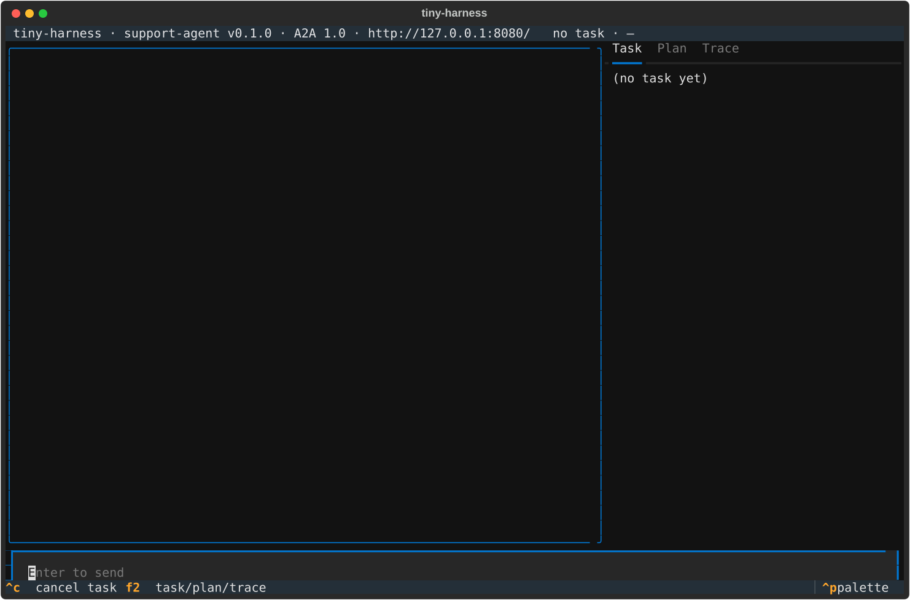

# Manual walkthrough: the TUI hosting its own harness

Work item: issue-17 · testing-plan row T11 · commit `116199d` · run 2026-10-10 in a
120×38 tmux pane (private server socket), `TEMPORAL_API_KEY` unset, `OPENAI_API_KEY`
and `TINY_HARNESS_PUSH_KEY` exported by reference (keyring lookup, `openssl rand`), the
web renderer built first (`bun run --cwd renderers/web build`) because the demo
configuration serves it.

## Outcome

| Step of the planned procedure | Observed | Result |
|---|---|---|
| `uv run tiny-harness --config examples/demo/config.embedded.toml tui` | prints the log path, opens the TUI connected to `http://127.0.0.1:8080/` | pass |
| INFO and WARNING lines in the log | `examples/demo/.state/tiny-harness.log` has `embedded Temporal at 127.0.0.1:<port>, namespace default, state …/temporal.sqlite3` and the `not for production` WARNING for every run | pass |
| Nothing else draws on the TUI's terminal | **failed on the first run**: uvicorn's access log and the dev server's banner were written to the terminal; fixed in `116199d` and re-run clean (pane below) | pass after fix |
| Send one message and see a reply | **not possible through the CLI TUI**: the server refuses it with `no participant asserted`. `tiny-harness tui` has never passed a participant to the TUI (the same code is on `main`), so it cannot send to any harness, remote or embedded. That is a renderer defect, and the requirements put renderer changes out of scope; raised on the PR. The same flow (the real `HarnessApp` against the hosted harness, with a participant, to `COMPLETED`) is proved by the integration scenario _TUI hosts its own harness in embedded mode_ (T2) | replanned, escalated |
| Quit with `q` | process exits `0` | pass |
| `pgrep` for the dev server after quit | no `temporal … start-dev` process left | pass |
| `stat` on the state files | `600 temporal.sqlite3`, `600 temporal.sqlite3.lock` | pass |

## The TUI, connected to its embedded harness



Captured by Textual's own screenshot (`TEXTUAL_SCREENSHOT=12`), which saves the SVG and
exits the app. The pane during the `q` run, after the fix (top rows):

```text
 tiny-harness · support-agent v0.1.0 · A2A 1.0 · http://127.0.0.1:8080/   no task · —
╭──────────────────────────────────────────────────────────────────────────────╮ Task  Plan  Trace
│                                                                              │╸━━━━╺━━━━━━━━━━━━━━━━━━━━━━━━━━━━━━━━━━
│                                                                              │ (no task yet)
│                                                                              │
│                                                                              │
│                                                                              │
│                                                                              │
```

## After quitting

```text
exit=0
start-dev processes after quit: none
600 examples/demo/.state/temporal.sqlite3
600 examples/demo/.state/temporal.sqlite3.lock
```
