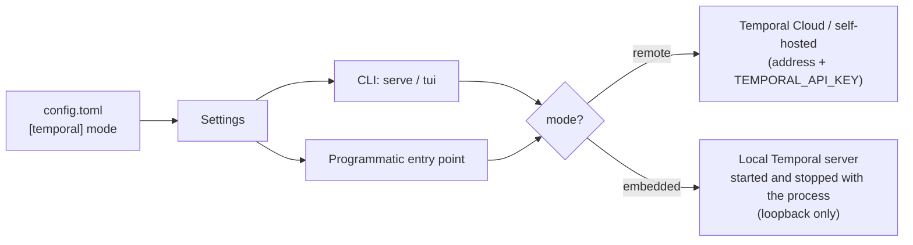

<!-- Written per the `the-loop:writing` skill: front-load each section's
     conclusion, draw it rather than describe it (3+ named parts -> a mermaid
     diagram), and keep the formal registers formal (EARS, abuse cases,
     RFC-2119, API contracts, schema descriptions). No length limit — length
     follows the change; the test is whether a sentence can come out without
     losing information. A gated section stays even when it is empty. -->

# Requirements: Support embedded Temporal mode

> Phase 1 of 3 (requirements → design → tasks). Following the Kiro spec approach
> (<https://kiro.dev/docs/specs/>). This phase MUST be reviewed and approved by the
> required collaborators before moving to design.

## Introduction

Today tiny-harness cannot start without a provisioned Temporal instance. `Settings`
requires `[temporal] address` and `namespace`, and `load_settings` refuses to start
without `TEMPORAL_API_KEY` — even for `tiny-harness tui`, which never talks to Temporal
itself. A consumer who just wants to try the harness, or embed it in a program or a
test suite, first has to sign up for Temporal Cloud or run a Temporal server by hand.
Ticket: [MadaraUchiha-314/tiny-harness#17](https://github.com/MadaraUchiha-314/tiny-harness/issues/17).

This work item adds an **embedded Temporal mode**: one configuration switch makes the
harness start a local Temporal server for its own process, connect to it, and stop it
on exit. In that mode the Temporal address and API key are not needed. The same
configuration drives both ways of running the harness — the `tiny-harness` CLI (with
the TUI) and the programmatic Python entry point — so a consumer never maintains two
configurations.

The local server is the Temporal CLI dev server that the Temporal Python SDK already
knows how to start (`temporalio.testing.WorkflowEnvironment.start_local`, the same SDK
the integration tests use). It runs as a **child process** owned by the harness process —
"in-process" in the ticket means *its lifetime is the harness process's*, not that it
shares the Python interpreter. Nothing about workflows, activities, the A2A server or
the renderers changes; only where the Temporal client connects.

## Requirements

### Requirement 1 — Choose the Temporal mode in configuration

**User story:** As a consumer of tiny_harness without a Temporal instance, I want to set
one configuration value to run against a local Temporal, so that Temporal is not a
blocker to trying or embedding the harness.

#### Acceptance criteria (EARS)

1. The `[temporal]` section SHALL accept a `mode` key whose value is `remote` or
   `embedded`.
2. IF `mode` is absent THEN the system SHALL treat it as `remote`, so every existing
   configuration keeps its current behaviour unchanged.
3. WHILE `mode` is `remote` the system SHALL keep requiring `address`, `namespace` and
   `TEMPORAL_API_KEY` exactly as today, failing at startup with status 2 and the missing
   key or variable named on stderr.
4. WHILE `mode` is `embedded` the system SHALL NOT require `address` or
   `TEMPORAL_API_KEY`, and SHALL start without them.
5. IF `mode` is `embedded` AND `address` or `TEMPORAL_API_KEY` is also set THEN the
   system SHALL refuse to start with status 2 and an error naming the conflicting key or
   variable, rather than silently ignoring either.
6. IF `mode` has any value other than `remote` or `embedded` THEN the system SHALL
   refuse to start with status 2 and an error naming `temporal.mode`.
7. WHILE `mode` is `embedded` the keys `namespace` and `task_queue` SHALL keep their
   meaning, with `namespace` defaulting to `default` when absent.

### Requirement 2 — Start, use and stop the embedded Temporal server

**User story:** As a consumer, I want the harness to own the local Temporal server's
whole lifecycle, so that I start and stop one thing and never leave a stray server
behind.

#### Acceptance criteria (EARS)

1. WHEN a harness process that needs Temporal starts in `embedded` mode THEN the system
   SHALL start a local Temporal server before connecting, and connect the process's one
   Temporal client to it.
2. WHEN the embedded server is started THEN the system SHALL bind it to the loopback
   interface (`127.0.0.1`) only.
3. WHEN the harness process exits — normally, on `SIGINT`/`SIGTERM`, or because startup
   or serving raised an error — THEN the system SHALL stop the embedded server it
   started, leaving no Temporal child process running.
4. IF the embedded server cannot be started (the binary is missing and cannot be
   obtained, the port is taken, the server does not become ready) THEN the system SHALL
   exit with a non-zero status and an error naming the cause, and SHALL NOT fall back to
   a remote Temporal.
5. WHEN the embedded server starts THEN the system SHALL log one line at `INFO` stating
   embedded mode, the bound address, the namespace and the persistence location, and one
   line at `WARNING` stating that embedded mode is meant for development and
   single-host use, not for a production deployment.
6. WHERE `search_attributes` is `true` in `embedded` mode the system SHALL register the
   `A2AContextId`, `A2ATaskState` and `TinyHarnessAgent` search attributes on the
   embedded server at startup, so the setting works without an external `tcld` step.
7. WHILE `mode` is `embedded` the heartbeat schedule SHALL be created on the embedded
   server exactly as on a remote one.

### Requirement 3 — Embedded state survives a restart

**User story:** As a consumer running the harness locally, I want tasks to survive a
restart of the harness process, so that embedded mode keeps the durable-execution
promise the harness is built on.

#### Acceptance criteria (EARS)

1. WHILE `mode` is `embedded` the system SHALL persist the embedded server's state to a
   file on disk, by default beside the configured SQLite store.
2. The `[temporal]` section SHALL accept a key that sets the persistence file's path in
   `embedded` mode.
3. WHEN a harness process restarts in `embedded` mode with the same persistence file
   THEN the system SHALL resume the task workflows that were running when it stopped.
4. The `[temporal]` section SHALL accept a way to run the embedded server with no
   persistence (in-memory), for tests and throwaway runs; persistence SHALL remain the
   default.

### Requirement 4 — Control where the server binary comes from

**User story:** As a consumer on a locked-down or offline machine, I want to point the
harness at a Temporal CLI binary I already have, so that embedded mode does not depend on
a download at startup.

#### Acceptance criteria (EARS)

1. The `[temporal]` section SHALL accept a key giving the path to an existing Temporal
   CLI binary to run in `embedded` mode.
2. WHERE that path is set the system SHALL run that binary and SHALL NOT download one.
3. IF that path is set AND no executable file exists there THEN the system SHALL refuse
   to start with status 2 and an error naming the key.
4. WHERE that path is not set the system SHALL obtain the binary the way the Temporal
   Python SDK does (download once, then reuse the cached copy), and SHALL log at `INFO`
   when a download happens and where the binary is cached.

### Requirement 5 — The CLI and the TUI run in embedded mode

**User story:** As a consumer, I want `tiny-harness` to work with no Temporal account,
including the TUI, so that `tiny-harness tui` is a one-command local experience.

#### Acceptance criteria (EARS)

1. WHEN `tiny-harness serve` runs in `embedded` mode THEN the system SHALL run the
   worker in the same process, because no other process can reach the embedded server.
2. WHEN `tiny-harness worker` runs in `embedded` mode THEN the system SHALL refuse with
   status 2 and an error stating that in embedded mode the worker runs inside `serve`.
3. WHEN `tiny-harness tui` runs in `embedded` mode without `--url` THEN the system SHALL
   start the embedded server, the A2A server and the worker in the same process, open
   the TUI against that server, and stop all three when the TUI exits.
4. WHEN `tiny-harness tui` runs with `--url` THEN the system SHALL connect the TUI to
   that URL and SHALL NOT start an embedded server, whatever the mode.
5. WHEN `tiny-harness schedules delete` or `tiny-harness tasks purge <task-id>` runs in
   `embedded` mode THEN the system SHALL act on the persisted embedded state (starting
   the embedded server for the duration of the command) and SHALL refuse with status 2
   and an explanatory error when the embedded server runs with no persistence.

### Requirement 6 — The programmatic entry point runs in embedded mode

**User story:** As a developer embedding tiny_harness in my own Python program or test
suite, I want the same configuration to start the harness in embedded mode from code, so
that the CLI and my program never diverge.

#### Acceptance criteria (EARS)

1. The package SHALL expose a public, documented async entry point that takes a
   `Settings` and runs the harness (A2A server and worker) — the path the demo
   (`examples/demo`) uses today through `commands.serve`.
2. WHEN that entry point is given `Settings` with `mode` `embedded` THEN the system SHALL
   start and stop the embedded server exactly as the CLI does (Requirement 2), from the
   same `Settings` and the same configuration file.
3. The package SHALL expose an async context manager that, given a `Settings`, yields a
   connected Temporal client — embedded or remote according to `mode` — and on exit
   releases it (stopping the embedded server when it started one), so a consumer's code
   or tests can run against the harness's Temporal without the A2A server.
4. WHEN the demo (`uv run python -m examples.demo`) runs with a configuration whose
   `mode` is `embedded` THEN it SHALL start without `TEMPORAL_API_KEY`.

### Requirement 7 — Documentation

**User story:** As a new consumer, I want the README and the guides to show how to run
without Temporal, so that I find the embedded mode before I go and provision Temporal.

#### Acceptance criteria (EARS)

1. The README's run instructions SHALL show running the harness in embedded mode with no
   Temporal account, alongside the existing Temporal Cloud instructions.
2. The configuration reference and the configuration capability doc SHALL describe every
   new `[temporal]` key, its default, and which keys each mode requires or forbids.
3. The deployment guide SHALL state that embedded mode is not a production deployment
   and why (single host, unauthenticated loopback server, no Temporal operations
   tooling).

## Non-functional requirements

- **Startup time.** With the binary already cached, embedded mode SHOULD add no more
  than 10 seconds to process startup on a developer laptop.
- **No new mandatory dependency.** Embedded mode SHOULD use the Temporal Python SDK the
  project already depends on (`temporalio`); any new dependency is justified in
  `design.md`.
- **Observability.** The startup and shutdown of the embedded server SHALL go through the
  harness's existing JSON logging and redaction, at the same levels in dev and runtime.
- **Testability.** Embedded mode SHOULD let the e2e suite run without Temporal Cloud
  credentials; whether it does in CI is a testing-plan decision.

## Security considerations

Embedded mode adds one new trust surface — a local, **unauthenticated** Temporal server —
and one supply-chain input — the server binary. It removes no existing check: remote mode
keeps every requirement it has today.

- **Actors & trust:**
  - The operator who writes the configuration and environment: trusted, as today.
  - **Other local users and processes on the same host:** untrusted. They can reach any
    TCP port bound on loopback. The embedded Temporal frontend has no authentication, so
    anything that reaches it can read workflow histories (which carry conversation
    content and tool results), signal, update, cancel or start workflows.
  - **Remote network peers:** untrusted; must not be able to reach the embedded server at
    all.
  - **The binary's download source** (when no existing binary is configured): trusted
    only as far as the Temporal SDK's own download mechanism is; a compromised or
    intercepted download would run with the harness's privileges.
- **Trust boundaries & data:**
  - Harness process ↔ embedded server: crosses a loopback TCP socket with no TLS and no
    API key. Workflow payloads (personal data in conversations) cross it in clear.
  - The persistence file holds the same workflow histories at rest on local disk.
  - No new secret is introduced; `TEMPORAL_API_KEY` becomes *absent* rather than
    optional-and-present in embedded mode (Requirement 1.5), so no key can be sent to a
    local server by mistake.
- **Abuse cases (EARS):**
  1. WHEN a host on the network tries to connect to the embedded Temporal server THEN the
     connection SHALL fail, because the server is bound to `127.0.0.1` only (R2.2).
  2. WHEN a configuration sets `mode = "embedded"` together with `address` or
     `TEMPORAL_API_KEY` THEN the system SHALL refuse to start (R1.5), so an operator who
     meant remote mode never silently runs an unauthenticated local server and never
     leaks the key to it.
  3. WHEN `mode` is absent or misspelled THEN the system SHALL NOT start an embedded server
     (R1.2, R1.6): embedded mode is only ever an explicit choice.
  4. WHEN the configured Temporal binary path does not point at an executable file THEN
     the system SHALL refuse to start rather than download a substitute (R4.3).
  5. WHEN the embedded server cannot start THEN the system SHALL exit non-zero and SHALL
     NOT connect anywhere else (R2.4).
  6. WHEN the harness exits for any reason THEN the embedded server SHALL be stopped
     (R2.3), so no unauthenticated server outlives the process that owned it.
  7. WHEN the persistence file is created THEN the system SHALL create it readable and
     writable by the owning user only.
  8. WHEN the embedded server starts THEN the system SHALL log the production warning
     (R2.5), so the mode is visible in every log stream that would reach an operator.
- **Fail closed:** missing, unknown or conflicting mode configuration refuses startup with
  status 2; a failed embedded start never falls back to remote; a missing configured
  binary never triggers a download. **Residual risk, accepted and documented
  (R7.3):** other users on the same host can reach the loopback port; embedded mode is
  therefore for single-user development hosts and tests, not shared or production hosts.

## Out of scope

- **Production use of the embedded server**: clustering, TLS or authentication on the
  embedded frontend, archival, metrics, upgrades of the persisted format.
- **Remote mode without an API key** (for example a self-hosted Temporal without
  authentication): remote mode keeps requiring `TEMPORAL_API_KEY` as today. A follow-up
  ticket can relax it.
- **Defaulting to embedded** when `[temporal]` is absent: embedded mode is explicit opt-in
  (see Open questions, Q1).
- **The Temporal Web UI** for the embedded server (see Open questions, Q3).
- **Relaxing the other required secrets** (`OPENAI_API_KEY`, `TINY_HARNESS_PUSH_KEY`)
  or making `tiny-harness tui --url` start without the full `Settings`.
- Any change to workflows, activities, the A2A protocol surface or the renderers.

## Open questions

Each is answered with the default below unless the reviewer says otherwise on the pull
request.

- **Q1 — Should an absent `[temporal]` section mean embedded?** Default: **no**. The mode
  is explicit (`mode = "embedded"`), so a production configuration that loses its
  Temporal section fails at startup instead of quietly running a local, unauthenticated
  server. The cost is one line of configuration for the zero-setup user.
- **Q2 — What does "TUI mode" start?** The TUI today is a pure A2A client that needs a
  running server. Default: **in embedded mode with no `--url`, `tiny-harness tui` hosts
  the server, worker and embedded Temporal in its own process** (R5.3), which is the only
  reading where "embedded" changes anything for the TUI. With `--url` it stays a pure
  client (R5.4).
- **Q3 — Expose the Temporal Web UI in embedded mode?** Default: **not in this work
  item.** The SDK can start it on loopback; it is useful for debugging but is a second
  unauthenticated port. Easy to add later behind an off-by-default key.
- **Q4 — Persistence default.** Default: **persist to a file beside the SQLite store**
  (R3.1), so crash recovery holds in embedded mode too; in-memory is opt-in (R3.4).

## Review comments

> Appended by the-loop's `record-feedback` hook when a human gate approves with
> comments (issue-109). Append-only and attributed: an approval never silently
> discards a reviewer's suggestions, and the feedback travels with the document
> it concerns rather than living in a side-channel tracker.

### 2026-10-10 — approved

**@MadaraUchiha-314** wrote:

approved
