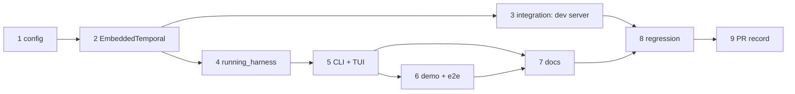

<!-- Written per the `the-loop:writing` skill: front-load each section's
     conclusion, draw it rather than describe it (3+ named parts -> a mermaid
     diagram), and keep the formal registers formal (EARS, abuse cases,
     RFC-2119, API contracts, schema descriptions). No length limit — length
     follows the change; the test is whether a sentence can come out without
     losing information. A gated section stays even when it is empty. -->

# Tasks: Support embedded Temporal mode

> The last spec artifact (requirements → design → testing plan → tasks). A DAG of
> implementation tasks derived from the approved [design](design.md) and
> [testing plan](testing-plan.md). It has no approval gate of its own (issue-281).

Nine tasks, delivered on the work item's one pull request,
[#18](https://github.com/MadaraUchiha-314/tiny-harness/pull/18), in this repository.
No other repository is touched. Every task names the requirement it satisfies, the
testing-plan row that proves it, and the test that goes red first.

Conventions for every task:

- pyright strict, zero errors, no `Any`.
- Integration tests carry the Gherkin docstring with
  `Requirement: docs/specs/issue-17/requirements.md#requirement-<n>--<slug>`.
- Embedded tests run with `TEMPORAL_API_KEY` unset.
- The commit message records the test command and its red→green transition.

## Task list

- [x] 1. Config: `mode`, `[temporal.embedded]` and per-mode validation
  - Add `EmbeddedTemporalConfig` and the new `TemporalConfig` fields (`mode`, optional
    `address` / `namespace` / `api_key`, `embedded`), the `model_validator` enforcing the
    per-mode table (using `model_fields_set` for `tls`), `effective_namespace` and
    `database_path(store)`, and the `binary_path` executable check.
  - In `load_settings`: validate the raw `temporal.mode` first, then require
    `TEMPORAL_API_KEY` in remote mode, refuse it in embedded mode, and skip it otherwise.
  - `runtime.secret_values` skips a `None` key. `connect()` asserts remote mode, so it
    never runs with `api_key=None`.
  - _Depends on:_ none
  - _Requirements:_ R1.1–R1.7, R3.1, R3.2, R3.4, R4.1, R4.3
  - _Test:_ T1, T8 (abuse cases 2, 3, 4), T10 —
    `uv run pytest tests/unit/test_config.py` (new cases per row of design § the
    per-mode table; the existing demo config still loads as remote and still needs the
    key) (red→green)

- [x] 2. `EmbeddedTemporal` and `temporal_client` (`service/durable/temporal.py`)
  - Implement the state lock (`fcntl.flock` on `<db>.lock`; skipped with a WARNING where
    `fcntl` is absent), `0600` database and lock creation and tightening, and the private
    `0700` download dir (`$XDG_CACHE_HOME`/`~/.cache` fallback).
  - Call `start_local` with the design's arguments, using the same converter and
    interceptor as `connect()`, with `ip="127.0.0.1"` as a literal.
  - Log the INFO and WARNING lines and the download notice. Wrap failures in
    `EmbeddedTemporalError` and release the lock. `__aexit__` shuts down and releases.
  - `temporal_client(settings)` dispatches on the mode.
  - _Depends on:_ 1
  - _Requirements:_ R2.1–R2.5, R3.1, R3.4, R4.2, R4.4
  - _Test:_ T1, T8 (abuse cases 5, 7, 8; temp-dir plant) —
    `uv run pytest tests/unit/test_embedded_temporal.py` with `start_local` stubbed
    (red→green)

- [ ] 3. Integration: the real dev server
  - Add `tests/integration/embedded/` with a shared fixture (a `tmp_path` state dir and
    `download_dir` = the suite's `~/.cache/temporalio`).
  - Scenarios: _Embedded mode starts without Temporal credentials_, _Embedded server binds
    loopback only_, _Embedded server stops when the harness exits_ (normal, exception,
    cancellation; checks the child pid is gone), _Embedded state survives a restart_
    (start a task workflow, stop, restart on the same database, the workflow is still
    running), _A second process cannot open the same embedded state_.
  - The `startup_time` measurement (5 cached starts, timings printed).
  - _Depends on:_ 2
  - _Requirements:_ R1.4, R2.1–R2.3, R3.3; design § lock
  - _Test:_ T2, T7, T8 (abuse cases 1, 6; two-process lock) —
    `env -u TEMPORAL_API_KEY uv run pytest tests/integration/embedded` (red→green)

- [ ] 4. `running_harness` / `serve` (`service/process.py`) and the public API
  - Move the body of `commands.serve` into `running_harness`. It opens `temporal_client`,
    builds the runtime, runs the worker (forced on in embedded mode, with the INFO line),
    and runs uvicorn as a task with a readiness wait on `server.started` (re-raising if
    the task dies). Teardown runs in reverse.
  - `serve` is built on it. `commands.serve` and `commands.worker` route through
    `temporal_client`. Re-export `running_harness`, `serve`, `RunningHarness`,
    `temporal_client` from `tiny_harness.service`.
  - Search attributes and the heartbeat schedule go through the existing
    `ensure_search_attributes` and `ensure_heartbeat_schedule`.
  - _Depends on:_ 2
  - _Requirements:_ R2.6, R2.7, R5.1, R6.1–R6.3
  - _Test:_ T2 — `Scenario: Programmatic harness runs a task in embedded mode` (stub
    model; an A2A message reaches a terminal state through `running_harness`) and
    `Scenario: Embedded server registers search attributes and the heartbeat schedule`;
    T10 — the existing `tests/integration/a2a` suite unchanged (red→green)

- [ ] 5. CLI: per-command embedded behaviour and signal routing
  - In `cli.dispatch`: `worker` in embedded mode → exit 2; `schedules delete` /
    `tasks purge` with `persist = false` → exit 2; `EmbeddedTemporalError` → exit 1 with
    `embedded Temporal failed to start: <cause>`.
  - In `cli.main`: install `SIGTERM` → `KeyboardInterrupt`.
  - `commands.tui` with no `--url` in embedded mode wraps `run_tui` in
    `running_harness`; with `--url` it is unchanged. `schedules_delete` and `tasks_purge`
    use `temporal_client`.
  - _Depends on:_ 4
  - _Requirements:_ R2.3, R2.4, R5.2–R5.5
  - _Test:_ T1 — `uv run pytest tests/unit/test_cli.py` (exit codes, messages); T2 —
    `Scenario: TUI hosts its own harness in embedded mode` (Textual pilot against the
    in-process harness), `Scenario: TUI with a URL starts no embedded server`,
    `Scenario: Admin commands act on persisted embedded state`; T8 — SIGTERM to
    `tiny-harness serve` in embedded mode leaves no dev-server child (abuse case 6)
    (red→green)

- [ ] 6. Demo: `config.embedded.toml` and an optional config path
  - Add `examples/demo/config.embedded.toml`. `examples.demo.__main__` takes an optional
    path argument and calls `service.serve`.
  - Add the embedded e2e test beside the existing ones. The e2e conftest's `REQUIRED`
    becomes per-test: the embedded test needs only `OPENAI_API_KEY`.
  - _Depends on:_ 5
  - _Requirements:_ R6.4
  - _Test:_ T4 —
    `Scenario: Demo completes a task in embedded mode without Temporal credentials`,
    `env -u TEMPORAL_API_KEY uv run pytest tests/e2e -k embedded` (red→green: fails
    before the config exists)

- [ ] 7. Documentation and capability docs
  - README: a "Run without Temporal" block beside the Cloud instructions (R7.1).
  - Configuration reference (`docs/guide/` and `docs/capabilities/configuration.md`):
    every new key, its default, and the per-mode table (R7.2).
    `docs/capabilities/durable-execution.md` gets the embedded-mode behaviour and a
    history row.
  - `docs/guide/deployment.md`: "embedded mode is not a production deployment" and why
    (R7.3). `docs/guide/getting-started.md`: embedded as the zero-setup path.
  - `docs/architecture/architecture.md`: the `durable/temporal.py` line.
  - _Depends on:_ 5, 6
  - _Requirements:_ R7.1–R7.3
  - _Test:_ T12 — `bun run --cwd docs docs:build`; markdownlint via
    `uv run pre-commit run --all-files`

- [ ] 8. Regression sweep
  - Run CI's exact commands on the branch. Fix any break in remote mode (expected:
    none). Confirm `examples/demo/config.toml` is untouched.
  - _Depends on:_ 1–7
  - _Requirements:_ R1.2, R1.3
  - _Test:_ T10 — `uv run pre-commit run --all-files` and
    `uv run pytest tests/integration tests/contract tests/security tests/ui`

- [ ] 9. Record the PR in `evidence/pull-requests.md`
  - Update #18's row: it now carries the implementation as well as the spec chain.
  - _Depends on:_ 8
  - _Requirements:_ —
  - _Test:_ n/a (paper trail)

## Dependency graph (DAG)

Tasks 3 and 4 are independent once 2 is done; everything else is sequential.

## Checkpoints

- After every task: `uv run pytest tests/unit` plus that task's own test command, with
  the red→green recorded in the commit. The task is ticked here in the same commit.
- After task 3 and task 5: `env -u TEMPORAL_API_KEY uv run pytest tests/integration`,
  the whole suite, because both change how integration tests start servers.
- After task 8: the CI commands in full. Then the **verification** node executes
  `testing-plan.md` (T1–T12) and commits the evidence. Then come the self and critic
  review rounds and the **security review gate** (`evidence/security-review.md`).

## Review comments

> Appended by the-loop's `record-feedback` hook when a human gate approves with
> comments (issue-109). Append-only and attributed: an approval never silently
> discards a reviewer's suggestions, and the feedback travels with the document
> it concerns rather than living in a side-channel tracker.
