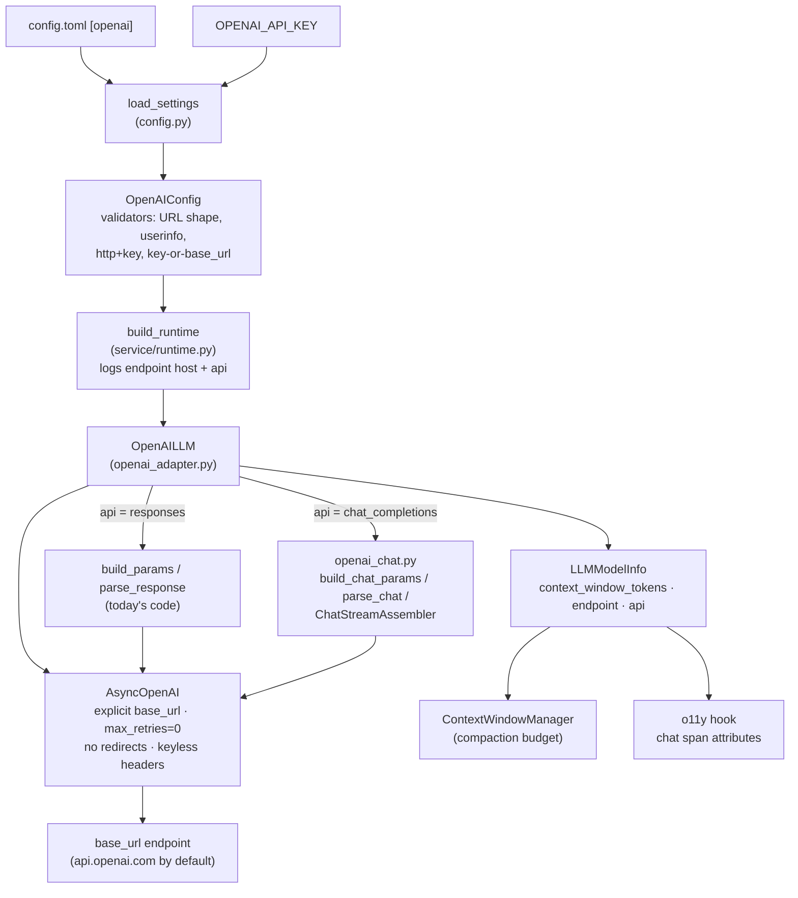
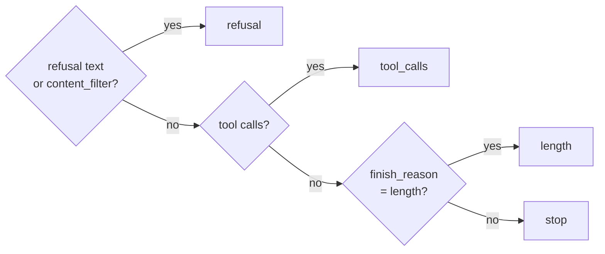

<!-- Written per the `the-loop:writing` skill: front-load each section's
     conclusion, draw it rather than describe it (3+ named parts -> a mermaid
     diagram), and keep the formal registers formal (EARS, abuse cases,
     RFC-2119, API contracts, schema descriptions). No length limit — length
     follows the change; the test is whether a sentence can come out without
     losing information. A gated section stays even when it is empty. -->

# Design: Support connecting to any OpenAI-compatible API

> Phase 2 of 3 (requirements → design → tasks). Derives from the
> [approved requirements](requirements.md). MUST be reviewed and approved before moving
> to tasks breakdown.

## Overview

The existing `OpenAILLM` adapter gains an endpoint, an optional key and a second wire
API; nothing outside the models package and the configuration learns that a non-OpenAI
server exists. Four keys are added to `[openai]`, validated fail-closed in
`OpenAIConfig`; `build_runtime` passes them to `OpenAILLM`; the adapter always builds its
`AsyncOpenAI` client with an **explicit** `base_url` (which is what makes the SDK ignore
`OPENAI_BASE_URL`), and dispatches each call either to today's Responses API code,
unchanged, or to a new Chat Completions module. A demo configuration for a loopback
Ollama with embedded Temporal closes the ticket's offline goal.

Both open questions in the requirements were approved as written (the reviewer approved
the file with no answer to either, so the drafted default stands): Chat Completions is
**in** (Requirement 3), and a custom endpoint keeps using **`OPENAI_API_KEY`**.

| Requirement | Where it is met |
|-------------|-----------------|
| R1 endpoint | `OpenAIConfig.base_url`; `OpenAILLM` client construction |
| R2 optional key | `load_settings` secret rule; `OpenAIConfig` validator; keyless client |
| R3 wire API | `OpenAIConfig.api`; new `openai_chat.py`; `OpenAILLM` dispatch |
| R4 context window | `OpenAIConfig.context_window_tokens` → `LLMModelInfo` |
| R5 errors | `translate_error` (unchanged mapping) + parse-failure wrapping |
| R6 offline demo | `examples/demo/config.ollama.toml`; README; getting-started guide |
| NFR observability | `LLMModelInfo.endpoint` / `.api`; startup log; chat-span attributes |
| Security | `OpenAIConfig` validators; client construction; redactor input |

## Architecture



No component outside `tiny_harness/config.py`, `tiny_harness/harness/models/`,
`tiny_harness/service/runtime.py`, the o11y hook and `LLMInvokedPre` changes. Durable
execution is untouched: the model call is still one activity, and its retry contract
still keys off `RetryableProviderError`.

## Components & interfaces

### `OpenAIConfig` (`tiny_harness/config.py`)

```python
class OpenAIConfig(_Strict):
    api_key: SecretStr | None = Field(default=None, description="from OPENAI_API_KEY; never logged")
    base_url: HttpUrl | None = Field(default=None, description="an OpenAI-compatible endpoint; default https://api.openai.com/v1")
    api: Literal["responses", "chat_completions"] = "responses"
    model: str = "gpt-6.1-sol"
    timeout: timedelta = timedelta(seconds=60)
    max_output_tokens: int = 2_000
    context_window_tokens: PositiveInt | None = None
```

- `api_key` is declared **before** `base_url` so the `base_url` field validator can read
  it from `ValidationInfo.data`; that keeps every endpoint error located at
  `openai.base_url` (R1.4, abuse cases 2–3).
- `base_url` field validator, in order: reject user information (`url.username` or
  `url.password` set); reject `scheme == "http"` with a non-loopback host when `api_key`
  is set. Pydantic's `HttpUrl` already rejects anything that is not an absolute
  `http`/`https` URL.
- Loopback is decided **without DNS**: the host is `localhost`, or parses with
  `ipaddress.ip_address` to an address whose `is_loopback` is true (`127.0.0.0/8`,
  `::1`). A hostname that merely resolves to loopback does not count — resolution is
  what an attacker controls.
- A `model_validator(mode="after")` rejects `api_key is None and base_url is None`.
  `load_settings` reaches that case first and names `OPENAI_API_KEY` (R2.1); the
  validator is the backstop for a `Settings` built in code and handed to the
  programmatic `serve`.

### `load_settings` secret rule (`tiny_harness/config.py`)

`SECRET_VARIABLES` marks `OPENAI_API_KEY` as required, as today. A helper
`_openai_base_url_set(data)` — the same shape as `_temporal_mode` — reads the raw
`[openai] base_url`; when it is present, a missing `OPENAI_API_KEY` is skipped instead of
raising (R2.2). Everything else about secret loading is unchanged.

### `OpenAILLM` (`tiny_harness/harness/models/openai_adapter.py`)

```python
class OpenAILLM(LLM):
    def __init__(
        self,
        api_key: SecretStr | None,
        *,
        model: str = "gpt-6.1-sol",
        timeout: timedelta = timedelta(seconds=60),
        max_output_tokens: int = 2_000,
        base_url: str | None = None,
        api: Literal["responses", "chat_completions"] = "responses",
        context_window_tokens: int | None = None,
        client: AsyncOpenAI | None = None,
    ) -> None: ...
```

Client construction (`_client(...)`, used when no `client` is injected):

| Setting | Value | Why |
|---------|-------|-----|
| `base_url` | the configured URL, else `DEFAULT_BASE_URL = "https://api.openai.com/v1"` | Always explicit, so the SDK never reads `OPENAI_BASE_URL` (R1.2, R1.3, abuse case 1). |
| `api_key` | the key, else the placeholder `"no-key"` | The SDK refuses to build without one. |
| per-request `extra_headers` | `{"Authorization": omit}` when there is no key | Strips the placeholder; verified against `openai` 3.28 — no `Authorization` header is sent (R2.2). |
| `default_headers` | `{"OpenAI-Organization": omit, "OpenAI-Project": omit}` when `base_url` is set | The SDK otherwise copies `OPENAI_ORG_ID` / `OPENAI_PROJECT_ID` from the environment into every request; a third-party server has no business seeing them. |
| `http_client` | `DefaultAsyncHttpxClient(follow_redirects=False)` when `base_url` is set | The SDK follows redirects by default; refusing them keeps every request on the configured host (R1.1). A 3xx then surfaces as `ProviderError`. |
| `max_retries`, `timeout` | `0`, the configured timeout | Unchanged (R18.3 of issue-3). |

With `base_url` unset the client is built exactly as today plus the explicit default
URL, so the Responses API requests are byte-identical (NFR backwards compatibility);
the only behavioural difference is that `OPENAI_BASE_URL` stops redirecting it.

`LLMModelInfo` is filled with `context_window_tokens or CONTEXT_WINDOWS.get(model,
400_000)` (R4.1, R4.2), `endpoint` = the endpoint's `scheme://host[:port]` (`endpoint_origin`), and `api`.

`invoke` / `stream` dispatch on `api`: `responses` calls the existing `build_params` /
`parse_response` / event loop **unchanged** (R3.2); `chat_completions` calls the new
module. Both run their parse step inside the same `try` that translates errors (R5).

### `openai_chat.py` (new, `tiny_harness/harness/models/`)

Pure functions plus one small assembler, mirroring the Responses module's split so each
piece is unit-testable against recorded bodies:

- `build_messages(request, names) -> list[ChatCompletionMessageParam]` — `instructions`
  → one `system` message first; `MessageItem` → `user` / `assistant` message;
  consecutive `ToolCallItem`s → **one** `assistant` message with a `tool_calls` list
  (Chat Completions requires the calls of one turn together); `ToolResultItem` → a
  `tool` message with `tool_call_id` and the same `_result_text` rendering.
- `build_chat_params(request, *, model, max_output_tokens, names)` — `model`,
  `messages`, `max_tokens` (request value or configured), `tools` as
  `{"type": "function", "function": {name, description, parameters, strict: False}}`
  through the same `WireNames`, and `response_format = {"type": "json_schema",
  "json_schema": {"name": "response", "schema": …, "strict": True}}` when the request
  carries one. It sends **no** `store` and **no** `prompt_cache_key`: neither is part of
  the Chat Completions contract most compatible servers implement.
- `parse_chat(completion, names) -> LLMResponse` — the first choice's `content` (or
  `refusal`), its `tool_calls` decoded through `WireNames`, usage from `usage`
  (`prompt_tokens`, `completion_tokens`, `prompt_tokens_details.cached_tokens`) with
  every absent field read as `0` (R3.4). A tool call without an `id` gets `call_<index>`.
- `ChatStreamAssembler` — fed each chunk of a `stream=True,
  stream_options={"include_usage": True}` call; yields `text_delta` events as content
  arrives, accumulates tool-call fragments by `index`, and on the end of the stream
  yields one `tool_call` event per completed call and the `done` event carrying the
  assembled `LLMResponse`. Tool calls are emitted at the end, not as each finishes,
  because Chat Completions has no per-call "done" marker.

Finish reason, applied identically to both paths:



Deriving `tool_calls` from the presence of calls, not from `finish_reason`, matches
`parse_response` and tolerates servers that report `stop` on a
turn that did call tools.

### `LLMModelInfo` and `LLMInvokedPre` (`harness/models/llm.py`, `harness/core/loop.py`)

Additive, defaulted fields: `LLMModelInfo.endpoint: str | None = None` and
`LLMModelInfo.api: str | None = None`; `LLMInvokedPre.model: LLMModelInfo | None =
None`, set by `InProcessOperations` from `self.llm.info`. Existing constructors and the
Anthropic adapter keep working unchanged.

### Observability

- `build_runtime` logs once at INFO: `model endpoint <scheme>://<host[:port]> api=<api> model=<model>` — scheme, host and port only, never the path or query.
- The o11y hook's chat span adds `server.address`, `server.port` (OTel's client
  attributes) and `tiny_harness.llm.api` when `ctx.model` carries them.
  `gen_ai.provider.name` stays as it is today (`tiny_harness`). The requirements' NFR
  says "`gen_ai.system` stays `openai`"; the code sets no `gen_ai.system` today, so the
  faithful reading is *the provider attribute does not change*, which this does.
- `secret_values(settings)` adds `openai.api_key` only when it is set; the redactor is
  otherwise unchanged and keeps masking the key whatever the endpoint (abuse case 5).

### Demo configuration (`examples/demo/config.ollama.toml`)

A copy of `config.embedded.toml` with:

```toml
[openai]
base_url = "http://127.0.0.1:11434/v1"
api = "chat_completions"          # Ollama serves both; this exercises the new path
model = "qwen3:8b"                # tool calling, runs on a laptop
context_window_tokens = 16384     # MUST match the server: OLLAMA_CONTEXT_LENGTH=16384
timeout = "PT300S"                # a local model is slower than the hosted one
```

and comments naming the bring-up: `OLLAMA_CONTEXT_LENGTH=16384 ollama serve`, `ollama
pull qwen3:8b`, `unset OPENAI_API_KEY TEMPORAL_API_KEY`, and that a fully offline run
also needs the Temporal CLI binary already cached (or `temporal.embedded.binary_path`)
and the demo's MCP servers' environment already synced (`uv sync`), since both would
otherwise reach the network on first use. The README's "Run the demo" and
`docs/guide/getting-started.md` gain a short "Offline with Ollama" section (R6.3).

## UI/UX design

N/A — configuration and adapter work with no user-facing surface; the renderers are
unchanged.

## Data models

- **Configuration (TOML, `[openai]`)** — four new keys, all optional:

  | Key | Type | Default | Validation |
  |-----|------|---------|------------|
  | `base_url` | absolute `http`/`https` URL | unset → `https://api.openai.com/v1` | no user info; `http` only to a loopback host when a key is set |
  | `api` | `"responses"` \| `"chat_completions"` | `"responses"` | literal |
  | `context_window_tokens` | integer | unset → built-in table, else 400 000 | `> 0` |
  | `api_key` (from `OPENAI_API_KEY`) | secret | — | required only when `base_url` is unset |

- **`tests/contract/snapshots/`** — `settings.schema.json`, `tiny_harness.config.txt`,
  `tiny_harness.harness.models.txt` and `tiny_harness.harness.core.txt` change
  additively; the snapshots are regenerated and the diff reviewed in the PR.
- No persistence change: nothing new is stored.

## Error handling

| Failure | Raised as | Where |
|---------|-----------|-------|
| Bad `base_url`, `api`, `context_window_tokens`; key missing without `base_url` | `ConfigError` → exit 2 naming the key or variable | `load_settings` |
| 429, 5xx, timeout, connection refused | `RetryableProviderError` (unchanged mapping) | `translate_error` |
| Other HTTP status, including a refused 3xx redirect | `ProviderError(status=<code>)` | `translate_error` |
| 2xx body the selected API cannot parse — missing fields, wrong types, invalid tool-call JSON, an empty `choices` | `ProviderError(status=200)`, message `unparseable <api> response: <exception>` | `translate_error(exc, api=…)` maps `PARSE_ERRORS` before the HTTP mapping; the parse step runs inside the translating `try` on both APIs |

The parse mapping fixes a latent gap for the Responses path too: today `parse_response`
runs **outside** the `try` in `invoke`, and the stream path's `translate_error` returns
a `json.JSONDecodeError` untouched, so an invalid tool-call argument string escapes as an
unhandled exception. Both paths now catch `ValueError`, `KeyError`, `TypeError`,
`AttributeError` and `IndexError` from parsing and raise `ProviderError`. An invalid
tool-call argument string is treated as an unparseable body (`ProviderError`, not
retried), per R5.3 — see Trade-offs.

Errors carry the SDK's message, which names neither the key nor the URL's path; the
redactor still runs over every log line and span.

## Security design

Each boundary from the requirements' Security considerations, and the mechanism that
enforces it:

- **AuthN/AuthZ:** no inbound surface is added; the only identity is the bearer key the
  harness presents to the endpoint. It is sent only to the configured host: the base URL
  is explicit, redirects are refused, and `httpx` would in any case drop
  `Authorization` on a cross-origin redirect.
- **Input validation & injection surfaces:**
  - `base_url` (operator-trusted, but validated): absolute `http`/`https` only, no user
    information, no clear-text key to a non-loopback host. Loopback is decided from the
    literal host, never by DNS.
  - `OPENAI_BASE_URL`, `OPENAI_ORG_ID`, `OPENAI_PROJECT_ID` (ambient environment): never
    read on a custom endpoint, and `OPENAI_BASE_URL` never read at all, because the
    client is always constructed with explicit values.
  - Endpoint responses (untrusted): parsed only through the SDK's typed models and the
    two parse functions; any shape they cannot map becomes `ProviderError`. Model
    output and tool-call arguments flow into the core loop through the same channels as
    today — tool names are decoded through `WireNames`, so a server cannot name a tool
    the request did not offer any more than OpenAI can. Prompt injection via model
    output is the existing surface, unchanged by this work.
- **Secrets handling:** `OPENAI_API_KEY` from the environment only, held as
  `SecretStr`, registered with the redactor when set; no key is ever placed in the URL
  (user information is rejected) or logged (the startup line prints scheme, host and
  port only).
- **Least privilege:** the harness sends the endpoint nothing beyond what it sends OpenAI
  today, minus the organization and project headers; the keyless path sends no
  credential at all.
- **Fail-closed behaviour:** every invalid or ambiguous endpoint setting exits 2 before
  a request is made; there is no fallback from a custom endpoint to OpenAI, and no
  fallback from one wire API to the other.
- **Abuse-case coverage:**

  | Abuse case | Mechanism | Negative test |
  |------------|-----------|---------------|
  | 1 `OPENAI_BASE_URL` redirects | explicit `base_url` always passed | unit: env set to another host → request still goes to the configured / default host |
  | 2 key over clear-text `http` | `base_url` validator | unit: `http://10.0.0.5/v1` + key → `ConfigError` naming `openai.base_url`; `http://127.0.0.1` + key and `http://10.0.0.5` without key → accepted |
  | 3 credentials in the URL | `base_url` validator | unit: `http://u:p@127.0.0.1/v1` → `ConfigError` naming `openai.base_url` |
  | 4 malformed / unexpected body | `PARSE_ERRORS` in `translate_error` | unit: recorded bad bodies (empty `choices`, wrong types, invalid tool JSON) on both APIs, invoke and stream → `ProviderError` |
  | 5 key in logs or errors | redactor input + startup line shape | unit: key-bearing config → no key in the startup log or a translated error; existing redaction tests extended to a custom endpoint |

## Testing strategy

Unit tests carry most of the proof, against `httpx.MockTransport` and recorded bodies as
`tests/unit/models/test_openai.py` already does: the configuration validators and the
secret rule; client construction (the URL a request reaches, the headers it carries,
redirect refusal); Chat Completions request mapping, response parsing, streaming
assembly and the finish table against recorded fixtures under
`tests/fixtures/openai/chat/`; and the Responses path proven byte-identical by the
existing request-mapping test plus one asserting the default URL. The contract snapshots
pin the additive API change. One integration scenario runs a scripted fake
OpenAI-compatible server on loopback through `build_runtime` and a full task —
`Scenario: Harness completes a task against an OpenAI-compatible endpoint` — and the e2e
`Scenario: Demo completes a task offline against a local Ollama` runs the new demo
configuration against a real Ollama where one is available. The executable detail —
which testing types apply, the environment and the evidence — is `testing-plan.md`'s.

## Trade-offs & decisions

- **One adapter with a dispatch, not a second LLM class.** Configuration, client,
  errors, model info and the key handling are shared; only request mapping and parsing
  differ. A separate `OpenAIChatLLM` would duplicate all of it for no isolation gain.
- **`max_tokens`, not `max_completion_tokens`, on Chat Completions.** Every server this
  targets accepts `max_tokens`; OpenAI's newer models prefer the other name, but OpenAI
  itself is served by the Responses path. Cost: pointing `api = "chat_completions"` at
  OpenAI with a reasoning model may be refused — documented in the configuration
  reference.
- **No caching hints on Chat Completions.** `prompt_cache_key` and `store` are dropped
  there; prefix caching on local servers is automatic where it exists.
- **Invalid tool-call JSON fails the call (not retried).** R5.3 asks for
  `ProviderError`. Small local models emit bad JSON more often than hosted ones, and a
  retry might succeed; making it retryable is a one-line change if verification shows it
  matters, but it would depart from the approved requirement, so it is not done here.
- **No redirects on a custom endpoint.** A server behind a redirecting proxy must be
  configured with its final URL. The default OpenAI path keeps the SDK's default.
- **Durable decision** to record as `docs/decisions/decision-006.md` with the
  implementation: the endpoint is configuration-only (`OPENAI_BASE_URL` is ignored) and
  a custom endpoint reuses `OPENAI_API_KEY`.

## Open questions

None open. The two raised with the requirements were settled by their approval as
written (see Overview).

## Review comments

> Appended by the-loop's `record-feedback` hook when a human gate approves with
> comments (issue-109). Append-only and attributed: an approval never silently
> discards a reviewer's suggestions, and the feedback travels with the document
> it concerns rather than living in a side-channel tracker.
