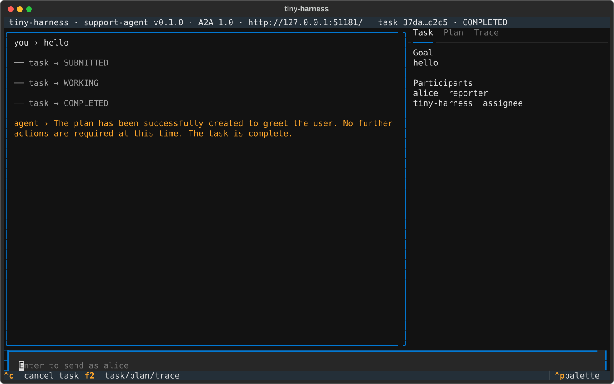

# TUI walkthrough against a local Ollama (T11)

The TUI, talking to a harness built from `examples/demo/config.ollama.toml` (model
swapped to `qwen3:1.7b`), sent "hello" and showed the local model's answer with the task
`COMPLETED` in 58.5 s; the startup log named the loopback endpoint and the Chat
Completions API. Run at `420df50` with neither `OPENAI_API_KEY` nor `TEMPORAL_API_KEY`
set.



## How it was driven

This session has no interactive terminal, so the walkthrough was scripted with Textual's
pilot rather than typed by hand. It composes what `tiny-harness --config … tui` does when
it hosts its own harness in embedded mode — `running_harness(settings)`, then the real
`HarnessApp` over the real `SdkClient` A2A client — and presses the same keys a person
would:

```python
settings = Settings.load(config, env={"TINY_HARNESS_PUSH_KEY": push_key})
async with running_harness(settings) as harness:
    client = await SdkClient.connect(harness.base_url, participant="alice")
    app = HarnessApp(client, url=harness.base_url, participant="alice")
    async with app.run_test(size=(120, 36)) as pilot:
        await pilot.press(*"hello", "enter")
        while app.state_name not in ("COMPLETED", "INPUT_REQUIRED", "FAILED"):
            await asyncio.sleep(2)
        app.save_screenshot("tui.svg", path=out)
```

The configuration differs from the shipped file only in the model, the bind port, the
state directory and the absent `ui_dir`.

## Output

```text
state=COMPLETED elapsed=58.5s
entry: you › hello
entry: ── task → SUBMITTED
entry: ── task → WORKING
entry: ── task → COMPLETED
entry: agent › The plan has been successfully created to greet the user. No further actions are required at this time. The task is complete.
log: model endpoint http://127.0.0.1:11434 api=chat_completions model=qwen3:1.7b
```

The answer's wording is the 1.7B model's; the point is that it came back through the
whole path.
