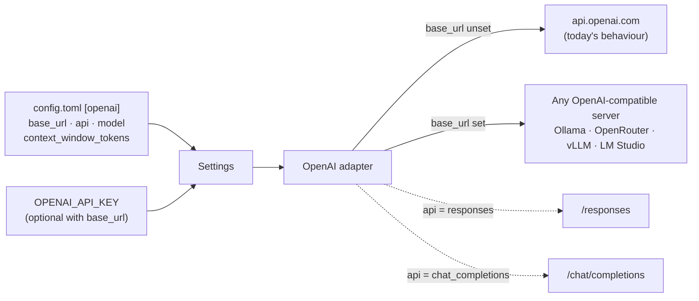

<!-- Written per the `the-loop:writing` skill: front-load each section's
     conclusion, draw it rather than describe it (3+ named parts -> a mermaid
     diagram), and keep the formal registers formal (EARS, abuse cases,
     RFC-2119, API contracts, schema descriptions). No length limit — length
     follows the change; the test is whether a sentence can come out without
     losing information. A gated section stays even when it is empty. -->

# Requirements: Support connecting to any OpenAI-compatible API

> Phase 1 of 3 (requirements → design → tasks). Following the Kiro spec approach
> (<https://kiro.dev/docs/specs/>). This phase MUST be reviewed and approved by the
> required collaborators before moving to design.

## Introduction

Today tiny-harness can only talk to OpenAI itself. `[openai]` has no endpoint setting,
`OPENAI_API_KEY` is always required, and the adapter speaks only the Responses API. So
Ollama, OpenRouter, vLLM, LM Studio and the other servers that expose an
OpenAI-compatible API are out of reach, and the harness cannot run without the internet
even now that Temporal can be embedded (issue-17, PR #18).
Ticket: [MadaraUchiha-314/tiny-harness#19](https://github.com/MadaraUchiha-314/tiny-harness/issues/19).

This work item makes the endpoint configuration. `[openai] base_url` points the
existing adapter at any OpenAI-compatible server; the API key becomes optional when a
custom endpoint is set (a local Ollama needs none); `[openai] api` picks the Responses
API or Chat Completions, because many compatible servers implement only the latter; and
`[openai] context_window_tokens` tells compaction how big a model's window really is,
since a local model's is not in the adapter's table.

With `base_url` on a loopback Ollama and `[temporal] mode = "embedded"`, the demo runs
with no network access at all — the ticket's stated goal.

Nothing changes for a configuration that sets none of the new keys: it keeps calling
OpenAI's Responses API with the same requests it sends today.

## Requirements

### Requirement 1 — Point the OpenAI adapter at any endpoint

**User story:** As an operator, I want to set the URL the OpenAI adapter calls, so that
I can use Ollama, OpenRouter or any other OpenAI-compatible server instead of OpenAI.

#### Acceptance criteria (EARS)

1. WHERE `[openai] base_url` is set THEN the system SHALL send every model request to
   that URL and to no other host.
2. WHERE `[openai] base_url` is not set THEN the system SHALL call
   `https://api.openai.com/v1`, as it does today.
3. The system SHALL take the endpoint only from `[openai] base_url`; WHEN the
   `OPENAI_BASE_URL` environment variable is set THEN the system SHALL ignore it.
4. IF `[openai] base_url` is not an absolute `http` or `https` URL THEN the system SHALL
   exit with status 2 naming `openai.base_url`.
5. The `[openai] model` value SHALL be passed to the endpoint verbatim, so any model name
   the server knows (e.g. `llama3.2`, `qwen3:8b`, `openai/gpt-oss-120b`) is accepted.

### Requirement 2 — API key optional for a custom endpoint

**User story:** As an operator running a local model, I want to start the harness
without an API key, so that a keyless server like Ollama works without a fake secret.

#### Acceptance criteria (EARS)

1. WHERE `[openai] base_url` is not set, IF `OPENAI_API_KEY` is not set THEN the system
   SHALL exit with status 2 naming `OPENAI_API_KEY`, as it does today.
2. WHERE `[openai] base_url` is set, WHEN `OPENAI_API_KEY` is not set THEN the system
   SHALL start and send model requests without an `Authorization` header.
3. WHERE `[openai] base_url` is set, WHEN `OPENAI_API_KEY` is set THEN the system SHALL
   send it to that endpoint as the bearer token.

### Requirement 3 — Choose the wire API

**User story:** As an operator, I want to choose between the Responses API and Chat
Completions, so that I can use a server that implements only one of them.

#### Acceptance criteria (EARS)

1. The system SHALL accept `[openai] api` as `responses` (the default) or
   `chat_completions`; IF it is any other value THEN the system SHALL exit with status 2
   naming `openai.api`.
2. WHERE `api = "responses"` the system SHALL call the endpoint's Responses API exactly as
   the adapter does today.
3. WHERE `api = "chat_completions"` the system SHALL call the endpoint's Chat Completions
   API and SHALL support, as with the Responses API: the system prompt, the conversation
   turns, tool definitions, tool calls and tool results, streaming text and tool calls,
   structured output, usage counts, and the finish reasons `stop`, `tool_calls`,
   `length` and `refusal`.
4. WHERE `api = "chat_completions"`, WHEN the endpoint omits a field the harness maps
   (e.g. usage) THEN the system SHALL record it as absent or zero rather than fail the
   call.

### Requirement 4 — Context window for models the adapter does not know

**User story:** As an operator using a local model, I want to tell the harness the
model's context window, so that compaction triggers before the model runs out of room.

#### Acceptance criteria (EARS)

1. WHERE `[openai] context_window_tokens` is set THEN the system SHALL use it as the
   model's context window in place of the adapter's built-in table.
2. WHERE it is not set, the system SHALL keep today's behaviour: the table entry for a
   known model, 400 000 tokens otherwise.
3. IF `[openai] context_window_tokens` is not a positive integer THEN the system SHALL
   exit with status 2 naming `openai.context_window_tokens`.

### Requirement 5 — Errors from a compatible endpoint

**User story:** As an operator, I want a failing or incompatible endpoint to fail the
way OpenAI failures already do, so that retries and error reporting keep working.

#### Acceptance criteria (EARS)

1. WHEN the endpoint answers 429 or 5xx, times out or refuses the connection THEN the
   system SHALL raise `RetryableProviderError`, whatever the endpoint.
2. WHEN the endpoint answers any other error status THEN the system SHALL raise
   `ProviderError` with that status.
3. WHEN the endpoint answers 2xx with a body the selected API cannot parse THEN the
   system SHALL raise `ProviderError`, never an unhandled exception.

### Requirement 6 — Run fully offline with Ollama

**User story:** As a developer, I want a ready-made configuration for a local Ollama
with embedded Temporal, so that I can run the whole demo on a machine with no network.

#### Acceptance criteria (EARS)

1. The demo SHALL ship a configuration that uses `[temporal] mode = "embedded"` and an
   `[openai] base_url` of a loopback Ollama, with no API key required.
2. WHEN the demo runs with that configuration and the Ollama model already pulled THEN
   the system SHALL complete a task end to end with no outbound connection to a
   non-loopback address.
3. The getting-started guide and the README SHALL document how to run it.

## Non-functional requirements

- **Backwards compatibility.** A configuration that sets none of `base_url`, `api` and
  `context_window_tokens` SHALL produce byte-identical Responses API requests to today's.
- **Observability.** Model spans and logs SHALL carry the endpoint's host and the wire
  API in use, so a trace shows where a call went; `gen_ai.system` stays `openai`.
- **Dependencies.** The work SHALL use the `openai` SDK already in the project; no new
  runtime dependency.

## Security considerations

The new surface is one operator-controlled URL that decides **where prompts, tool
results and the API key are sent**. The threat is misdirection and leakage, not a new
inbound path.

- **Actors & trust:** the operator who writes the configuration file and the
  environment is trusted, as today. The endpoint's responses are **untrusted** — a
  third-party router or a local server is no more trusted than OpenAI was, and its model
  output already flows through the harness's existing untrusted-output handling. No new
  inbound interface is added.
- **Trust boundaries & data:** outbound, the request carries the system prompt, the
  conversation, tool definitions, tool results and `OPENAI_API_KEY`; all of it now goes
  to whatever host `base_url` names. Inbound, the response crosses back into the core
  loop exactly as an OpenAI response does today. The key is still read only from the
  environment and held as `SecretStr`.
- **Abuse cases (EARS):**
  1. WHEN the `OPENAI_BASE_URL` environment variable names another host THEN the system
     SHALL ignore it, so an environment variable cannot silently redirect prompts and
     the key away from the configured endpoint.
  2. IF `base_url` uses `http` to a non-loopback host AND `OPENAI_API_KEY` is set THEN the
     system SHALL exit with status 2 naming `openai.base_url`, so the key is never sent
     in clear text over a network.
  3. IF `base_url` contains user information (`user:password@`) THEN the system SHALL exit
     with status 2 naming `openai.base_url`, so a credential is never kept in the
     configuration file or written to logs.
  4. WHEN the endpoint returns malformed, oversized-field or unexpected JSON THEN the
     system SHALL raise `ProviderError` and SHALL NOT crash the worker or execute
     anything from the body beyond today's tool-call handling.
  5. WHEN the system logs, traces or reports an error about the endpoint THEN it SHALL
     NOT include `OPENAI_API_KEY`; the redactor SHALL keep masking it whatever the
     endpoint.
- **Fail closed:** an invalid, ambiguous or credential-bearing `base_url`, an unknown
  `api`, or a non-positive `context_window_tokens` stops the process with status 2
  before any request is sent. With no `base_url`, a missing `OPENAI_API_KEY` still
  stops it. There is no fallback from a custom endpoint to OpenAI.

## Out of scope

- The Anthropic adapter: no `base_url` there; Anthropic-compatible servers are a
  separate ticket.
- More than one model endpoint per deployment, or choosing the endpoint per agent or per
  task.
- Discovering a server's models or context windows automatically (e.g. Ollama's
  `/api/show`).
- Provider-specific extensions beyond the OpenAI wire format (OpenRouter's provider
  routing headers, Ollama's native `/api/chat`).
- Making Chat Completions the default, or removing the Responses API path.

## Open questions

Raised on the pull request carrying this spec; the reviewer's answer at the gate
settles them.

1. **Chat Completions (Requirement 3).** Ollama, OpenRouter, vLLM and LM Studio all
   serve the Responses API, so Requirement 3 could be dropped and the work cut by about
   half. It is in because "OpenAI-compatible" most often means Chat Completions, and
   servers such as older llama.cpp builds and many hosted routers implement only that.
   Keep or cut?
2. **Key variable.** The key for a custom endpoint stays `OPENAI_API_KEY`, as the ticket
   asks ("the config section related to OpenAI"). The cost: an operator with a real
   OpenAI key exported who points `base_url` at OpenRouter sends that key to OpenRouter.
   The alternative is a separate variable (e.g. `TINY_HARNESS_MODEL_API_KEY`) used
   whenever `base_url` is set.

## Review comments

> Appended by the-loop's `record-feedback` hook when a human gate approves with
> comments (issue-109). Append-only and attributed: an approval never silently
> discards a reviewer's suggestions, and the feedback travels with the document
> it concerns rather than living in a side-channel tracker.
