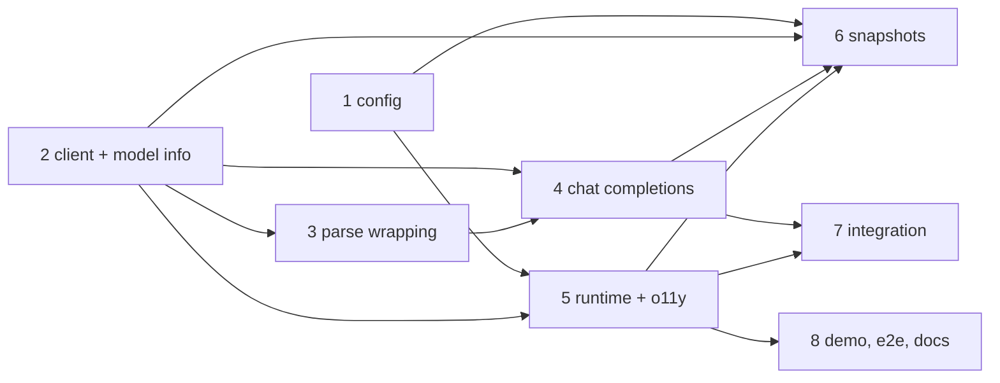

<!-- Written per the `the-loop:writing` skill: front-load each section's
     conclusion, draw it rather than describe it (3+ named parts -> a mermaid
     diagram), and keep the formal registers formal (EARS, abuse cases,
     RFC-2119, API contracts, schema descriptions). No length limit — length
     follows the change; the test is whether a sentence can come out without
     losing information. A gated section stays even when it is empty. -->

# Tasks: Support connecting to any OpenAI-compatible API

> The last spec artifact (requirements → design → testing plan → tasks). A DAG of
> implementation tasks derived from the [design](design.md) and
> [testing plan](testing-plan.md). It has no approval gate of its own (issue-281).

Eight tasks, delivered on the work item's one pull request,
[#22](https://github.com/MadaraUchiha-314/tiny-harness/pull/22), in this repository.
No other repository is touched. Every task names the requirement it satisfies, the
testing-plan row that proves it, and the test that goes red first.

Conventions for every task:

- pyright strict, zero errors, no `Any`; ruff clean.
- Integration tests carry the Gherkin docstring with
  `Requirement: docs/specs/issue-19/requirements.md#R<n>` (the repository's convention).
- Tests run with `OPENAI_API_KEY` unset unless the case is about a key.
- The commit message records the test command and its red→green transition.

## Task list

- [x] 1. Config: `base_url`, `api`, `context_window_tokens`, optional key
  - `OpenAIConfig`: `api_key: SecretStr | None` declared before `base_url: HttpUrl |
    None`; `api: Literal["responses", "chat_completions"]`; `context_window_tokens:
    PositiveInt | None`.
  - `base_url` field validator: reject user information; reject `http` to a non-loopback
    host when `api_key` is set (loopback = `localhost` or a literal loopback IP, no DNS).
  - `model_validator(mode="after")`: neither key nor `base_url` → error (programmatic
    backstop).
  - `load_settings`: `_openai_base_url_set(data)`; skip the missing-`OPENAI_API_KEY`
    error when it is set.
  - `secret_values` in `service/runtime.py`: add `openai.api_key` only when set.
  - _Depends on:_ none
  - _Requirements:_ R1.4, R2.1, R2.2, R3.1, R4.3; abuse cases 2, 3
  - _Test:_ T1 + T8 — new `tests/unit/test_config_openai.py` (every R1.4 / R2 / R3.1 /
    R4.3 case and abuse cases 2–3 from the trace table); T10 — existing
    `tests/unit/test_config.py` unedited (red→green)
- [x] 2. Adapter: client construction, model info, keyless headers
  - `OpenAILLM.__init__` gains `base_url`, `api`, `context_window_tokens`; `api_key` may
    be `None`. `_client(...)` per the design's table: explicit `base_url` (default
    `DEFAULT_BASE_URL`), `"no-key"` placeholder + per-request `Authorization: omit`,
    `OpenAI-Organization` / `OpenAI-Project` omitted and `follow_redirects=False` when
    `base_url` is set.
  - `LLMModelInfo.endpoint` and `.api` (defaulted); `context_window_tokens` override.
  - Responses path unchanged apart from passing `extra_headers` when keyless.
  - _Depends on:_ none
  - _Requirements:_ R1.1, R1.2, R1.3, R1.5, R2.2, R2.3, R4.1, R4.2; abuse case 1
  - _Test:_ T1 + T8 — `tests/unit/models/test_openai_endpoint.py` (URL reached, headers,
    `OPENAI_BASE_URL` ignored, org/project suppressed, 307 refused, model info); T10 —
    existing `tests/unit/models/test_openai.py` unedited (red→green)
- [x] 3. Parse-failure wrapping for both APIs
  - Move `parse_response` inside the translating `try` in `invoke`; catch `ValueError`,
    `KeyError`, `TypeError`, `AttributeError`, `IndexError` from parsing in `invoke` and
    `stream` → `ProviderError(status=200, detail="unparseable responses response")`.
  - _Depends on:_ 2
  - _Requirements:_ R5.3; abuse case 4
  - _Test:_ T1 + T8 — malformed Responses bodies (invalid tool-call JSON, wrong types) on
    invoke and stream → `ProviderError` (red: today `json.JSONDecodeError` escapes)
- [x] 4. Chat Completions module and dispatch
  - New `tiny_harness/harness/models/openai_chat.py`: `build_messages`,
    `build_chat_params`, `parse_chat`, `ChatStreamAssembler`, the shared finish rule.
  - Recorded fixtures under `tests/fixtures/openai/chat/` (text, tool calls, refusal,
    `content_filter`, `length`, no-usage, no-id, malformed, and an SSE stream with
    fragmented tool-call arguments and a usage chunk).
  - `OpenAILLM.invoke` / `stream` dispatch on `api`; parse failures wrapped as in task 3
    with `detail="unparseable chat_completions response"`.
  - The new names stay public in `openai_chat` itself; the package re-exports only
    `OpenAILLM`, as it does for the Responses helpers.
  - _Depends on:_ 2, 3
  - _Requirements:_ R3.2, R3.3, R3.4, R5.1–R5.3
  - _Test:_ T1 — `tests/unit/models/test_openai_chat.py` (every R3.3 / R3.4 / R5 case in
    the trace table) (red→green)
- [x] 5. Runtime wiring and observability
  - `build_runtime` passes the four settings to `OpenAILLM` and logs `model endpoint
    <scheme>://<host[:port]> api=<api> model=<model>` once at INFO.
  - `LLMInvokedPre.model: LLMModelInfo | None = None`, set by `InProcessOperations`; the
    o11y hook adds `server.address`, `server.port`, `tiny_harness.llm.api` to the chat
    span.
  - _Depends on:_ 1, 2
  - _Requirements:_ R1.1, R4.1, NFR observability; abuse case 5
  - _Test:_ T1 + T8 — runtime unit test: the log line's shape (no path, query or key);
    o11y hook unit test: span attributes; key absent from log, span and a translated
    error (red→green)
- [ ] 6. Contract snapshots
  - Regenerate the four snapshots; confirm the diff is additive only.
  - _Depends on:_ 1, 2, 4, 5
  - _Requirements:_ NFR backwards compatibility
  - _Test:_ T6 — `uv run pytest tests/contract` (red until regenerated)
- [ ] 7. Integration scenarios against a scripted endpoint
  - `tests/integration/compat/`: a `starlette` + `uvicorn` fake OpenAI-compatible server
    on an OS-chosen loopback port serving `/v1/responses` and `/v1/chat/completions`
    from scripted recorded bodies, recording each request's headers; `running_harness`
    with embedded Temporal and `[openai] base_url` pointing at it, no key.
  - The three T2 scenarios from the trace table, each with its Gherkin docstring.
  - _Depends on:_ 4, 5
  - _Requirements:_ R1.1, R2.2, R3.2, R3.3, R5.1, R6.2
  - _Test:_ T2 — `uv run pytest tests/integration/compat`; T8 offline — the same inside
    `unshare -rn` (red→green)
- [ ] 8. Ollama demo configuration, e2e test and documentation
  - `examples/demo/config.ollama.toml` per the design; `tests/e2e/test_demo_ollama.py`
    (`e2e` marker; skips with a reason when `127.0.0.1:11434` does not answer or the
    model is not pulled; `TINY_HARNESS_OLLAMA_MODEL` overrides the model) using the
    existing `tests/e2e/demo.py` driver.
  - README "Run the demo" and `docs/guide/getting-started.md`: an "Offline with Ollama"
    section. Configuration reference / `docs/capabilities/configuration.md` and
    `models.md`: the new keys, `OPENAI_BASE_URL` ignored, the key rule; history rows.
  - `docs/decisions/decision-006.md` + its row in `decisions.md`: the endpoint is
    configuration-only and a custom endpoint reuses `OPENAI_API_KEY`.
  - _Depends on:_ 5
  - _Requirements:_ R6.1, R6.2, R6.3
  - _Test:_ T4 — `uv run pytest tests/e2e -k ollama -s` (skips without Ollama: the skip
    reason is asserted in a unit test of the guard); T12 — `bun run --cwd docs
    docs:build` (red→green)

## Dependency graph (DAG)

Tasks 1 and 2 have no dependency on each other; the session runs them in order 1, 2,
3, 4, 5, 6, 7, 8.

## Checkpoints

- After every task: `uv run pytest tests/unit` and `uv run pyright`, then commit with the
  red→green line, tick the box, compact.
- After task 6: `uv run pytest tests/contract tests/security`.
- After task 7: `uv run pytest tests/integration`.
- After task 8: `uv run pre-commit run --all-files` — then the **verification** node
  executes `testing-plan.md`, and the review phases run the self/critic rounds and the
  **security review gate** (recorded in `evidence/security-review.md`).

## Review comments

> Appended by the-loop's `record-feedback` hook when a human gate approves with
> comments (issue-109). Append-only and attributed: an approval never silently
> discards a reviewer's suggestions, and the feedback travels with the document
> it concerns rather than living in a side-channel tracker.
