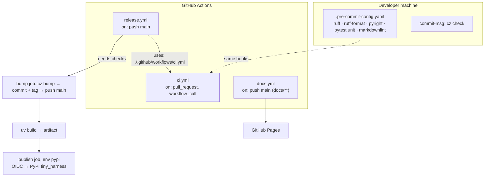

# Design: Repo tooling setup

## Overview

One `pyproject.toml` owns the Python side, one `.pre-commit-config.yaml` owns the checks,
and every other place that runs checks calls those two. The pre-commit hooks are the
single definition of "lint, type-check, unit-test"; `ci.yml` runs them plus the
integration tests and the docs build; `release.yml` *calls* `ci.yml` before it bumps and
publishes. Nothing is defined twice, so local and CI cannot drift (requirements NFR
"Parity").

| Concern | Choice | Why |
|---------|--------|-----|
| Python | CPython **3.14** (`.python-version`, `requires-python = ">=3.14"`) | Latest stable on 2026-10-08; uv offers 3.15 only as rc2 |
| Package manager | uv, `uv.lock` committed, `.venv/` in repo root | Issue; uv's default venv location |
| Build backend | `uv_build` | uv's native backend — no extra tool (minimalism ladder: existing dep) |
| Lint + format | ruff | Issue |
| Type check | pyright, `strict` | Issue; strict costs nothing on a one-function codebase and sets the bar early |
| Tests | pytest; `tests/unit/`, `tests/integration/` | Issue; directory split lets hooks run unit only |
| Commit lint + versioning | commitizen 4.x, `cz_conventional_commits` | Issue; also computes the release version |
| Hooks | pre-commit framework, all hooks `local` / `uv run` | Versions come from `uv.lock`, not pre-commit's own envs |
| Markdown lint | markdownlint-cli2, pinned via `npx` | the-loop rule: lint all files incl. markdown |
| Docs | VitePress 1.6 (default theme) + `vitepress-plugin-mermaid`, bun, `docs/` as `srcDir` | Issue; same stack as the-loop's site. Mermaid rendering added at review (PR #5) |

## Architecture



`docs/architecture/architecture.md` gains a "Repository layout and tooling" section that
points at the docs-site guides rather than restating them.

### Repository layout

```text
pyproject.toml          project, deps, ruff/pyright/pytest/commitizen config
uv.lock  .python-version
tiny_harness/
  __init__.py           re-exports hello_world; __all__ = ["hello_world"]
  hello.py              def hello_world() -> str
  py.typed
tests/
  unit/test_hello.py
  integration/test_package.py
.pre-commit-config.yaml
.markdownlint-cli2.jsonc
.github/workflows/{ci,release,docs}.yml
docs/
  .vitepress/config.mts
  package.json  bun.lock
  index.md              home page (hero + feature cards)
  guide/{tech-stack,local-development,releasing}.md
  architecture/ capabilities/ decisions/ learnings/ specs/   (existing the-loop trees)
```

## Components & interfaces

### `tiny_harness` package (R1, R2)

- `hello.py`: `def hello_world() -> str: return "Hello, world!"`.
- `__init__.py`: `from tiny_harness.hello import hello_world` and `__all__`.
- `py.typed` marks the package as typed for downstream pyright/mypy users.
- `pyproject.toml` `[tool.uv.build-backend]`: `module-root = ""` (flat layout, so the
  package sits at the repo root as the issue asks) and `module-name = "tiny_harness"`.

### `pyproject.toml` tool config (R3)

- `[dependency-groups] dev`: ruff, pyright, pytest, pre-commit, commitizen. uv installs the
  `dev` group by default on `uv sync`.
- ruff: `target-version` from `requires-python`, `line-length = 100`, rules
  `E, W, F, I, UP, B, SIM, RUF`.
- pyright: `typeCheckingMode = "strict"`, `include = ["tiny_harness", "tests"]`,
  `venvPath = "."`, `venv = ".venv"`.
- pytest: `testpaths = ["tests"]`, `addopts = "-ra --strict-markers"`.

### Commitizen (R4, R7)

`[tool.commitizen]` in `pyproject.toml`: `name = "cz_conventional_commits"`,
`version_provider = "uv"` (rewrites `[project] version` **and** `uv.lock` in the bump
commit, so the lockfile never lags the package), `tag_format = "v$version"`,
`major_version_zero = true` (a breaking change bumps minor while on 0.x),
`update_changelog_on_bump = false`. The project starts at `version = "0.0.0"`; this PR's
squash commit (`feat: …`) makes the first release **0.1.0**.

### `.pre-commit-config.yaml` (R5)

`default_install_hook_types: [pre-commit, commit-msg]`, so one command —
`uv run pre-commit install` — installs both git hooks. Hooks, all `repo: local`,
`language: system`:

| id | entry | stage |
|----|-------|-------|
| ruff-lint | `uv run ruff check --fix` | pre-commit |
| ruff-format | `uv run ruff format` | pre-commit |
| pyright | `uv run pyright` (`pass_filenames: false`) | pre-commit |
| pytest-unit | `uv run pytest tests/unit -q` (`pass_filenames: false`) | pre-commit |
| markdownlint | `npx --yes markdownlint-cli2@0.23.3` (`require_serial: true`) | pre-commit |
| commitizen | `uv run cz check --allow-abort --commit-msg-file` | commit-msg |

`.markdownlint-cli2.jsonc` disables `MD013` (line length) and ignores `node_modules`,
`docs/.vitepress/{cache,dist}` and `CHANGELOG.md`.

### `ci.yml` (R6)

Triggers: `pull_request` and `workflow_call`. Workflow-level `permissions: contents: read`.

| Job | Steps |
|-----|-------|
| `checks` | checkout → setup-uv (pinned uv version) → setup-node 22 → `uv sync --locked` → `uv run pre-commit run --all-files --show-diff-on-failure` |
| `integration` | checkout → setup-uv → `uv sync --locked` → `uv run pytest tests/integration` |
| `docs` | checkout → setup-bun → `bun install --frozen-lockfile` → `bun run docs:build` (in `docs/`) |

`uv sync --locked` fails on a stale `uv.lock` (R1.4).

### `release.yml` (R7)

Trigger: `push` to `main`, plus `workflow_dispatch`. `concurrency: release`, no cancel.
Workflow-level `permissions: contents: read`.

1. **`checks`** — `uses: ./.github/workflows/ci.yml`. The called workflow inherits
   `contents: read`.
2. **`bump`** — `needs: checks`; `if: !startsWith(github.event.head_commit.message, 'bump:')`;
   `permissions: contents: write`. Checkout `main` tip with full history → setup-uv →
   configure the bot identity → **first-release bootstrap**: when no `v*` tag exists, tag
   the current `[project] version` on `HEAD^` locally (never pushed), so the increment is
   computed from this merge only → `uv run cz bump --yes`; exit codes 21 (no increment)
   and 3 (no commits) are a clean no-op with `released=false` → `git push --atomic origin
   HEAD:main refs/tags/v<version>` → `uv build` → upload `dist/` as an artifact.
3. **`publish`** — `needs: bump`, `if: needs.bump.outputs.released == 'true'`;
   `environment: pypi`; `permissions: id-token: write` only. Download `dist/` →
   `pypa/gh-action-pypi-publish@release/v1`.

The pattern is the-loop's own `release.yml`, minus its GitHub Release and changelog steps,
which the issue does not ask for.

### `docs.yml` and the VitePress site (R8)

- `docs/package.json`: `vitepress`, `vitepress-plugin-mermaid` and `mermaid` (11.x, the plugin's supported range) dev dependencies, exact versions; `config.mts` wraps the config in `withMermaid` so every mermaid fence renders; scripts `docs:dev`, `docs:build`,
  `docs:preview` run against `.` (`docs/` is `srcDir`). `bun.lock` committed.
- `config.mts`: `base: "/tiny-harness/"`, `cleanUrls`, `lastUpdated`,
  `themeConfig.search.provider = "local"`, edit-on-GitHub link, social link to the repo.
  Nav: Guide · Architecture · Capabilities · Decisions · Specs. The specs sidebar is
  generated from the filesystem (one collapsed group per `docs/specs/<id>/`, spec files in
  phase order), copied from the-loop's config, so new work items appear without nav edits.
  `srcExclude: ["**/evidence/**", "**/node_modules/**"]` — evidence files are raw records,
  not reader pages.
- `docs.yml`: on `push` to `main` with `paths: [docs/**, .github/workflows/docs.yml]`,
  and `workflow_dispatch`. `permissions: contents: read, pages: write, id-token: write`;
  `concurrency: pages`. Build with bun → `actions/upload-pages-artifact` → a `deploy` job
  with `environment: github-pages` running `actions/deploy-pages`.
- Guides: **tech-stack** (the table above, with links), **local-development** (install uv
  and bun, `uv sync`, `uv run pre-commit install`, running each check, running the docs
  site), **releasing** (how versions are computed, what the workflow does, and the
  repository settings it relies on: the PyPI trusted publisher, the `pypi` environment,
  Pages source = GitHub Actions, and the bot bypass if `main` gets branch protection).

## UI/UX design

N/A. The docs site uses VitePress's default theme unchanged; there is no custom visual
design to prototype.

## Data models

None. The only structured data is configuration (`pyproject.toml`, workflow YAML), whose
schemas belong to the tools.

## Error handling

- A failing hook exits non-zero and blocks the commit; pre-commit prints the tool's own
  output.
- In CI any failing step fails its job; `release.yml`'s `bump` cannot start until
  `checks` succeeds.
- `cz bump` exit codes 21/3 mean "nothing to release" and succeed; any other non-zero exit
  fails the job before anything is pushed.
- `git push --atomic` lands the bump commit and tag together or neither; if `main` moved
  during the run the push is rejected and the next queued run releases from the new tip.
- If PyPI rejects the upload (publisher misconfigured), the `publish` job fails visibly;
  the tag and bump commit already exist, and re-running the `publish` job retries the same
  artifact.

## Security design

- **AuthN/AuthZ:** PyPI authenticates the publish via GitHub OIDC; the trusted publisher
  binds `MadaraUchiha-314/tiny-harness`, `release.yml` and environment `pypi`. Writes to
  `main` use the run's `GITHUB_TOKEN`, scoped to the `bump` job.
- **Untrusted PR code:** `ci.yml` triggers on `pull_request` (never `pull_request_target`),
  so fork PRs get a read-only token and no secrets. No job in `ci.yml` requests
  `id-token` or write scopes. **Abuse case 1 → this mechanism.**
- **Injection surfaces:** no workflow interpolates PR titles, branch names or commit
  messages into a `run:` script. The one `github.event` value read —
  `head_commit.message` — is used only in an `if:` expression, never in shell.
- **Secrets:** none stored. No `secrets.*` beyond the implicit `GITHUB_TOKEN`.
  **Abuse case 4 → nothing to leak.**
- **Least privilege:** workflow-level `contents: read` everywhere; `contents: write` only
  on `bump`; `id-token: write` only on `publish` and the Pages deploy; `pages: write` only
  in `docs.yml`.
- **Fail closed:** `publish` needs `bump` which needs `checks` — a failed check skips
  everything after it (**abuse case 3**). PyPI refuses an OIDC token from any other
  workflow or environment (**abuse case 2**); there is no token fallback.
- **Supply chain:** Python tools pinned in `uv.lock`; docs deps pinned in `bun.lock`
  (`--frozen-lockfile`); markdownlint pinned to an exact version; actions are GitHub's own
  (`actions/*`), Astral's `setup-uv`, `oven-sh/setup-bun` and PyPA's publish action.
- **Abuse-case tests:** `tests/unit/test_workflows.py` parses the workflow YAML and asserts
  the properties above — no `pull_request_target`, workflow-level `contents: read`,
  `id-token: write` only on `publish` / Pages deploy, `release.yml` `publish` uses
  environment `pypi` and needs `bump` which needs `checks`.

## Testing strategy

Unit tests cover `hello_world` (R2.2) and the workflow invariants above (R6, R7, abuse
cases 1–3). One integration test proves the package installs and imports as published
(R1.5, R2.1): **Scenario: the built wheel installs and exposes hello_world** — build the
wheel with `uv build`, install it into a fresh venv, import it there and call it. The
tooling requirements (R3–R5) are proved by running the commands themselves and by
negative checks — a deliberately bad commit message rejected by the `commit-msg` hook, a
lint error blocked by the `pre-commit` hook — recorded under `evidence/`. R7's live
behaviour (bump, publish) can only run on `main` after merge; before merge it is proved by
the workflow tests and a local `cz bump --dry-run`. The test-planning phase was declared
away, so these results go to `evidence/verification.md`.

## Trade-offs & decisions

- **Release calls CI instead of duplicating it.** `workflow_call` keeps one definition of
  the checks. Cost: the release run repeats checks the PR already passed (~2 min).
- **First release is 0.1.0, not 1.0.0.** `major_version_zero` keeps breaking changes on
  minor bumps until the maintainer decides the API is stable.
- **Bun for the docs, not npm.** Matches the-loop and the-loop's tooling matrix default;
  contributors who only touch Python never need it, except for markdownlint, which runs
  via `npx` (Node).
- **markdownlint in the hooks.** Not in the issue, but the-loop's tooling rule requires
  markdown linting. It means a contributor needs Node to commit; Node ships with most dev
  setups and is required for the docs anyway.
- **No GitHub Release, no committed changelog.** Not requested; the tag is the record.
  Easy to add later.

Recorded as `docs/decisions/decision-001.md`: the toolchain and the single-definition
check pipeline.

## Open questions

None.

## Review comments
