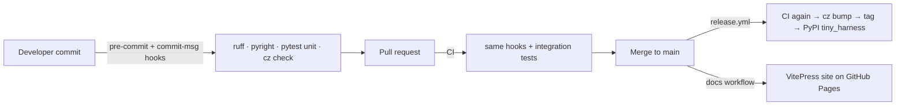

# Requirements: Repo tooling setup

## Introduction

tiny-harness has no code, no toolchain and no CI today: the repository holds only agent
instructions and the-loop's docs trees. [Issue #2](https://github.com/MadaraUchiha-314/tiny-harness/issues/2)
asks for the full Python project scaffold — packaging, linting, type checking, tests,
commit linting, git hooks, CI, automated PyPI releases and a documentation site — with a
single `hello_world` function as the first piece of code.

The work is rated **risk tier 4**: it adds `.github/workflows/**` (a sensitive path), and
the release workflow writes to `main` and publishes to PyPI.

## Requirements

### Requirement 1 — Python project and package layout

**User story:** As a contributor, I want a standard `pyproject.toml` project managed by
uv, so that one command gives me a working environment.

#### Acceptance criteria (EARS)

1. The repository SHALL declare the project in `pyproject.toml` with distribution name
   `tiny_harness` and import package `tiny_harness`.
2. The project SHALL require the latest stable CPython 3 release available at
   implementation time, pinned in `.python-version` and `requires-python`.
3. WHEN a contributor runs `uv sync` in a fresh clone THEN uv SHALL create `.venv/` in the
   repository root and install the project and its development dependencies there.
4. The repository SHALL commit `uv.lock`, and CI SHALL fail WHEN `uv.lock` is out of date
   with `pyproject.toml`.
5. All library code SHALL live under the top-level `tiny_harness/` folder, and the package
   SHALL be importable as `from tiny_harness import ...`.

### Requirement 2 — Hello world

**User story:** As a contributor, I want one example function and its test, so that the
tooling has something real to check and new code has a pattern to copy.

#### Acceptance criteria (EARS)

1. The package SHALL expose exactly one public function, `hello_world`, importable as
   `from tiny_harness import hello_world`.
2. WHEN `hello_world()` is called THEN it SHALL return the string `"Hello, world!"`.
3. The repository SHALL contain a unit test for `hello_world` that runs under pytest.
4. The repository SHALL contain at least one integration test, kept apart from unit
   tests, that exercises the installed package; each integration test SHALL carry a
   Gherkin docstring linked to this requirement (`testing.gherkinDocstrings: required`).

### Requirement 3 — Lint, type check, test

**User story:** As a contributor, I want ruff, pyright and pytest configured once, so that
local runs and CI agree.

#### Acceptance criteria (EARS)

1. The repository SHALL configure ruff as linter and formatter, pyright as type checker
   and pytest as test runner in `pyproject.toml`, pinned through `uv.lock`.
2. WHEN `uv run ruff check`, `uv run ruff format --check`, `uv run pyright` and
   `uv run pytest` run on the delivered tree THEN each SHALL exit 0.
3. Pyright SHALL run in `strict` mode over `tiny_harness/` and the tests.

### Requirement 4 — Conventional Commits

**User story:** As a maintainer, I want commit messages linted, so that releases can be
versioned from them.

#### Acceptance criteria (EARS)

1. The repository SHALL use commitizen with the `cz_conventional_commits` rules.
2. WHEN a contributor commits with a message that is not a Conventional Commit THEN the
   `commit-msg` hook SHALL reject the commit.
3. WHEN the message is a Conventional Commit (`feat:`, `fix:`, …), a merge or a revert
   THEN the hook SHALL accept it.

### Requirement 5 — Pre-commit hooks

**User story:** As a contributor, I want the checks to run before each commit, so that
broken code does not reach a PR.

#### Acceptance criteria (EARS)

1. The repository SHALL configure the pre-commit framework with hooks for ruff lint,
   ruff format, pyright, the unit tests and markdownlint (the-loop lints all files,
   markdown included), plus commitizen on `commit-msg`.
2. WHEN a contributor runs the documented install command THEN the `pre-commit` and
   `commit-msg` git hooks SHALL be installed.
3. WHEN a commit introduces a lint error, a type error or a failing unit test THEN the
   `pre-commit` hook SHALL fail and block the commit.
4. Hooks SHALL invoke tools through `uv run` so they use the versions pinned in `uv.lock`.

### Requirement 6 — CI on pull requests

**User story:** As a reviewer, I want every PR checked by the same commands as the local
hooks, plus integration tests, so that green CI means the same thing everywhere.

#### Acceptance criteria (EARS)

1. WHEN a pull request is opened or updated THEN CI SHALL run the same pre-commit hooks
   over all files (`pre-commit run --all-files`).
2. WHEN a pull request is opened or updated THEN CI SHALL run the integration tests.
3. IF any of these steps fails THEN the CI run SHALL fail.
4. WHEN a pull request is opened or updated THEN CI SHALL build the documentation site
   and fail if the build fails.

### Requirement 7 — Release on merge to main

**User story:** As a maintainer, I want each merge to `main` released to PyPI with a
version computed from the commits, so that publishing needs no manual steps or stored
tokens.

#### Acceptance criteria (EARS)

1. The release workflow SHALL be `.github/workflows/release.yml` and its publish job SHALL
   use the GitHub environment `pypi`.
2. WHEN a commit lands on `main` THEN the release workflow SHALL first run every check the
   PR workflow runs, and SHALL NOT publish if any fails.
3. WHEN the checks pass and the commits since the last release warrant one THEN the
   workflow SHALL compute the next version with commitizen (`fix` → patch, `feat` →
   minor, breaking → major), commit the new version to `main`, tag it `v<version>`, build
   the distribution and publish it to PyPI as `tiny_harness`.
4. WHEN no commit since the last release warrants one THEN the workflow SHALL publish
   nothing and SHALL succeed.
5. The publish step SHALL authenticate to PyPI with Trusted Publishing (OIDC) only.
6. WHEN the workflow's own version-bump commit lands on `main` THEN it SHALL NOT trigger
   another release.

### Requirement 8 — Documentation site

**User story:** As a reader, I want the project's docs as a searchable site, so that
onboarding, development and architecture notes are in one place.

#### Acceptance criteria (EARS)

1. All project documentation SHALL live under `docs/` as Markdown, including the existing
   the-loop trees (specs, capabilities, architecture, decisions, learnings).
2. The site SHALL be generated by VitePress with the default theme — top nav, sidebar,
   local search — in the style of [the-loop's docs](https://madarauchiha-314.github.io/the-loop/).
3. WHEN a commit that changes `docs/` lands on `main` THEN a workflow SHALL build the site
   and deploy it to GitHub Pages.
4. The docs SHALL describe the tech stack and local development: environment setup,
   running each check, and installing the pre-commit hooks.
5. WHEN `README.md` is read THEN it SHALL link to the docs site and the local-dev guide.

## Non-functional requirements

- **Parity:** pre-commit, the PR workflow and the release workflow run the same commands
  through `uv run`; a check that passes locally passes in CI.
- **Pinned tooling:** Python tools resolve from `uv.lock`; the docs toolchain resolves from
  a committed lockfile; GitHub Actions use major-version tags of first-party or
  widely-used actions.
- **Speed:** the PR checks finish in under 5 minutes on a GitHub-hosted runner.

## Security considerations

- **Actors & trust:** maintainers (trusted, merge to `main`); outside contributors opening
  PRs from forks (**untrusted** — their code runs in CI); third-party GitHub Actions and
  PyPI/npm packages (**untrusted supply chain**).
- **Trust boundaries & data:** the release job holds two privileges — `contents: write` on
  the repository and an OIDC token PyPI trusts for `tiny_harness`. PR code must never run
  with either. No long-lived secret (PyPI token, PAT) is stored anywhere.
- **Abuse cases (EARS):**
  1. WHEN a pull request from a fork runs CI THEN the workflow SHALL run with a read-only
     `GITHUB_TOKEN` and no `id-token: write`, and SHALL NOT use `pull_request_target`.
  2. WHEN any workflow other than `release.yml` on `main` (environment `pypi`) requests a
     PyPI upload THEN PyPI SHALL refuse it, because the trusted publisher names only that
     workflow and environment.
  3. WHEN a checks step fails on `main` THEN the release job SHALL NOT bump, tag or
     publish.
  4. IF a secret or token would appear in committed files or logs THEN it SHALL NOT be
     committed; the repository SHALL contain no credentials.
- **Fail closed:** permissions default to `contents: read` at workflow level and are
  widened only on the job that needs them (`contents: write` for the bump job,
  `id-token: write` for the publish job, `pages: write` + `id-token: write` for the docs
  deploy). A missing `pypi` environment or publisher makes the publish fail, never fall
  back to a token.

## Out of scope

- Any harness functionality beyond `hello_world`.
- Branch protection rules, the PyPI publisher itself (already registered) and enabling
  GitHub Pages in the repository settings — repository settings, not files. The docs
  record what must be set.
- Docs versioning, i18n and a custom theme.

## Open questions

None blocking. Two defaults taken, to be confirmed in review of the PR:

- The first published version is `0.1.0`.
- If branch protection on `main` later rejects the release workflow's bump push, the
  maintainer allows `github-actions[bot]` to bypass it.

## Review comments
