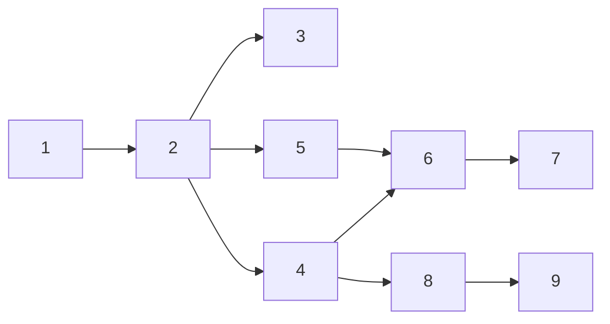

# Tasks: Repo tooling setup

`test-planning` was declared away, so each `_Test:_` names the command or test that proves
the task; results are recorded in `evidence/verification.md`.

## Task list

- [ ] 1. Python project skeleton
  - `.python-version` (3.14), `pyproject.toml` (project `tiny_harness` 0.0.0, `uv_build`
    flat layout, dev group, ruff/pyright/pytest/commitizen config), `uv lock`, `uv sync`.
  - _Depends on:_ none
  - _Requirements:_ R1.1–R1.4, R3.1, R3.3, R4.1
  - _Test:_ `uv sync --locked` exits 0 and creates `.venv/`; `uv run ruff --version`,
    `pyright --version`, `pytest --version`, `cz version` resolve from the lock.
- [ ] 2. `hello_world` with unit test
  - Write `tests/unit/test_hello.py` first (red: import fails), then
    `tiny_harness/{__init__,hello}.py` and `py.typed` (green).
  - _Depends on:_ 1
  - _Requirements:_ R1.5, R2.1–R2.3
  - _Test:_ `uv run pytest tests/unit/test_hello.py` (red→green)
- [ ] 3. Integration test: built wheel installs and imports
  - `tests/integration/test_package.py` with a Gherkin docstring linked to R2.
  - _Depends on:_ 2
  - _Requirements:_ R1.5, R2.4
  - _Test:_ `uv run pytest tests/integration` (red before task 2's package exists is
    covered by task 2's red; green here)
- [ ] 4. Pre-commit hooks and markdownlint
  - `.pre-commit-config.yaml`, `.markdownlint-cli2.jsonc`; fix existing markdown findings.
  - _Depends on:_ 2
  - _Requirements:_ R3.2, R4.2, R4.3, R5.1–R5.4
  - _Test:_ `uv run pre-commit run --all-files` exits 0; negative: a commit with message
    `bad message` is rejected by `commit-msg`, one with a ruff error is blocked by
    `pre-commit`.
- [ ] 5. Workflow invariant tests (security abuse cases)
  - `tests/unit/test_workflows.py` written first against the workflows of tasks 6–7 (red:
    files missing).
  - _Depends on:_ 2
  - _Requirements:_ R6, R7, security abuse cases 1–3
  - _Test:_ `uv run pytest tests/unit/test_workflows.py` (red→green with tasks 6–7)
- [ ] 6. `ci.yml`
  - _Depends on:_ 4, 5
  - _Requirements:_ R6.1–R6.4
  - _Test:_ task 5's tests; the PR's own CI run is green.
- [ ] 7. `release.yml`
  - _Depends on:_ 6
  - _Requirements:_ R7.1–R7.6
  - _Test:_ task 5's tests; `uv run cz bump --dry-run --yes` from a throwaway clone shows
    `0.0.0 → 0.1.0`.
- [ ] 8. VitePress docs site and `docs.yml`
  - `docs/package.json`, `bun.lock`, `.vitepress/config.mts`, `index.md`, `docs.yml`,
    `.gitignore` entries.
  - _Depends on:_ 4
  - _Requirements:_ R8.1–R8.3
  - _Test:_ `bun run docs:build` in `docs/` exits 0 (dead-link check included).
- [ ] 9. Guides, README, architecture, capability doc, decision
  - `docs/guide/{tech-stack,local-development,releasing}.md`; README links; architecture
    section; `docs/capabilities/repo-tooling.md` + index row; `docs/decisions/decision-001.md`.
  - _Depends on:_ 8
  - _Requirements:_ R8.4, R8.5
  - _Test:_ docs build and markdownlint pass; guide commands executed as written in a
    fresh clone during verification.

## Dependency graph (DAG)

## Checkpoints

Run `uv run pre-commit run --all-files` after tasks 4, 7 and 9. Each task's commit
message records its test command and red→green transition.

## Review comments
