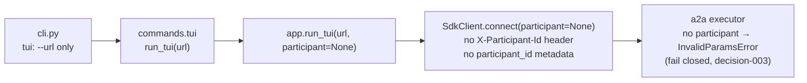

<!-- Written per the `the-loop:writing` skill: front-load each section's
     conclusion, draw it rather than describe it (3+ named parts -> a mermaid
     diagram), and keep the formal registers formal (EARS, abuse cases,
     RFC-2119, API contracts, schema descriptions). No length limit — length
     follows the change; the test is whether a sentence can come out without
     losing information. A gated section stays even when it is empty. -->

# Bugfix spec: `tiny-harness tui` never asserts a participant, so it cannot send messages

> Phase 1 of 3 for a bug (bugfix → design → tasks). The `requirements-approval` gate was
> skipped by declaration at phase-selection, so this spec is reviewed on the pull request
> together with the rest of the chain.

## Summary

`tiny-harness tui` cannot send a single message. The server refuses every send with
JSON-RPC error `-32602 no participant asserted`, and the TUI crashes with
`InvalidParamsError`. This holds for a remote harness (`--url`) and for the embedded one
the TUI hosts itself (issue-17). The terminal renderer is therefore unusable from the
CLI. Ticket: [MadaraUchiha-314/tiny-harness#20](https://github.com/MadaraUchiha-314/tiny-harness/issues/20).

The fix adds a `--participant <id>` option to `tiny-harness tui`. When it is omitted, the
TUI asserts the operating-system user name. The command passes the identity to the TUI
on both paths, so every message carries one.

## Steps to reproduce

1. `uv run python -m examples.demo` (or `uv run tiny-harness --config examples/demo/config.embedded.toml tui`).
2. `uv run tiny-harness tui --url http://127.0.0.1:8080`.
3. Type any message and press Enter.

## Expected vs actual

- **Expected:** the message is sent under an asserted participant, and the reply streams
  into the conversation.
- **Actual:** `InvalidParamsError: no participant asserted` (JSON-RPC `-32602`). The TUI
  stops.

## Root cause (confirmed)

The identity is dropped at the first hop. Every layer below it would carry one if it
were given one.

- `tiny_harness/service/cli.py` gives `tui` no way to name a participant.
- `tiny_harness/service/commands.py` `tui` calls `run_tui(url)` on both the remote and
  the embedded path.
- `tiny_harness/interaction/tui/app.py` `run_tui(url, participant=None)` connects without
  one. It shows `participant or "you"` on screen, which hides the gap: the TUI shows a
  name it never sends.
- `tiny_harness/service/a2a/executor.py` refuses a message that asserts nobody. That
  refusal is correct and stays (abuse case 4 of issue-3, decision-003).

The integration scenario *TUI hosts its own harness in embedded mode* passes only
because its stand-in for `run_tui` connects with `participant="alice"` itself.

## Requirements

### Requirement 1 — The TUI asserts a participant on every message

**User story:** As a person at a terminal, I want `tiny-harness tui` to send my messages
under an identity, so that I can talk to a harness from the TUI at all.

#### Acceptance criteria (EARS)

1. `tiny-harness tui` SHALL accept a `--participant <id>` option.
2. WHEN `tiny-harness tui` runs with `--participant <id>` THEN every message and action
   the TUI sends SHALL assert `<id>`, both as the `participant_id` message metadata and
   as the `X-Participant-Id` request header.
3. WHEN `tiny-harness tui` runs without `--participant` THEN the TUI SHALL assert the
   operating-system user name of the process (Python's `getpass.getuser()`).
4. IF `--participant` is absent AND the operating-system user name cannot be determined
   THEN the command SHALL exit with status 2 before connecting, and stderr SHALL name the
   `--participant` option.
5. IF `--participant` is given an empty or whitespace-only value THEN the command SHALL
   exit with status 2 before connecting, and stderr SHALL name the `--participant`
   option.
6. The asserted participant SHALL reach the TUI on both paths: with `--url` (or a remote
   `temporal.mode`), and in embedded mode with no `--url`, where the TUI hosts its own
   harness.
7. The TUI SHALL display the participant it asserts, not a placeholder it never sends.

### Requirement 2 — The fix stays fixed

1. The fix SHALL include a regression test that drives the real `run_tui` path from
   `commands.tui` and sends a message. The test SHALL fail with `no participant asserted`
   before the fix and pass after it.
2. The existing scenario *TUI hosts its own harness in embedded mode* SHALL take the
   participant from the command, not set one itself, so it can no longer mask this bug.

## Security considerations

**No new attack surface; the fail-closed refusal is unchanged.** The participant
assertion is self-asserted by design (decision-003). Today any A2A client, including the
web renderer through `?participant=`, can assert any identity. The authenticating
perimeter in front of the server is what binds it to a person. This fix lets the TUI do
what every other client already does, and adds no privilege.

- **Actors & trust:** the person running the CLI (trusted for their own process); the A2A
  server they connect to; the perimeter that authenticates them (decision-003).
- **Trust boundaries & data:** the participant id crosses from the CLI to the server in a
  header and in message metadata. The server must keep treating it as untrusted input. No
  secret is added or moved. The OS user name is sent to the server the user chose, which
  is the identity they are acting as.
- **Abuse cases:**
  1. WHEN a message arrives with no participant asserted THEN the server SHALL still
     refuse it with `no participant asserted`. The fix SHALL NOT add a server-side
     default.
  2. WHEN a TUI user asserts another person's id with `--participant` THEN the server
     SHALL treat it exactly as the same assertion from any other A2A client: task
     membership checks use it as given, and the perimeter is what authenticates it.
- **Fail-closed expectations:** no identity is ever invented to get past the refusal. An
  undeterminable user name or an empty `--participant` stops the command (R1.4, R1.5)
  rather than falling back to a shared placeholder such as `you`.

## Out of scope

- Authentication of the participant. Deferred to the perimeter by decision-003.
- A configuration key or environment variable for the participant. Nothing has asked for
  one, and the flag plus the OS default covers the reported case.
- The web renderer's `?participant=` default of `you`. It already asserts an identity,
  so it does not have this bug.

## Open questions

- **Default or require?** The ticket left this open. Resolved here as *default to the OS
  user name*: the ticket names it as the example default, it gives two people on two
  terminals distinct identities without extra typing, and R1.4 keeps it fail-closed. The
  `requirements-approval` gate was skipped by declaration, so this choice is open to
  review on the pull request.
