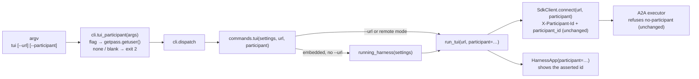

<!-- Written per the `the-loop:writing` skill: front-load each section's
     conclusion, draw it rather than describe it (3+ named parts -> a mermaid
     diagram), and keep the formal registers formal (EARS, abuse cases,
     RFC-2119, API contracts, schema descriptions). No length limit — length
     follows the change; the test is whether a sentence can come out without
     losing information. A gated section stays even when it is empty. -->

# Design: `tiny-harness tui` never asserts a participant, so it cannot send messages

> Derived from [`bugfix.md`](bugfix.md). The `design-approval` gate was skipped by
> declaration at phase-selection; this design and the testing plan are reviewed on
> PR #21.

## Overview

The fix threads one string from the command line to the A2A client. The CLI resolves
the participant once, before anything starts: `--participant` if it was given, otherwise
the OS user name. It refuses with status 2 when neither yields an id. `commands.tui` then
passes the participant to `run_tui` on both of its paths. `run_tui` makes the participant
a required argument, so no future caller can drop it again. Below `run_tui` nothing
changes: `SdkClient` already sets the header and the metadata when it is given an id.

## Architecture



Changed: `cli.py`, `commands.py`, `interaction/tui/app.py`. Unchanged: `SdkClient`, the
executor, the access policy and the web renderer.

## Components & interfaces

**`tiny_harness/service/cli.py`**

- `build_parser`: the `tui` sub-parser gains
  `--participant ID` (`default=None`, help: "the participant id to assert (default: the
  OS user name)").
- New `tui_participant(args: argparse.Namespace) -> str | None`. It takes
  `args.participant.strip()` when the flag was given, else `getpass.getuser()` (`None`
  when that raises `OSError`, the Python 3.14 contract when no user name can be found).
  It returns `None` unless the id is non-empty printable ASCII (R1.8). The id also rides
  in the `X-Participant-Id` header: httpx sends it as UTF-8, Starlette decodes it as
  latin-1, and h11 refuses CR/LF only at send time.
- `main`: for the `tui` command, after `refusal`, calls `tui_participant`. On `None` it
  prints `configuration error: no participant to assert; pass --participant <id>
  (--participant)` and returns `CONFIG_EXIT` (2). This happens before `asyncio.run`,
  so nothing connects or starts (R1.4, R1.5).
- `dispatch`: passes `participant=args.participant` to `commands.tui`. `main` writes the
  resolved value back onto `args.participant`, so `dispatch` keeps taking one namespace.

**`tiny_harness/service/commands.py`**

- `tui(settings, *, url, participant: str)`: the cast becomes
  `Callable[..., Awaitable[int]]`, and both `run_tui` calls pass `participant=participant`
  (R1.6).

**`tiny_harness/interaction/tui/app.py`**

- `run_tui(url: str, *, participant: str) -> int`: `participant` becomes required and
  non-optional. `HarnessApp(..., participant=participant)` drops the `or "you"`
  placeholder.
- `HarnessApp.compose` sets the composer placeholder to
  `Enter to send as {participant}` (R1.7).
- `HarnessApp.__init__` keeps its `"you"` default: the UI snapshot tests and the
  prototype construct it without a client and send nothing.

## UI/UX design

One text change, no new layout. Today `HarnessApp.participant` is stored but never
rendered, so a person cannot see who they are acting as. The composer's placeholder
becomes `Enter to send as <participant>`:

```text
▊Enter to send as alice▎
```

This matters more now that the id can be defaulted silently from the OS user name. The
first draft appended `as <participant>` to the top bar instead. The regenerated snapshots
showed it pushing the task state (`INPUT_REQUIRED`) off the right edge at 110 columns,
so it moved to the composer, which has room. No widget, key or layout is added, so there
are no artifacts under `design/`. The four TUI SVG snapshots change by exactly this text
and are regenerated.

## Data models

None changed. The participant is a plain `str` on the existing wire fields
(`X-Participant-Id`, `metadata.participant_id`).

## Error handling

| Condition | Where | Result |
|-----------|-------|--------|
| `--participant ""` or whitespace only | `cli.main` | stderr `configuration error: … (--participant)`, exit 2, nothing started |
| no flag, `getpass.getuser()` raises `OSError` | `cli.main` | same as above |
| id (flag or OS user) not printable ASCII, for example `josé` or one containing `\n` | `cli.main` | same as above; the user passes an ASCII `--participant` |
| server still refuses (for example a perimeter strips the header and metadata) | executor → TUI | unchanged behaviour of the server; out of scope |

## Security design

| Boundary (from `bugfix.md`) | Enforcement |
|-----------------------------|-------------|
| CLI → server, participant id | Unchanged server enforcement: `executor.py` still refuses a message that asserts nobody, and `AccessPolicy` still checks membership against the asserted id. The fix adds no server-side default; abuse case 1 is proved by the existing refusal test, which still passes. |
| Self-asserted identity (decision-003) | The TUI uses the same two channels every other client uses (`X-Participant-Id`, `participant_id`). The value the TUI sends gets no extra trust; abuse case 2 is the existing `tests/integration/a2a/test_access.py` behaviour. |
| Fail closed on missing identity | `cli.main` exits 2 on a blank flag, an undeterminable user name, or an id outside printable ASCII. It never falls back to a shared placeholder such as `you`. |

No secret is read, logged or stored. The participant id is not logged by the CLI.

## Testing strategy

Test-first. The regression test goes red on today's code with `no participant asserted`.

- **Unit** (`tests/unit/service/test_cli.py`): parsing `--participant`; `tui_participant`
  for flag, blank flag, OS default and `OSError`; `main` exits 2 naming `--participant`
  in the blank and `OSError` cases; `commands.tui` passes the participant on the `--url`
  path (fake `run_tui` records its kwargs).
- **Integration** (`tests/integration/embedded/test_cli_embedded.py`): the existing
  embedded scenario's stand-in now *receives* the participant from `commands.tui` instead
  of choosing one. A new regression scenario drives the **real** `run_tui` →
  `SdkClient.connect` → `HarnessApp` path. Only `HarnessApp.run_async` is patched to run
  under Textual's pilot, which sends a message to the embedded harness and expects
  `COMPLETED`.
- **Manual**: the ticket's reproduction against the demo, recorded as evidence.

Details and commands: [`testing-plan.md`](testing-plan.md).

## Trade-offs & decisions

- **Default to the OS user name rather than require the flag.** The ticket names it as
  the candidate default. It keeps `tiny-harness tui` a zero-argument command, and two
  terminals still get distinct ids. Requiring the flag would be safer only if the
  identity were trusted, and it is not (decision-003). Not a durable project decision;
  recorded here and in `bugfix.md`.
- **No config key or env var.** Minimalism ladder, YAGNI rung: nothing asks for one.
- **Resolve in `cli.main`, not in `commands.tui`.** `main` already owns the exit-2
  configuration refusals (`refusal`), so the new refusal sits beside them and runs before
  the event loop and any embedded Temporal start.
- **No new dependency.** `getpass` is in the standard library.

## Open questions

None open. The default-versus-require choice is resolved above and open to PR review.

## Review comments
