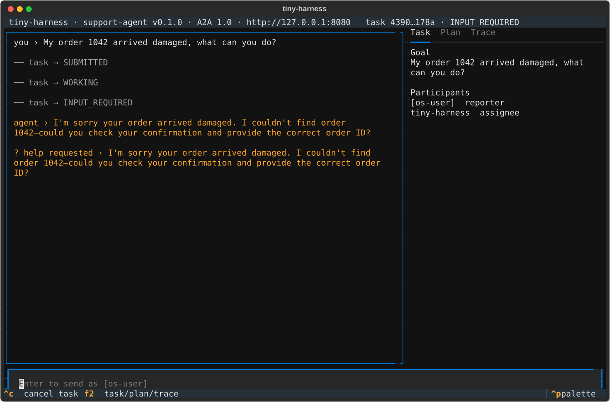

# Manual walkthrough: the ticket's reproduction, after the fix

Work item: issue-20 · testing-plan row T11 · commit `f8228d8` · run 2026-10-10 in a
120×38 tmux pane (private server socket). `TEMPORAL_API_KEY` was unset.
`OPENAI_API_KEY` came from the keyring and `TINY_HARNESS_PUSH_KEY` from `openssl rand`,
both by reference. The web renderer was built first because the demo configuration
serves it. The OS user name is redacted to `[os-user]` below and in the screenshot.

## Outcome

| Step | Observed | Result |
|---|---|---|
| `uv run python -m examples.demo examples/demo/config.embedded.toml` | agent card served on `127.0.0.1:8080` after 7 s | pass |
| `tiny-harness --config examples/demo/config.embedded.toml tui --url http://127.0.0.1:8080`, type a message, Enter | the agent replies; Participants shows `[os-user]  reporter`; the composer reads `Enter to send as [os-user]` | pass (R1.3, R1.6, R1.7) |
| same with `--participant alice` | reply; `alice  reporter`; `Enter to send as alice` | pass (R1.2) |
| same with `--participant '  '` | `configuration error: no participant to assert; pass --participant <id> in printable ASCII (--participant)`, `exit=2`, no connection | pass (R1.5) |
| same with `--participant josé` (re-run after `2adbe39`) | the same refusal, `exit=2` | pass (R1.8) |
| demo log | `no participant asserted` appears 0 times | pass |
| demo stopped; `tiny-harness --config examples/demo/config.embedded.toml tui --participant bob` (embedded, TUI hosts the harness) | reply; `bob  reporter`; `Enter to send as bob` | pass (R1.6) |
| after the pane is killed | no `temporal … start-dev` process left | pass |

R1.4 (no OS user name) cannot be produced on this machine without breaking the account;
it is covered by the unit test that makes `getpass.getuser` raise `OSError`.

## Remote path, OS-user default



Captured by Textual's own screenshot (`TEXTUAL_SCREENSHOT`).

## Remote path, `--participant alice`

```text
 tiny-harness · support-agent v0.1.0 · A2A 1.0 · http://127.0.0.1:8080   task 0d0b…f719 · INPUT_REQUIRED
╭──────────────────────────────────────────────────────────────────────────────╮ Task  Plan  Trace
│ you › Where is order 1001?                                                   │╸━━━━╺━━━━━━━━━━━━━━━━━━━━━━━━━━━━━━━━━━
│                                                                              │ Goal
│ ── task → SUBMITTED                                                          │   Where is order 1001?
│ ── task → WORKING                                                            │ Participants
│                                                                              │   alice  reporter
│ ── task → INPUT_REQUIRED                                                     │   tiny-harness  assignee
│ agent › I couldn’t find order 1001 in our order system. Could you            │
│ double-check the order number in your confirmation email and send it here?   │
│ ? help requested › I couldn’t find order 1001 in our order system. Could you │
│ double-check the order number in your confirmation email and send it here?   │
…
▊▔▔▔▔▔▔▔▔▔▔▔▔▔▔▔▔▔▔▔▔▔▔▔▔▔▔▔▔▔▔▔▔▔▔▔▔▔▔▔▔▔▔▔▔▔▔▔▔▔▔▔▔▔▔▔▔▔▔▔▔▔▔▔▔▔▔▔▔▔▔▔▔▔▔▔▔▔▔▔▔▔▔▔▔▔▔▔▔▔▔▔▔▔▔▔▔▔▔▔▔▔▔▔▔▔▔▔▔▔▔▔▔▔▔▔▔▔▔▎
▊  Enter to send as alice                                                                                              ▎
 ^c cancel task  f2 task/plan/trace                                                                         ▏^p palette
```

## Embedded path, `--participant bob`

```text
 tiny-harness · support-agent v0.1.0 · A2A 1.0 · http://127.0.0.1:8080/   task eb3e…7fd4 · INPUT_REQUIRED
╭──────────────────────────────────────────────────────────────────────────────╮ Task  Plan  Trace
│ you › Hi, I need a refund for order 1042                                     │╸━━━━╺━━━━━━━━━━━━━━━━━━━━━━━━━━━━━━━━━━
│                                                                              │ Goal
│ ── task → SUBMITTED                                                          │   Hi, I need a refund for order 1042
│ ── task → WORKING                                                            │ Participants
│                                                                              │   bob  reporter
│ ── task → INPUT_REQUIRED                                                     │   tiny-harness  assignee
│ agent › I couldn’t find order 1042. Could you double-check the order number  │
│ and tell me why you’re requesting a refund?                                  │
│ ? help requested › I couldn’t find order 1042. Could you double-check the    │
│ order number and tell me why you’re requesting a refund?                     │
…
▊▔▔▔▔▔▔▔▔▔▔▔▔▔▔▔▔▔▔▔▔▔▔▔▔▔▔▔▔▔▔▔▔▔▔▔▔▔▔▔▔▔▔▔▔▔▔▔▔▔▔▔▔▔▔▔▔▔▔▔▔▔▔▔▔▔▔▔▔▔▔▔▔▔▔▔▔▔▔▔▔▔▔▔▔▔▔▔▔▔▔▔▔▔▔▔▔▔▔▔▔▔▔▔▔▔▔▔▔▔▔▔▔▔▔▔▔▔▔▎
▊  Enter to send as bob                                                                                                ▎
 ^c cancel task  f2 task/plan/trace                                                                         ▏^p palette
```

## The blank flag, and a non-ASCII id

Re-run at commit `38637b4`, after self-review round 1 added R1.8. Both print the same:

```text
configuration error: no participant to assert; pass --participant <id> in printable ASCII (--participant)
exit=2
```
