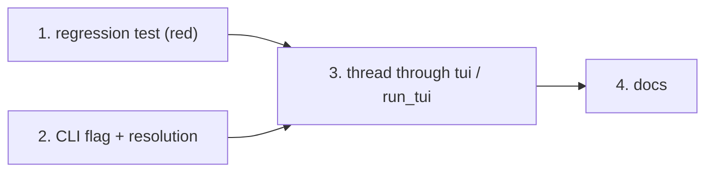

# Tasks: `tiny-harness tui` never asserts a participant, so it cannot send messages

> Derived from [`bugfix.md`](bugfix.md), [`design.md`](design.md) and
> [`testing-plan.md`](testing-plan.md). No approval gate follows this file.

## Task list

- [x] 1. Regression test first: the real `run_tui` path sends a message
  - New scenario `TUI sends a message under the asserted participant` in
    `tests/integration/embedded/test_cli_embedded.py`: patch only `HarnessApp.run_async`
    to drive the app under Textual's pilot. Call `commands.tui(settings, url=None,
    participant="alice")`, type a message, expect `COMPLETED` and `alice` in the composer placeholder.
  - Rewrite the existing embedded scenario's stand-in to accept `participant` from the
    command and connect with it (R2.2).
  - Run it on today's code and record the red (`no participant asserted`, or the
    `participant` keyword the old signature rejects).
  - _Depends on:_ none
  - _Requirements:_ R2.1, R2.2
  - _Test:_ T2 — `uv run pytest tests/integration/embedded/test_cli_embedded.py` (red)
- [x] 2. CLI: `--participant` and fail-closed resolution
  - Unit tests first in `tests/unit/service/test_cli.py`: parse `--participant`;
    `tui_participant` for flag, blank flag, OS default, `OSError`; `main` exits 2 naming
    `--participant` for a blank flag and for `OSError`.
  - Implement `--participant`, `tui_participant`, the refusal in `main` and the pass-through
    in `dispatch`.
  - _Depends on:_ none
  - _Requirements:_ R1.1, R1.3, R1.4, R1.5
  - _Test:_ T1 — `uv run pytest tests/unit/service/test_cli.py` (red→green)
- [x] 3. Thread the participant through `commands.tui` and `run_tui`
  - Unit test first: `commands.tui(settings, url="http://x", participant="alice")` calls
    `run_tui("http://x", participant="alice")`.
  - `commands.tui` takes `participant` and passes it on both paths; `run_tui` makes it a
    required `str` and drops the `or "you"` placeholder.
  - The composer placeholder reads `Enter to send as <participant>`; regenerate the TUI snapshots
    (`uv run pytest tests/ui --snapshot-update`) and check the diff is only that text.
  - _Depends on:_ 1, 2
  - _Requirements:_ R1.2, R1.6, R1.7
  - _Test:_ T1 + T2 + T5 + T6 — task 1's scenarios go green; snapshots match
- [x] 4. Docs: capability doc, README and guide
  - `docs/capabilities/surfaces-and-renderers.md`: the TUI asserts `--participant` or the
    OS user name; history row for issue-20.
  - `README.md`, `docs/guide/getting-started.md`: mention `--participant`.
  - `evidence/documentation.md`.
  - _Depends on:_ 3
  - _Requirements:_ R1
  - _Test:_ T12 — markdownlint via `uv run pre-commit run --all-files`

## Dependency graph (DAG)

## Checkpoints

- After 1: the red run is captured for `evidence/integration.md`.
- After 2 and 3: `uv run pytest tests/unit tests/integration/embedded tests/ui`.
- After 4: `uv run pre-commit run --all-files`; then the verification node runs
  `testing-plan.md`.

## Review comments
