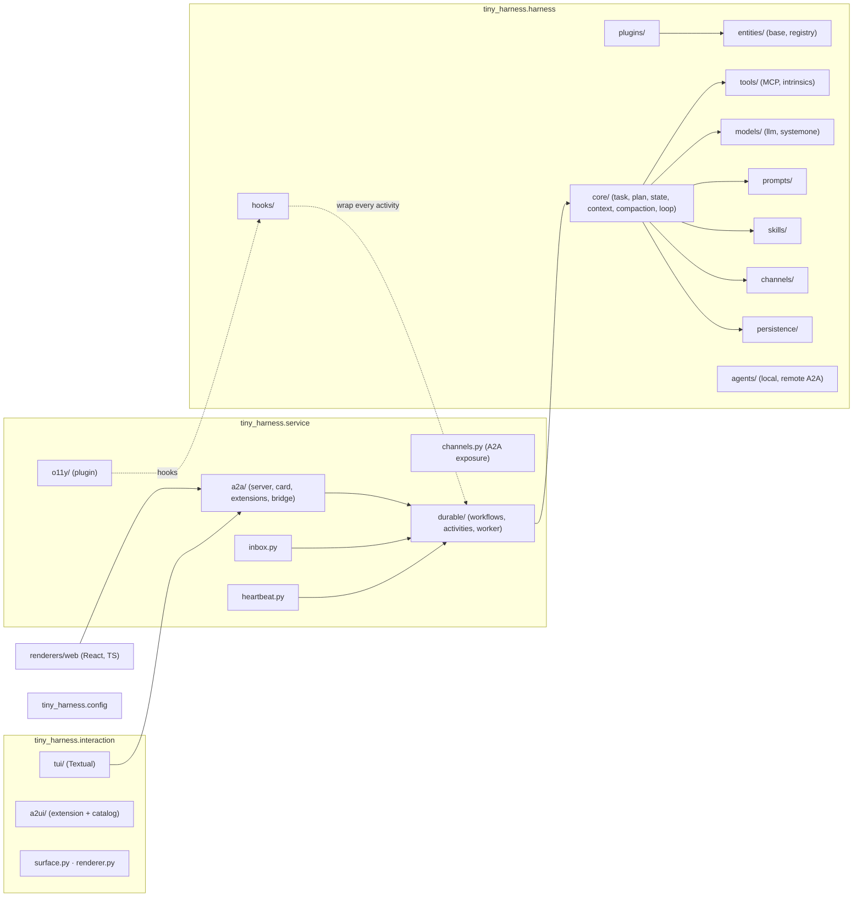
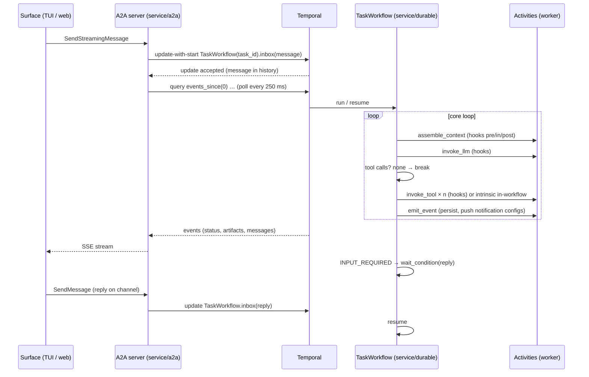
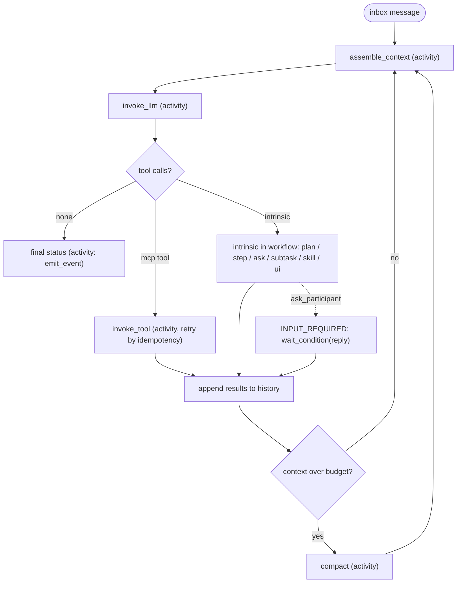
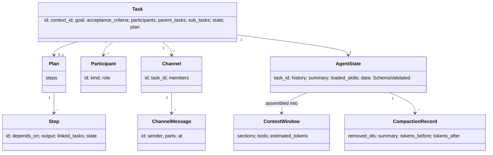

<!-- Written per the `the-loop:writing` skill: front-load each section's
     conclusion, draw it rather than describe it (3+ named parts -> a mermaid
     diagram), and keep the formal registers formal (EARS, abuse cases,
     RFC-2119, API contracts, schema descriptions). No length limit — length
     follows the change; the test is whether a sentence can come out without
     losing information. A gated section stays even when it is empty. -->

# Design: tiny-harness: A tiny agent harness

> Phase 2 of 3 (requirements → design → tasks). Derives from the approved
> requirements. MUST be reviewed and approved before moving to tasks breakdown.

## Overview

The harness is one Temporal workflow per task running sherma's five-line loop, where
everything the LLM can make the harness do is a tool call, every operation is an activity
wrapped in a hook chain, and every construct is a registry entity a plugin can replace.
The A2A server is a thin adapter: it turns a request into an update-with-start on the task
workflow and streams the workflow's events back. Two renderers, a Textual TUI and a React
web app, are plain A2A clients that also speak the A2UI extension.

Three decisions shape everything below:

- [decision-002](../../decisions/decision-002.md): Temporal owns the whole request
  lifecycle; the inbox is the workflow mailbox; the event bridge polls workflow queries.
- [decision-003](../../decisions/decision-003.md): no authentication in this release; a
  perimeter authenticates, and the A2A SDK's security schemes are the later hook.
- [decision-004](../../decisions/decision-004.md): plans, steps, help requests, sub-tasks
  and skills are tools, so the loop stays the ticket's pseudo-code.

Where the requirements name a version "current on 2026-10-09", this design pins:
`a2a-sdk` 1.2, `mcp` 2.3, `temporalio` 1.34, `openai` 3.27, `anthropic` 1.13,
`opentelemetry-sdk` 1.45, `textual` 8.2, React 19.3, and **A2UI 0.9.1** (the 1.0
candidate has no library support: `a2ui-agent-sdk` ships 0.8–0.9.1 catalogs only, so the
approver's rule picks 0.9.1). Every signature quoted below was read from the installed
packages on Python 3.14.7, where all of them import. Exact pins land in `pyproject.toml`
and `renderers/web/package.json` at implementation; the testing plan verifies them.

## Architecture

### Layers and modules

The package mirrors the diagram: one top-level module per column, one sub-module per box
(Requirement 22.1).



| Diagram box | Module | Requirement |
|---|---|---|
| Surface, Renderer, Web renderer, TUI renderer | `interaction/surface.py`, `interaction/renderer.py`, `renderers/web`, `interaction/tui` | R20 |
| Events, Inbox | `service/inbox.py` + the task workflow's mailbox | R15 |
| Heartbeat | `service/heartbeat.py` (Temporal schedule + workflow) | R16 |
| API Server (A2A) | `service/a2a/` | R14 |
| Channels (service) | `service/channels.py` (A2A extension) | R13 |
| o11y | `service/o11y/` (a plugin) | R17 |
| Durable Execution | `service/durable/` | R19 |
| Sys Prompt | `harness/prompts/` | R4 |
| Skills | `harness/skills/` | R5 |
| Tools, MCP | `harness/tools/` | R6 |
| Hooks | `harness/hooks/` | R2 |
| Models: LLM, SystemOne | `harness/models/` | R18 |
| Core Loop, Task, Plan, Step, State, Context Window Manager, Compaction | `harness/core/` | R8, R9, R10 |
| Persistence | `harness/persistence/` | R11 |
| A2A (client) | `harness/agents/remote.py` | R7 |
| Channels (harness) | `harness/channels/` | R12, R13 |
| (principles) entity, registry, plugin | `harness/entities/`, `harness/plugins/` | R1, R3 |
| (cross-cutting) configuration | `config.py` | R21 |
| Memory, Sandbox, Self-improvement | not built; `tools/` leaves a `ToolKind` slot | out of scope |

### A request's life



The dashed obligations of decision-002: the message is in Temporal history before the
server acknowledges; the executor never runs loop code; a crash of the worker leaves the
workflow to resume on another worker from history; a crash of the server leaves the
workflow running and a reconnecting surface calls `SubscribeToTask`, which re-attaches a
poller at the task's current cursor.

### The core loop



## Components & interfaces

Every signature below is a public interface under Requirement 23: the design-approval
gate reviews it, a contract test pins it, and an incompatible change fails that test. All
models are Pydantic v2 (`BaseModel`, `frozen=True` where stated); `Any` appears nowhere.

### Entities and registry (R1) — `harness/entities/`

```python
class EntityKind(StrEnum):
    PROMPT = "prompt"; SKILL = "skill"; TOOL = "tool"; LLM = "llm"; SYSTEM_ONE = "system_one"
    HOOK = "hook"; CHANNEL = "channel"; RENDERER = "renderer"; STORE = "store"; AGENT = "agent"

class EntityRef(BaseModel, frozen=True):
    """Registry reference. `version` is None for kinds that are not versioned."""
    kind: EntityKind
    id: str
    version: str | None = None          # PEP 440 specifier; "*" = latest concrete

class Protocol(StrEnum):
    A2A = "a2a"; MCP = "mcp"; HTTPS = "https"

class Entity(ABC):
    ref: EntityRef
    @property
    @abstractmethod
    def kind(self) -> EntityKind: ...

class RegistryEntry[T: Entity](BaseModel):
    ref: EntityRef
    instance: T | None = None
    factory: Callable[[], T | Awaitable[T]] | None = None
    remote: RemoteLocation | None = None    # url + protocol; exactly one of instance/factory/remote

class RemoteLocation(BaseModel, frozen=True):
    url: HttpUrl
    protocol: Protocol

class Registry:
    async def add(self, entry: RegistryEntry[Entity], *, override: bool = False) -> None
    async def get[T: Entity](self, ref: EntityRef, kind: type[T]) -> T      # EntityNotFoundError
    async def remove(self, ref: EntityRef) -> None
    def list(self, kind: EntityKind | None = None) -> Sequence[EntityRef]
```

Divergences from sherma, each deliberate: `version` is `str | None` instead of a required
string defaulting to `"*"` (Requirement 1.2); `tenant_id` is dropped (multi-tenancy is out
of scope; a later work item adds it on the ref); `RemoteLocation` is a required pair, so a
remote entry cannot lack a protocol (1.5); kind-specific `fetch` is a method of the
protocol adapter (`agents/remote.py`, `tools/mcp.py`), not of a per-kind registry
subclass, so there is one registry with typed `get`. Version resolution reuses sherma's
algorithm (`packaging.SpecifierSet`; `packaging` is already a transitive dependency of
`openai`).

### Hooks (R2) — `harness/hooks/`

```python
class Operation(StrEnum):
    REQUEST_RECEIVED = "request.received"; TASK_CREATED = "task.created"
    TASK_STATE_CHANGED = "task.state_changed"; CONTEXT_CREATED = "context.created"
    LLM_INVOKED = "llm.invoked"; TOOL_CALLS_EXTRACTED = "tool_calls.extracted"
    TOOL_INVOKED = "tool.invoked"; SYSTEM_ONE_INVOKED = "system_one.invoked"
    PLAN_CREATED = "plan.created"; STEP_STARTED = "step.started"; STEP_FINISHED = "step.finished"
    SUBTASK_SPAWNED = "subtask.spawned"; HELP_REQUESTED = "help.requested"; HELP_DECIDED = "help.decided"
    CHANNEL_SENT = "channel.sent"; CHANNEL_RECEIVED = "channel.received"
    COMPACTION = "compaction"; PERSISTENCE_READ = "persistence.read"; PERSISTENCE_WRITE = "persistence.write"
    ACTIVITY_FAILED = "activity.failed"; ACTIVITY_RETRIED = "activity.retried"
    HEARTBEAT_TICK = "heartbeat.tick"; SHUTDOWN = "shutdown"
    SKILL_LOADED = "skill.loaded"; SKILL_UNLOADED = "skill.unloaded"; AGENT_INVOKED = "agent.invoked"

class Phase(StrEnum):
    PRE = "pre"; IN = "in"; POST = "post"

class HookPoint(BaseModel, frozen=True):
    operation: Operation
    phase: Phase

class HookContext(BaseModel):
    """Base of every typed context: serialisable, carries refs not live objects."""
    task_id: str
    correlation_id: str
    participants: tuple[Participant, ...]
    entity: EntityRef | None            # the entity the operation acts on
    attempt: int = 1

class LLMInvokedPre(HookContext):  request: LLMRequest
class LLMInvokedPost(HookContext): request: LLMRequest; response: LLMResponse
class ToolInvokedPre(HookContext): call: ToolCall           # one call; veto by raising HookAbort
class ToolInvokedPost(HookContext): call: ToolCall; result: ToolResult
# … one Pre/Post pair per Operation, plus an In context for the replaceable bodies:
class PlanCreatedIn(HookContext):   task: Task; result: Plan | None = None
class HelpDecidedIn(HookContext):   need: HelpNeed; result: HelpRoute | None = None
class CompactionIn(HookContext):    window: ContextWindow; result: ContextWindow | None = None

class HookAbort(Exception):
    """Raised by an executor to cancel the operation; carries a typed reason."""
    reason: AbortReason

class HookExecutor(Protocol):
    name: str
    priority: int                                    # lower runs first; built-in defaults are 1000
    points: frozenset[HookPoint]
    async def handle(self, point: HookPoint, ctx: HookContext) -> HookContext | None: ...

class HookManager:
    def register(self, executor: HookExecutor) -> None
    async def run[C: HookContext](self, point: HookPoint, ctx: C) -> C
```

- **Semantics.** `run` passes the context through executors in `(priority, registration
  order)`; a returned context replaces the input for the next executor; `None` passes
  through (sherma's `HookManager`). `pre` replaces the operation's input, `post` its
  output, `in` its body: the built-in plugin registers the default body at priority 1000,
  so any executor with a lower priority that sets `result` wins (Requirement 2.2–2.3,
  decision-004's overridability).
- **Where hooks run.** Never in workflow code. Every operation is an activity, and the
  hook chain runs inside the activity around its body. Workflow-level transitions
  (`task.state_changed`, `step.started`, `subtask.spawned`) are dispatched through one
  `dispatch_hooks` activity. This satisfies 2.11 without sandbox pass-throughs for hook
  modules.
- **Remote executors.** `JsonRpcHookExecutor(url)` and `McpHookExecutor(server)` port
  sherma's two transports; the context is sent as JSON (Pydantic `model_dump_json`) and
  the reply parsed back into the same model. A transport error raises inside the
  activity, which fails the operation through the normal retry policy and runs
  `activity.failed`; nothing passes through silently (Requirement 2.6, reversing sherma).
- **Infrastructure providers (2.7)** are not serialisable hooks but a `Providers`
  object given to the harness at construction: `http_client_factory`, `clock`, `random`.
  Activities read them from the worker's dependency container; workflows use
  `workflow.now()` and `workflow.random()`.
- **Single tool-call veto (2.9).** `ToolInvokedPre` carries one `ToolCall`; the loop runs
  the chain once per call, so an executor can rewrite or abort that call alone.

### Plugins (R3) — `harness/plugins/`

```text
my-plugin/
  plugin.json                       # Agent Plugins 1.0.0 manifest
  skills/<name>/SKILL.md            # Agent Skills
  mcp.json                          # MCP servers
  io.github.madarauchiha-314.tiny-harness/     # the client namespace this harness reads
    hooks.json                      # [{name, priority, import_path | url | mcp: {...}, points?}]
    prompts/*.md                    # prompt entities, id = file stem
    systemprompt.md                 # optional replacement of the default system prompt
```

```python
class PluginManifest(BaseModel, extra="allow"):      # unknown top-level keys are non-fatal (spec)
    name: Annotated[str, StringConstraints(pattern=r"^[a-z0-9][a-z0-9.-]{0,63}$")]
    version: str; description: str | None = None; ...
class McpServerDef(BaseModel, extra="forbid"):        # discriminated on `type`
    type: Literal["stdio"]; command: str; args: list[str] = []; env: dict[str, str] = {}; cwd: str | None = None
class McpHttpServerDef(BaseModel, extra="forbid"):
    type: Literal["streamable-http"]; url: HttpUrl; headers: dict[str, str] = {}
class HookDef(BaseModel, extra="forbid"): ...        # exactly one of import_path | url | mcp
class Plugin(BaseModel): manifest: PluginManifest; root: Path | None; skills: ...; mcp: ...; hooks: ...; prompts: ...

class PluginLoader:
    async def load_directory(self, root: Path) -> LoadReport
    async def load(self, plugin: Plugin) -> LoadReport          # the programmatic form (3.2)
```

`LoadReport` lists each component as `loaded | skipped(reason)`; a manifest failure raises
`PluginError` before any component is touched (3.5). Path escape: every component path is
resolved and required to be inside `root` (3.6). Variable expansion is a pure function
`expand(value, {"PLUGIN_ROOT", "PLUGIN_DATA"})` applied to `args`, `env` values and `cwd`
only (3.7). The built-in plugin (`tiny_harness/builtin/`) is loaded first with the same
loader (3.9) and registers: the default system prompt, the intrinsic tools, the default
`in` bodies, the default channel, the SQLite store, the two renderers' catalogs.

### System prompt (R4) — `harness/prompts/`

`PromptEntity(ref, text: str, sections: tuple[PromptSection, ...])`. The default lives at
`tiny_harness/builtin/systemprompt.md` (4.4) and is parsed into named sections by its
`##` headings: `role`, `task`, `participants`, `tools`, `skills`, `rules`. A plugin
replaces the whole file (`systemprompt.md` in its namespace directory) or extends a
section (`prompts/<section>.md` with front matter `extends: participants`). The context
window manager renders the prompt first, from the stable sections only (4.3, 10.3).

### Skills (R5) — `harness/skills/`

```python
class SkillFrontMatter(BaseModel, extra="forbid"):
    name: Annotated[str, StringConstraints(pattern=r"^[a-z0-9]+(-[a-z0-9]+)*$", max_length=64)]
    description: Annotated[str, StringConstraints(min_length=1, max_length=1024)]
    license: str | None = None
    compatibility: Annotated[str, StringConstraints(max_length=500)] | None = None
    metadata: dict[str, str] = {}
    allowed_tools: tuple[str, ...] = ()           # `allowed-tools`, space separated
class Skill(Entity):
    front_matter: SkillFrontMatter; body: str; root: Path
    def resources(self) -> Sequence[SkillResource]  # scripts/, references/, assets/, one level deep
class SkillLoader:
    def load(self, directory: Path) -> Skill | SkillError
```

Disclosure (5.3) is three intrinsic tools: `list_skills` (names and descriptions, also
rendered into the prompt's `skills` section), `load_skill(name)` (body into the
never-compact set), `load_skill_resource(name, path)`. A loaded skill's `mcp.json` servers
and the plugin's local tools are registered on load and removed on unload through the
same `ToolRegistry` calls (5.6).

### Tools and MCP (R6) — `harness/tools/`

```python
class Idempotency(StrEnum): IDEMPOTENT = "idempotent"; NOT_IDEMPOTENT = "not_idempotent"
class Execution(StrEnum): ACTIVITY = "activity"; INTRINSIC = "intrinsic"
class ToolDefinition(BaseModel, frozen=True):
    name: str; description: str; input_schema: JsonSchema; output_schema: JsonSchema | None
    idempotency: Idempotency = Idempotency.NOT_IDEMPOTENT
    execution: Execution = Execution.ACTIVITY
class ToolCall(BaseModel, frozen=True): call_id: str; name: str; arguments: JsonObject
class ToolResult(BaseModel, frozen=True): call_id: str; content: tuple[ContentPart, ...]; is_error: bool; untrusted: Literal[True] = True
class Tool(Entity):
    definition: ToolDefinition
    async def invoke(self, call: ToolCall) -> ToolResult
class McpToolSource:
    """One MCP server; lists tools and wraps each as a Tool."""
    def __init__(self, server: McpServerDef | McpHttpServerDef, client_factory: McpClientFactory)
    async def tools(self) -> Sequence[Tool]
```

`JsonSchema` and `JsonObject` are typed recursive aliases (`dict[str, JsonValue]`), not
`Any`. `McpToolSource` maps `mcp.Tool` (`name`, `description`, `input_schema`,
`output_schema`, `annotations`) into a `ToolDefinition`; `idempotency` is `IDEMPOTENT`
only when the server's `annotations.idempotent_hint` or `read_only_hint` is true, else
`NOT_IDEMPOTENT` (6.7). The MCP client is `mcp.Client(StdioServerParameters(command,
args, env, cwd))` or `mcp.Client(url)` for streamable HTTP; its outbound spans and
`traceparent` propagation are built in. Argument validation (6.4) uses `jsonschema`,
justified below. Tool
output is wrapped in `ToolResult.untrusted` and the context window manager renders it
inside a delimited `<tool_result name=…>` block with a fixed preamble that it is data
(6.5). Schema drift (abuse case 8): `McpToolSource` records the schema hash at
registration; `invoke` re-lists before calling when the server advertises
`listChanged`, and refuses on mismatch.

### Agents, local and remote (R1.1, R7) — `harness/agents/`

```python
class Agent(Entity):
    agent_card: AgentCard
    @abstractmethod
    def send_message(self, request: Message, *, extensions: Sequence[str] = ()) -> AsyncIterator[A2AEvent]: ...
    @abstractmethod
    async def cancel_task(self, task_id: str) -> Task: ...
A2AEvent = Message | Task | TaskStatusUpdateEvent | TaskArtifactUpdateEvent
class LocalAgent(Agent):      # the harness itself: send_message = update-with-start + event bridge
class RemoteAgent(Agent):     # a2a-sdk client; card fetched from /.well-known/agent-card.json
```

`RemoteAgent` refuses a card whose `capabilities.extensions` contains `required: true`
for a URI outside `SUPPORTED_EXTENSIONS` (7.4) and sends `A2A-Extensions` only with
advertised URIs (7.5). Delegation is the intrinsic `spawn_subtask(agent, goal)`: a child
workflow `RemoteTaskWorkflow` sends the message as an activity and relays status updates
into the parent's sub-task record (7.3).

### Core: task, plan, state (R8, R9) — `harness/core/`

```python
class Role(StrEnum): ASSIGNEE = "assignee"; REPORTER = "reporter"; WATCHER = "watcher"; ADMIN = "admin"
class Participant(BaseModel, frozen=True): id: str; kind: Literal["human", "agent"]; role: Role; display_name: str
class TaskRef(BaseModel, frozen=True): task_id: str; agent: EntityRef | None   # None = this harness
class Task(BaseModel):
    id: str; context_id: str; name: str; type: str | None; goal: str; description: str
    acceptance_criteria: tuple[AcceptanceCriterion, ...]
    participants: tuple[Participant, ...]
    parent_tasks: tuple[TaskRef, ...]; sub_tasks: tuple[TaskRef, ...]
    state: TaskState                       # the A2A enum, authoritative (8.2)
    plan: Plan | None
class Step(BaseModel):
    id: str; name: str; description: str; depends_on: tuple[str, ...]
    output: str | None = None; linked_tasks: tuple[TaskRef, ...] = (); state: StepState
class Plan(BaseModel):
    steps: tuple[Step, ...]
    @model_validator(mode="after")
    def acyclic(self) -> Self: ...         # PlanCycleError (9.5)
```

The A2A `Task` carries only id, context, status, artifacts and history; the rest travels
in the task extension (8.3): `Task.metadata["io.github.madarauchiha-314.tiny-harness/task"]`
holds the JSON of `TaskExtensionData(goal, description, acceptance_criteria,
participants, parent_tasks, sub_tasks, plan)` and the same object is emitted as a
`DataPart` of media type `application/vnd.tiny-harness.task+json` on every status update
whose payload changed, so renderers need no second call (9.6).

### Context window manager and compaction (R10) — `harness/core/context.py`

```python
class Stability(StrEnum): STATIC = "static"; PER_TASK = "per_task"; PER_TURN = "per_turn"
class ContextSection(BaseModel, frozen=True):
    name: str; stability: Stability; never_compact: bool; content: str
class ContextWindow(BaseModel, frozen=True):
    sections: tuple[ContextSection, ...]   # in render order
    tools: tuple[ToolDefinition, ...]
    estimated_tokens: int
class ContextWindowManager:
    order: tuple[str, ...] = ("system_prompt", "participants", "skills_index", "task", "plan", "state_summary", "history", "tool_results")
    async def assemble(self, state: AgentState) -> ContextWindow
    def needs_compaction(self, window: ContextWindow, model: LLMModelInfo) -> bool   # > fraction (default 0.75)
```

Order is by stability: `system_prompt`, `participants`, `skills_index` and the tool
definitions are `STATIC` for the task and form the cached prefix; `task` and `plan` are
`PER_TASK`; `history`, `state_summary` and `tool_results` are `PER_TURN`. For OpenAI the
adapter sends the static sections as `instructions`, the rest as `input`, with
`prompt_cache_key = task_id` and `store=False`; the static prefix of the demo prompt is
measured at implementation and must exceed the provider's 1,024-token minimum (10.3).
Token estimation uses the previous turn's `usage.input_tokens` plus a 4-characters-per-token
estimate for the delta; no tokenizer dependency. Compaction is the `compaction.in` body:
summarise the oldest `PER_TURN` history with the LLM into one `state_summary` section,
leave every `never_compact` section intact, and record `CompactionRecord(removed_ids,
summary, tokens_before, tokens_after)` on the task (10.6).

### Persistence (R11) — `harness/persistence/`

```python
class Store(Entity):
    async def put(self, record: Record) -> None
    async def get[R: Record](self, kind: type[R], id: str) -> R | None
    async def query[R: Record](self, kind: type[R], where: Filter) -> Sequence[R]
Record = TaskRecord | PlanRecord | StateRecord | ChannelMessageRecord | InboxAuditRecord | CompactionRecord
```

The default is `SqliteStore` on the standard library `sqlite3`, one table per record kind
with a JSON column and indexed id, context and timestamp columns, run through
`asyncio.to_thread`. Limits: single process writer, no replication; production deployments
plug a store entity. What Temporal already holds (the running workflow's state, history,
activity results) is not duplicated; the store holds what must be readable without the
workflow: terminal task records, channel messages, compaction records, inbox audit rows
(11.5). Secrets never enter a `Record` because `Record` fields are typed and none is a
credential (11.4).

### Participants and channels (R12, R13) — `harness/channels/`

```python
class Channel(Entity):
    id: str; task_id: str; members: frozenset[str]          # participant ids
    async def send(self, message: ChannelMessage) -> None
    def receive(self) -> AsyncIterator[ChannelMessage]      # pull-based media implement this
    pull: bool                                              # True → heartbeat polls it
class ChannelMessage(BaseModel, frozen=True): id: str; channel_id: str; sender: str; parts: tuple[ContentPart, ...]; at: datetime
class HelpNeed(BaseModel): question: str; options: tuple[str, ...]; blocking_work: bool | None
class HelpRoute(StrEnum): ASK = "ask"; CREATE_TASK = "create_task"
```

The default channel medium is A2A itself (`A2AChannel`): a `send` emits an A2A `Message`
event on the task carrying the channel extension data part; a participant sends by calling
`SendMessage` on the task with the same part. The channel extension
(`…/tiny-harness/channel`) defines `ChannelMessageData(channel_id, sender, text, parts)`
and the membership rule (13.3). `help.decided.in` default body: route `ASK` when the
need's options fit one message and no acceptance criterion depends on another
participant's work, else `CREATE_TASK`; an executor can replace it (12.4). `ASK` is the
intrinsic `ask_participant`: it emits the help message, sets `INPUT_REQUIRED`, and the
workflow `wait_condition`s on the reply update (12.2, 12.5, 12.6). `CREATE_TASK` is the
intrinsic `create_task_for_participant`: a new task workflow assigned to that participant,
linked as a sub-task (12.3).

### A2A server (R14) — `service/a2a/`

```python
class HarnessExecutor(AgentExecutor):           # a2a-sdk
    async def execute(self, context: RequestContext, event_queue: EventQueue) -> None
    async def cancel(self, context: RequestContext, event_queue: EventQueue) -> None
def build_agent_card(agent: LocalAgent, config: ServerConfig) -> AgentCard     # from the entity (14.2)
SUPPORTED_EXTENSIONS: Final = (TASK_EXT_URI, CHANNEL_EXT_URI, A2UI_EXT_URI)
class EventBridge(Protocol):
    def events(self, task_id: str, cursor: int) -> AsyncIterator[tuple[int, A2AEvent]]
class PollingEventBridge(EventBridge): interval: timedelta = 250 ms   # queries TaskWorkflow.events_since
def create_app(config: ServerConfig) -> Starlette   # mounts JSON-RPC, REST and agent-card routes
```

`a2a-sdk` 1.2 facts the adapter is built on: types are protobuf messages (`a2a.types`,
package `a2a.v1`; `Part` is one message with a `text | raw | url | data` oneof, built with
`a2a.helpers.proto_helpers.new_data_part`); there is no application wrapper, so
`create_app` mounts `create_agent_card_routes(card)`, `create_jsonrpc_routes(handler,
rpc_url="/")` and `create_rest_routes(handler)` on a Starlette app; the handler is
`DefaultRequestHandler(agent_executor=HarnessExecutor, task_store=TemporalTaskStore,
agent_card=card, push_config_store=StorePushConfigStore, push_sender=
BasePushNotificationSender)`; every dispatcher method requires `A2A-Version: 1.0` (a
missing header is read as 0.3 and refused), and both renderers send it.

`execute`: validate the message (size limit, parts), run `request.received` hooks (an
activity, so the hook chain is the same everywhere), then
`client.execute_update_with_start_workflow(TaskWorkflow.inbox, message,
start_workflow_operation=WithStartWorkflowOperation(TaskWorkflow.run, start, id=task_id,
task_queue=…, id_conflict_policy=USE_EXISTING))`, then stream from `EventBridge` until a
final event or client disconnect, mapping each to `TaskUpdater` calls (`submit`,
`start_work`, `update_status`, `add_artifact`, `requires_input`, `complete`, `failed`,
`cancel`) so the SDK's streaming contract holds (14.5, 14.7). `cancel`: signal
`TaskWorkflow.cancel` and emit `CANCELED` (14.6). `GetTask` and `ListTasks` are served by
`TemporalTaskStore(TaskStore)` (`save`, `get`, `delete` with a `ServerCallContext`):
`get` queries the workflow's `task()` (or the `Store` for terminal tasks), `list` uses
Temporal visibility with search attributes `A2AContextId` and `A2ATaskState`. Push
notification configs live in the `Store` behind `PushNotificationConfigStore` and are
delivered by the `emit_event` activity through `BasePushNotificationSender`. The
`A2A-Extensions` header is parsed by the SDK into `RequestContext.requested_extensions`;
`HarnessExecutor` rejects a request whose set contains a URI outside
`SUPPORTED_EXTENSIONS` with `UnsupportedOperationError` before intake (14.4). A
multi-process deployment replaces `PollingEventBridge` with an implementation of the
SDK's own `TaskEventStream` seam (`DefaultRequestHandler(event_stream=…)`); the default
stays in-process. Extension URIs are under
`https://madarauchiha-314.github.io/tiny-harness/a2a/ext/<name>/v1`, the docs site the
owner controls; their JSON schemas live beside the docs and are what the contract tests
validate (23.2). No security scheme is declared (decision-003); the later integration
point is a `ServerCallContextBuilder` subclass reading `request.scope["user"]` into
`ServerCallContext.user`, which the SDK already threads into every handler.

### Inbox and events (R15) — `service/inbox.py`

The inbox is the task workflow's mailbox plus an audit row. `IntakeActivity` runs inside
`execute` before update-with-start: size and rate checks, `request.received` hooks, an
`InboxAuditRecord` to the store. The four A2A event payloads are accepted on
`SendMessage`: a `Message` is the normal case; a `Task` payload creates or updates the
task extension data; `TaskStatusUpdateEvent` and `TaskArtifactUpdateEvent` from a remote
agent are routed to the sub-task record that references that remote task (15.1).
`returnImmediately: true` returns the `Task` as soon as the update is accepted (15.2).
Processing policy (15.3): the workflow's `inbox` update appends to a mailbox list; the loop
drains the mailbox at the top of each iteration (so a message to an executing task is
seen when the current step finishes) and `wait_condition` wakes an idle task at once;
the `inbox.policy` executor can mark a message `interrupt`, which cancels the in-flight
activity and re-enters the loop (15.4). Unprocessed items survive restarts because they
are workflow state (15.5).

### Heartbeat (R16) — `service/heartbeat.py`

A Temporal **schedule** (`tiny-harness-heartbeat`, interval from config, default 30 s)
starts `HeartbeatWorkflow`, which runs two activities: `poll_channels` (every channel with
`pull=True`, forwarding found messages as updates to their task workflows) and
`monitor_snapshot` (lists open task workflows through visibility, runs
`heartbeat.tick` hooks with the snapshot, exposes it on `GET /_monitor` of the server
for the API layer). A failed tick is one failed workflow run; the schedule fires the next
on time (16.4). The schedule rather than a process loop because it survives the server
process and is visible in Temporal (16.5).

### Observability (R17) — `service/o11y/`

A plugin whose single `HookExecutor` subscribes to every `pre` and `post` point: it opens
a span on `pre` (name `{gen_ai.operation.name} {model}` for LLM calls, `execute_tool
{name}` for tools, `invoke_agent {name}` for the task), closes it on `post` with usage
attributes, and writes one structured log record per operation with task id, correlation
id and phase at the same level in every environment (17.1–17.3). Trace context crosses
Temporal through `temporalio.contrib.opentelemetry.TracingInterceptor` and MCP through
the SDK's built-in OTel middleware (17.4). Exporter: OTLP; a Langfuse endpoint and key
pair are configuration (17.5). A `Redactor` runs over every attribute and log field
before export: regexes for bearer tokens, `sk-` and `tmprl`-style keys, `Authorization`
headers, plus any value equal to a configured secret (17.6, abuse case 6).

### Models (R18) — `harness/models/`

```python
class LLMRequest(BaseModel, frozen=True):
    instructions: str                                  # the static prefix
    input: tuple[InputItem, ...]                       # messages, tool results
    tools: tuple[ToolDefinition, ...]
    response_format: JsonSchema | None = None
    cache_key: str | None = None
class LLMResponse(BaseModel, frozen=True):
    output_text: str; tool_calls: tuple[ToolCall, ...]; usage: Usage; model: str; finish: FinishReason
class Usage(BaseModel, frozen=True): input_tokens: int; cached_tokens: int; output_tokens: int
class LLM(Entity):
    info: LLMModelInfo                                  # context window size, provider
    async def invoke(self, request: LLMRequest) -> LLMResponse
    def stream(self, request: LLMRequest) -> AsyncIterator[LLMStreamEvent]
class OpenAILLM(LLM):    # responses.create(model="gpt-6.1-sol", instructions, input, tools, prompt_cache_key, store=False); AsyncOpenAI(max_retries=0); usage.input_tokens_details.cached_tokens
class AnthropicLLM(LLM): # Messages API, cache_control on the static prefix; configurable, not exercised e2e

class NoulQuestion(BaseModel, frozen=True):   kind: Literal["noul"]; instructions: str
class ChoiceQuestion(BaseModel, frozen=True): kind: Literal["choice"]; instructions: str; options: Mapping[str, str]
class ScoreQuestion(BaseModel, frozen=True):  kind: Literal["score"]; instructions: str; levels: tuple[str, ...]
Question = Annotated[NoulQuestion | ChoiceQuestion | ScoreQuestion, Field(discriminator="kind")]
class NoulAnswer(BaseModel, frozen=True):   kind: Literal["noul"]; probability: float
class ChoiceAnswer(BaseModel, frozen=True): kind: Literal["choice"]; choice: str; confidence: float; probabilities: Mapping[str, float]
class ScoreAnswer(BaseModel, frozen=True):  kind: Literal["score"]; score: float; confidence: float; probabilities: Mapping[int, float]
Answer = Annotated[NoulAnswer | ChoiceAnswer | ScoreAnswer, Field(discriminator="kind")]
class SystemOne(Entity):
    async def decide(self, state: str, questions: Mapping[str, Question], *, timeout: timedelta) -> Mapping[str, Answer]
class FakeSystemOne(SystemOne): ...            # deterministic, for tests; the only implementation shipped
```

The System One interface mirrors `typesafe-sdk`'s shapes one to one (`Noul`, `Choice`,
`Score` questions; `NoulAnswer.noul`, `ChoiceAnswer.choice/confidence/probabilities`,
`ScoreAnswer.score/confidence/probabilities`; `AsyncTypeSafeClient.system_one(state,
questions)`), so the later Jev adapter is a field-for-field mapping with no interface
change (18.2). The loop does not call it in this work
item; `help.decided.in` uses the LLM with structured output.

### Durable execution (R19) — `service/durable/`

```python
@workflow.defn
class TaskWorkflow:
    @workflow.run
    async def run(self, start: TaskStart) -> TaskRecord
    @workflow.update
    async def inbox(self, message: InboundMessage) -> InboxReceipt      # the inbox (15)
    @workflow.signal
    async def cancel(self, reason: str) -> None
    @workflow.query
    def task(self) -> Task
    @workflow.query
    def events_since(self, cursor: int) -> EventPage                   # the event bridge reads this
@workflow.defn
class RemoteTaskWorkflow: ...     # one delegated remote task (7.3)
@workflow.defn
class HeartbeatWorkflow: ...

# activities (service/durable/activities.py), each a hook-wrapped body:
assemble_context, invoke_llm, invoke_tool, compact, persist, send_channel_message,
emit_event, dispatch_hooks, run_remote_agent_turn, poll_channels, monitor_snapshot, intake
```

- **Retry policy (19.3, 19.5).** `RetryPolicies` is configuration keyed by activity name
  with Temporal's fields (`initial_interval`, `backoff_coefficient`, `maximum_interval`,
  `maximum_attempts`, `non_retryable_error_types`); `activity.retried.pre` can rewrite
  the policy of the next attempt. `invoke_tool` reads the tool's `Idempotency`: a
  `NOT_IDEMPOTENT` tool runs with `maximum_attempts=1` and a `ToolNotRetriedError`
  surfaces to the loop as an error `ToolResult`, which a hook can override.
- **Failure detection (19.6).** Every activity has `start_to_close_timeout`; LLM and tool
  activities heartbeat every 10 s with `heartbeat_timeout=30 s`.
- **Replay safety (19.2).** Activities return typed results recorded in history; the
  workflow never calls a model or a tool directly. Tool-call extraction is a pure function
  of the recorded `LLMResponse`.
- **Multi-turn (19.7).** The `inbox` update appends to the mailbox; the loop awaits
  `workflow.wait_condition(lambda: self.mailbox)` while `INPUT_REQUIRED`, consuming no
  worker slot.
- **History bound (19.8).** After each loop iteration, if the workflow's current history
  length (`workflow.info().get_current_history_length()`) exceeds the configured bound
  (default 10,000 events) the workflow `continue_as_new`s with a `TaskStart` carrying its
  compacted state.
- **Sandbox (19.9).** Workflow modules import only `tiny_harness.harness.core` models and
  `pydantic`; `pydantic` is passed through (`workflow.unsafe.imports_passed_through`) as
  Temporal's Pydantic integration requires; nothing else. Payloads use
  `pydantic_data_converter` (19.10).
- **Connection (19.11).** `Client.connect(address, namespace=…, api_key=…, tls=True,
  data_converter=pydantic_data_converter, interceptors=[TracingInterceptor()])` from
  `TemporalConfig`; the worker and the server share one client. `temporalio`'s
  `openai-agents` and `google-adk` extras pin `mcp<2` and are never installed.
- **Lifecycle (19.12, decision-002).** `execute` → `IntakeActivity` → update-with-start →
  bridge. Heartbeat is a schedule. Channel delivery and persistence are activities.

### Surfaces and renderers (R20) — `interaction/`, `renderers/web`

```python
class Modality(StrEnum): TEXT = "text"
class Surface(Entity): modality: Modality; renderer: EntityRef
class Renderer(Entity):
    supported: frozenset[str]                           # media types / part kinds it renders
    def render(self, event: A2AEvent) -> RenderPlan     # placeholder for unsupported kinds (20.4)
```

Both renderers are A2A clients of the server and nothing else (20.2): the TUI uses
`a2a-sdk`'s client over JSON-RPC with streaming; the web app uses the REST binding with
SSE. Each keeps a `SubscribeToTask` stream per open task, so two surfaces see the same
events (20.3). Layout, states and interactions are the HTML prototypes in the UI/UX
inventory below. A2UI (20.5–20.6): **version 0.9.1**, extension URI
`https://a2ui.org/a2a-extension/a2ui/v0.9.1`, parts of media type
`application/a2ui+json`, card params `supportedCatalogIds` and `acceptsInlineCatalogs`.
The 1.0 candidate has no library support (`a2ui-agent-sdk` 0.2.4 bundles 0.8, 0.9 and
0.9.1 catalogs only), which is the approver's stated condition for staying on 0.9.
`a2ui-agent-sdk` itself is **not a dependency**: its A2A part helpers import the 0.3.x
pydantic types and fail against `a2a-sdk` 1.2, and it drags in `google-adk` and
`google-genai`. The harness vendors the 0.9.1 `catalog.json`, `common_types.json` and
`server_to_client.json` (Apache-2.0, with attribution) under `interaction/a2ui/schemas/`
and validates with `jsonschema`. `interaction/a2ui/` holds `UiMessage` models for the four
server messages (`createSurface`, `updateComponents`, `updateDataModel`,
`deleteSurface`) and the two client messages (`action`, `error`), the `emit_ui`
intrinsic tool, and action intake (abuse case 9: a surface or component id the task did
not create is discarded). Each renderer implements the basic catalog on its own
widget set: Textual widgets in `interaction/tui/a2ui.py` (Video and AudioPlayer render
the placeholder), React components in `renderers/web/src/a2ui/` (no React renderer
exists upstream; the Lit renderer is kept as a reference only). MCP Apps: `Renderer.
supported` can declare `text/html;profile=mcp-app` later; nothing else is built (20.7).

### Configuration (R21) — `config.py`

```python
class Settings(BaseSettings, extra="forbid"):
    temporal: TemporalConfig            # address, namespace, api_key: SecretStr (env TEMPORAL_API_KEY)
    openai: OpenAIConfig                # api_key: SecretStr (OPENAI_API_KEY), model = "gpt-6.1-sol"
    anthropic: AnthropicConfig | None
    server: ServerConfig                # bind, base_url, extensions, max_request_bytes, rate limits
    heartbeat: HeartbeatConfig          # interval
    plugins: tuple[Path, ...]
    store: StoreConfig                  # sqlite path
    o11y: O11yConfig                    # otlp endpoint, langfuse keys: SecretStr | None
    retries: RetryPolicies
```

`pydantic-settings` reads environment variables; a missing required secret fails
`Settings()` at startup with the variable name (21.2); unknown keys are rejected (21.3).
The e2e `.env.example` documents the two `secret-tool` lookups (21.1).

### Requirement → component map

| Requirement | Components |
|---|---|
| R1 | `entities/` (`EntityRef`, `Registry`, `RemoteLocation`) |
| R2 | `hooks/` (`HookPoint`, contexts, `HookManager`, local, JSON-RPC and MCP executors), activity wrapper |
| R3 | `plugins/` (`PluginLoader`, manifest models, namespace dir), `builtin/` |
| R4 | `prompts/`, `builtin/systemprompt.md` |
| R5 | `skills/` (`SkillLoader`, `Skill`), skill intrinsics |
| R6 | `tools/` (`Tool`, `McpToolSource`, validation, idempotency) |
| R7 | `agents/remote.py`, `RemoteTaskWorkflow`, `spawn_subtask` |
| R8, R9 | `core/task.py`, `core/plan.py`, task extension |
| R10 | `core/context.py`, `core/compaction.py` |
| R11 | `persistence/` (`Store`, `SqliteStore`) |
| R12, R13 | `channels/`, `A2AChannel`, channel extension, `ask_participant`, `create_task_for_participant` |
| R14 | `service/a2a/` (`HarnessExecutor`, card builder, `EventBridge`, `TemporalTaskStore`, middleware) |
| R15 | `service/inbox.py`, `TaskWorkflow.inbox` |
| R16 | `service/heartbeat.py`, `HeartbeatWorkflow`, schedule |
| R17 | `service/o11y/` plugin, `Redactor` |
| R18 | `models/` (`LLM`, `OpenAILLM`, `AnthropicLLM`, `SystemOne`, `FakeSystemOne`) |
| R19 | `service/durable/` (workflows, activities, worker, retry policies) |
| R20 | `interaction/` (surface, renderer, `tui/`, `a2ui/`), `renderers/web` |
| R21 | `config.py`, `.env.example` |
| R22 | package layout above; pyright strict; boundary parsers in each adapter |
| R23 | `tests/contract/` per interface; JSON schemas for extensions |
| R24 | `examples/demo/` (plugin with two MCP tools, demo script), evidence |

## UI/UX design

| Artifact | Type | Location / link | Covers (screen · requirement) | Status |
|----------|------|-----------------|-------------------------------|--------|
| `design/web-renderer.html` | html-prototype | `docs/specs/issue-3/design/web-renderer.html` (open the file in a browser; not routed by the docs site) | Web chat: event stream, tool calls, A2UI card with ChoicePicker and Button, help request, placeholder, task/plan/trace pane · R20, R12, R24 | draft |
| `design/tui-renderer.html` | html-prototype | `docs/specs/issue-3/design/tui-renderer.html` (open the file in a browser; not routed by the docs site) | TUI: the same states as Textual panes and key bindings · R20, R12, R24 | draft |

Screenshots of the drafts (rendered with headless Chromium, both themes, phone width):
`design/screenshots/web-renderer-{light,dark,phone}.png`,
`design/screenshots/tui-renderer-{light,dark,phone}.png`.

- **Flows & states.** One task from submission to `INPUT_REQUIRED` and back: user message
  → status update → tool calls → agent message → A2UI card → help request → reply on the
  channel → `WORKING`. Both prototypes simulate the reply and the A2UI action locally.
  States shown: `WORKING`, `INPUT_REQUIRED`; the pill also renders `COMPLETED`,
  `FAILED`, `CANCELED`, `REJECTED`, `AUTH_REQUIRED` with the same component.
- **Design system / tokens.** Six colour tokens per theme (`--bg`, `--panel`/`--term`,
  `--fg`, `--muted`, `--rule`, `--accent`) plus `--warn`/`--err` for task states, defined
  on `:root` with dark overrides under `prefers-color-scheme` and `data-theme`. System
  sans and monospace stacks; no web fonts, no external assets. The web app reuses the
  tokens as CSS variables; the TUI maps them to a Textual theme.
- **Accessibility & responsiveness.** Web: two panes above 820 px, stacked below; tab
  list and radio group semantics with `aria-selected`/`aria-pressed`; visible focus
  rings; 16 px gutters; no horizontal scroll at 400 px. TUI: every action has a key
  (Tab, F2, Enter, ^C, q); the A2UI ChoicePicker is a Textual `RadioSet`; unrenderable
  parts are announced as text.
- **Evidence.** The screenshots above are of the drafts; the locked set is re-captured
  when the designer (the owner, who holds the role) signs off at `design-approval`.

## Data models

Models are Pydantic v2, `extra="forbid"` unless the specification says unknown keys are
allowed, and shared by workflows (through the Pydantic data converter), the store (JSON
columns), the extensions (JSON schemas generated by `model_json_schema()` and committed
under `docs/a2a/ext/`) and the renderers (TypeScript types generated from the same
schemas at build time, `json-schema-to-typescript`).



- **Agent state (10.1).** `AgentState.data` is `SchemaValidated`: a JSON object plus the
  `(schema_id, schema)` a plugin registered for a named subset; writes to that subset are
  validated by `jsonschema` before the activity returns.
- **Task extension schema** (`application/vnd.tiny-harness.task+json`):
  `TaskExtensionData` as above, `additionalProperties: false`.
- **Channel extension schema** (`application/vnd.tiny-harness.channel+json`):
  `ChannelMessageData(channel_id, sender, text, parts, kind: "message" | "help_request" | "help_reply")`.
- **Temporal search attributes.** `A2AContextId` (keyword), `A2ATaskState` (keyword),
  `TinyHarnessAgent` (keyword), registered by the worker at startup.
- **Store tables.** `tasks`, `plans`, `channel_messages`, `inbox_audit`, `compactions`,
  `push_configs`; each `(id TEXT PRIMARY KEY, context_id TEXT, created_at TEXT, json
  TEXT)` with indexes on `context_id` and `created_at`.

## Error handling

One typed hierarchy, every error carrying a machine-readable `code` and never a secret:

```text
TinyHarnessError
├── EntityNotFoundError, VersionNotFoundError, RegistryConflictError       (R1)
├── HookAbort(reason), HookTransportError                                   (R2)
├── PluginError(manifest_path), ComponentSkipped(reason)                     (R3)
├── SkillError                                                               (R5)
├── ToolNotFoundError, ToolArgumentError(validation), ToolNotRetriedError    (R6, R19)
├── PlanCycleError                                                           (R9)
├── StoreWriteError                                                          (R11)
├── ChannelMembershipError                                                   (R13)
├── UnsupportedExtensionError                                                (R7, R14)
├── ConfigError(variable)                                                    (R21)
└── RetryableProviderError(provider, status)                                 (R18)
```

| Where | Failure | Surfaced as |
|---|---|---|
| Activity body | provider 429/5xx, network | `RetryableProviderError` → Temporal retry per policy; `activity.failed`/`activity.retried` hooks |
| Activity body | `HookAbort` | `ApplicationError(non_retryable=True)` → the loop records the abort; task `FAILED` or the step marked refused, per `reason` |
| `invoke_tool` | tool not in registry, arguments invalid | error `ToolResult` back to the LLM, no retry |
| `invoke_tool` | non-idempotent tool failed | `ToolNotRetriedError` as error `ToolResult`; a hook may re-issue |
| Workflow | cancel signal | activities cancelled, `CANCELED` emitted, store updated |
| Server | malformed or oversized request | A2A JSON-RPC error before intake, nothing persisted |
| Server | unadvertised extension | A2A `UnsupportedOperationError` |
| Startup | missing secret, unknown key | `ConfigError` with the variable name, process exits non-zero |
| Heartbeat | tick failure | workflow run fails, logged, schedule continues |

Every row logs through the o11y plugin at the same level in development and production
(`reference/observability.md`): one structured record with `task_id`, `correlation_id`,
`operation`, `phase`, `code`, and the span records the exception.

## Security design

Each boundary from the requirements' Security considerations, the mechanism, and the test
that proves it. Abuse cases are numbered as in `requirements.md`.

- **AuthN/AuthZ.** None in the harness (decision-003): the perimeter authenticates.
  Participant identity on a message is `Message.metadata["participant_id"]`, self-asserted;
  `ChannelMembershipError` enforces membership against the task's participant list
  (abuse case 4), and a privileged operation (role change, cancel by a non-participant)
  requires the asserted participant to hold `ADMIN` or be the reporter, else it is denied
  and recorded. The deployment guide names the perimeter requirement; the agent card
  declares no security scheme, so no client is told it can authenticate.
- **Input validation & injection surfaces.**
  - *A2A ingress*: the SDK parses the protocol types; `IntakeActivity` enforces
    `max_request_bytes` (default 1 MiB) and a token-bucket rate limit per peer address
    before anything is persisted (abuse case 7).
  - *Prompt injection* (abuse case 2): tool results, remote-agent messages, channel
    messages and A2UI actions are rendered only inside delimited untrusted blocks with a
    fixed preamble; the only effect text can have is through a tool call the LLM emits,
    which must name a registered tool and validate against its schema (`ToolNotFoundError`,
    `ToolArgumentError`); role changes exist only as the `set_participant_role` intrinsic,
    which checks the asserted role as above.
  - *Command injection* (abuse case 3): MCP `command` is never expanded; `args`, `env`,
    `cwd` expand two fixed variables; subprocesses are started with an argument vector,
    never a shell; `cwd` and every component path must resolve inside the plugin root.
  - *Path traversal*: same resolution rule for skills' `references/`, `assets/`,
    `scripts/` (one level deep, inside the skill directory).
  - *Schema drift* (abuse case 8): `McpToolSource` compares the schema hash at call time.
  - *A2UI actions* (abuse case 9): an action's `surfaceId` and `sourceComponentId` must
    exist in the task's emitted surfaces; otherwise discarded and logged.
  - *Remote agent cards* (abuse case 5): a card with an unknown required extension or any
    declared security scheme is refused by `RemoteAgent` until a later work item adds
    credential handling; nothing is sent.
- **Secrets handling.** All secrets are `SecretStr` in `Settings`, read from the
  environment; `Record` has no credential field; the `Redactor` runs over log fields,
  span attributes and every activity payload that could carry free text (tool arguments
  and results) before Temporal serialises it (abuse case 6). Secrets never appear in the
  context window: the LLM request carries no configuration.
- **Least privilege.** The worker needs the Temporal namespace, the provider key and the
  store file; the server needs the Temporal namespace and the store file, no provider
  key; MCP subprocesses inherit only `PLUGIN_ROOT`, `PLUGIN_DATA` and the `env` the
  manifest declares, not the parent environment; renderers hold no secret at all.
- **Fail-closed behaviour.** Missing secret or Temporal config: `ConfigError`, exit.
  Unresolvable entity, unknown hook point, manifest error: typed error, no default.
  Non-idempotent tool with an unclear policy: `maximum_attempts=1`. Ambiguous participant
  role: deny. Unreachable remote hook: activity failure through the retry policy, never
  pass-through. No perimeter: documented as the operator's responsibility.
- **Abuse-case coverage.**

| Abuse case | Mechanism | Negative test (testing-plan row: security) |
|---|---|---|
| 1 unauthenticated client | perimeter (out of scope) | documented; no harness test |
| 2 injected instructions | untrusted blocks + registry + schema + role check | `test_injected_tool_call_not_executed`, `test_role_change_requires_admin` |
| 3 unregistered tool / path escape / `command` expansion | `ToolNotFoundError`, path resolution, no expansion in `command` | `test_unknown_tool_rejected`, `test_plugin_path_escape_rejected`, `test_command_not_expanded` |
| 4 non-member on channel / foreign task | membership check, uniform error | `test_non_member_rejected_without_task_existence` |
| 5 unknown required extension / security scheme on remote card | `RemoteAgent` refusal | `test_remote_card_with_unknown_required_ext_refused` |
| 6 credential-shaped values | `Redactor` on logs, spans, payloads | `test_redactor_masks_tokens` |
| 7 oversized / rate-limited request | `IntakeActivity` limits before persistence | `test_oversized_request_not_persisted` |
| 8 tool schema drift | schema hash check | `test_schema_drift_refuses_invoke` |
| 9 forged A2UI action ids | surface/component registry | `test_unknown_a2ui_action_discarded` |

## Testing strategy

Unit tests cover each entity, loader, model adapter and the context window manager with
fakes (`FakeLLM`, `FakeSystemOne`, an in-memory `Store`, a scripted MCP server over
stdio), asserting through public interfaces only. Contract tests under `tests/contract/`
pin every signature in this document: the entity and hook interfaces (an `inspect`-based
snapshot of the public API), the hook-context and configuration JSON schemas, and the two
A2A extension schemas validated against committed fixtures. Integration tests run the
workflows in Temporal's time-skipping test environment with real activities against the
fakes, the A2A server in-process with the `a2a-sdk` client, and the plugin loader against
fixture plugins; each carries a Gherkin docstring (`Feature: Durable core loop`,
`Scenario: a worker crash mid-activity resumes without a second LLM call`; `Feature: A2A
server`, `Scenario: an unadvertised extension is rejected`; `Feature: Help requests`,
`Scenario: a reply on the channel resumes an INPUT_REQUIRED task`). The security table
above is the abuse-case suite. The e2e demo of Requirement 24 runs against Temporal Cloud
and `gpt-6.1-sol` with both renderers, captures screenshots and the multi-turn flow, and
kills the worker mid-task; its trace is the evidence that no LLM or tool call ran twice.
Which types apply, the environment and the evidence plan are `testing-plan.md`'s.

## Trade-offs & decisions

- **Temporal everywhere** (decision-002): durability and one mechanism, at the cost of
  Temporal as a hard dependency for local development and ~250 ms streaming latency.
- **No authentication** (decision-003): speed and enterprise fit, at the cost of a
  self-asserted participant identity until the next work item.
- **Intrinsics as tools** (decision-004): a five-line loop and one enforcement point, at
  the cost of relying on the LLM to call `create_plan` rather than forcing a plan phase;
  the `plan.created.in` default runs on the first turn of a task so a plan always exists.
- **Own loaders for Skills and Plugins**: the reference implementations are demo-grade
  or absent; two small parsers against published schemas cost less than an untyped
  dependency.
- **SQLite by default**: standard library, zero setup; replaced by a store entity in
  production.
- **Polling event bridge**: no broker; a plugin can replace it.
- **TypeScript types generated from the Python schemas**: one source of truth for the
  extensions across both renderers.
- **A2UI 0.9.1 with vendored schemas**: follows the approver's rule and avoids a
  dependency that breaks against `a2a-sdk` 1.x; moving to 1.0 later is a schema swap and
  a URI change.

### sherma: reused and replaced

| sherma | tiny-harness | Why |
|---|---|---|
| `Agent.send_message` / `cancel_task` / agent card | reused as `Agent` | ticket's chosen API |
| `Registry[T]`, `RegistryEntry[T]`, PEP 440 resolution | reused; one registry, typed `get`, `version: str \| None`, no `tenant_id` | R1.2, scope |
| `HookManager` chain, context-replacement semantics | reused | R2.5 |
| 20 hook names | kept where the lifecycle matches, renamed to `operation.phase`, extended | R2.1, R2.8 |
| remote hooks: JSON-RPC and MCP | reused; pass-through on error removed | R2.6 |
| `before_tool_call` on the tool set | per-call `ToolInvokedPre` | R2.9 |
| A2A executor (`a2a-sdk` 0.3) | ported to 1.x; card built from the entity; streaming | R14 |
| LangGraph graph, declarative YAML, CEL | not carried over | the loop is the ticket's pseudo-code; plugins replace YAML |
| LangChain model wrappers, `langchain-mcp-adapters` | official `openai`, `anthropic`, `mcp` SDKs | R22.4 |
| skill tools (list/load/unload/resources) | reused as intrinsics | R5.6 |
| `MemorySaver` checkpointer | Temporal history + `Store` | R11, R19 |
| no compaction | `ContextWindowManager` + `compaction.in` | R10.8 |

### Dependencies (minimalism ladder)

| Dependency | Rung 1–5 could not | Justification |
|---|---|---|
| `a2a-sdk[http-server]` | protocol types, server, client | R22.4; the protocol is the product's surface |
| `mcp` | MCP client, transports, OTel middleware | R22.4 |
| `temporalio[pydantic,opentelemetry]` | durable execution | R19 |
| `openai`, `anthropic` | provider SDKs | R22.4 |
| `pydantic`, `pydantic-settings` | typed models everywhere; env settings | R22.2; already pulled by `mcp` |
| `jsonschema` | validate tool arguments and state subsets against JSON Schema | stdlib has no validator |
| `opentelemetry-sdk`, `-exporter-otlp` | traces | R17 |
| `textual` | TUI | R20.2 |
| `packaging` | PEP 440 resolution | transitive via `openai`, used directly |
| `pyyaml` | skill and prompt front matter | already a dev dependency; `tomllib` cannot parse YAML |
| `a2ui-agent-sdk` | **not added**: incompatible with `a2a-sdk` 1.x and pulls `google-adk`; its 0.9.1 catalog schemas are vendored | R20.5 |
| `typesafe-sdk` | **not added**: the interface only, no client in this work item | Q3 answer |
| `langfuse` | **not added**: OTLP export reaches Langfuse | R17.5 |
| `react`, `vite`, `typescript` (web) | web renderer | R20.2 |

### Stacked pull requests

The approver chose stacked PRs (Q1). The task DAG cuts the work into layers, each a PR
against the previous one, merged in order:

1. `entities`, `hooks`, `config`, `errors`, contract-test scaffold.
2. `plugins`, `prompts`, `skills`, `builtin/` skeleton.
3. `models` (OpenAI, Anthropic, System One interface and fake), `tools` (MCP, intrinsics).
4. `core` (task, plan, state, context, compaction) and `persistence`, with the loop run in
   Temporal's test environment.
5. `service/durable`, `service/a2a`, `inbox`, `heartbeat`, `channels`.
6. `service/o11y`.
7. `interaction/a2ui`, `interaction/tui`.
8. `renderers/web`.
9. `examples/demo`, docs site pages, capability docs, the e2e run.

## Open questions

None open. The requirements gate answered Q1–Q7, and the A2UI version rule (Q7) resolves
to 0.9.1 on the installed-package facts above.

## Review comments

> Appended by the-loop's `record-feedback` hook when a human gate approves with
> comments (issue-109). Append-only and attributed: an approval never silently
> discards a reviewer's suggestions, and the feedback travels with the document
> it concerns rather than living in a side-channel tracker.
