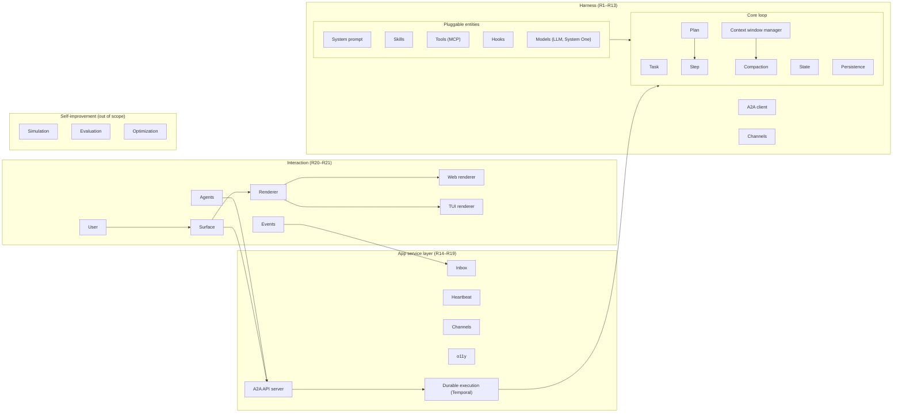

<!-- Written per the `the-loop:writing` skill: front-load each section's
     conclusion, draw it rather than describe it (3+ named parts -> a mermaid
     diagram), and keep the formal registers formal (EARS, abuse cases,
     RFC-2119, API contracts, schema descriptions). No length limit — length
     follows the change; the test is whether a sentence can come out without
     losing information. A gated section stays even when it is empty. -->

# Requirements: tiny-harness: A tiny agent harness

> Phase 1 of 3 (requirements → design → tasks). Following the Kiro spec approach
> (<https://kiro.dev/docs/specs/>). This phase MUST be reviewed and approved by the
> required collaborators before moving to design.

## Introduction

tiny-harness is an opinionated, production-grade agent harness for enterprises deploying
agentic systems in customer-facing workflows. Ticket:
[MadaraUchiha-314/tiny-harness#3](https://github.com/MadaraUchiha-314/tiny-harness/issues/3).

The repository today holds one example function and the tooling from issue #2. This work
item delivers the harness itself: the three left-hand columns of the architecture diagram
on the ticket, minus the Self-improvement column the ticket marks as not for now. It is
not a coding harness wrapped as a general one: the harness assumes no file system, shell
or any other tool unless a plugin registers it.

The ticket is large. Every requirement below is numbered so the design can sequence them
and so the ticket can, if the approver prefers, be split into child issues per requirement
group without rewriting this document (Open questions, Q1).

### Architecture the requirements follow

The diagram on the ticket, redrawn. Each group carries the requirements that specify it.

### Reading this document

- **Vocabulary.** *Entity* is any pluggable core construct (prompt, skill, tool, model,
  hook, channel, renderer, persistence store, agent). *Participant* is a human or agent
  with a role on a task. *Surface* is the way a participant reaches the harness.
  *Operator* is whoever deploys and configures a harness instance.
- **Precedence.** Where a requirement names an external specification (A2A, MCP, Agent
  Skills, Agent Plugins, A2UI), the specification's normative text wins over any
  paraphrase here. The versions named below are the ones current on 2026-10-09; the
  design pins the exact versions it targets.
- **sherma.** [sherma](https://github.com/MadaraUchiha-314/sherma) (v1.8.0) is the
  owner's earlier framework. Its agent interface, entity registry, hook executor chain
  and A2A executor are the reference the design starts from; they are re-used where
  they fit and replaced where this document says otherwise. The design records each
  divergence.

### External specifications and SDKs the requirements name

| Construct | Specification | Python SDK the design SHALL use | Current |
|---|---|---|---|
| Agent-to-agent | A2A 1.0.0 | `a2a-sdk` (official) | 1.2.2 |
| Tools | MCP, revision 2026-07-28 | `mcp` (official) | 2.3.0 |
| Skills | Agent Skills | own loader (the reference `skills-ref` is demo-only, untyped) | spec current |
| Plugins | Agent Plugins 1.0.0 | own loader (no official Python implementation) | 1.0.0 |
| Generative UI | A2UI 0.9.1 (A2A extension) | `a2ui-agent-sdk` | 0.8.0 |
| Durable execution | Temporal | `temporalio` | 1.34.0 |
| LLM | OpenAI Responses API; Anthropic Messages API | `openai`; `anthropic` | 3.27.0; 1.13.0 |
| System One model | TypeSafe AI System One API (Jev) | `typesafe-sdk` | 0.7.3 |
| Tracing | OpenTelemetry, GenAI semantic conventions | `opentelemetry-sdk` | 1.45.1 |
| Trace backend | Langfuse v4 (OTLP ingestion) | `langfuse` | 4.17.0 |
| TUI | — | `textual` | 8.2.8 |
| Web | — | React | 19.3 |

## Requirements

### Requirement 1 — Entity model and registry

**User story:** As an operator, I want every core construct to implement one standard
interface and be addressed by a registry reference, so that any of them can be replaced,
versioned or served remotely without touching the core loop.

#### Acceptance criteria (EARS)

1. The system SHALL define one abstract interface per entity kind: prompt, skill, tool,
   model (LLM and System One), hook, channel, renderer, persistence store, and agent.
   The agent interface SHALL be sherma's: an agent is addressed through `send_message`
   (an async stream of A2A `Message`, `Task` and update events) and `cancel_task`, and
   carries an A2A agent card.
2. The system SHALL identify every entity instance by a registry reference of the form
   `(id, version)` WHERE `version` is a string, or `null` when versioning does not apply
   to that entity kind; a version string SHALL be resolved as sherma resolves it (PEP 440
   specifiers, with `*` meaning the latest concrete version).
3. WHEN an entity is resolved by reference THEN the system SHALL return exactly one
   instance or raise a typed not-found error; it SHALL NOT fall back to a default
   silently.
4. The system SHALL support local entities (in-process) and remote entities (reached
   through an application protocol) behind the same interface.
5. WHEN a remote entity is registered THEN the registration SHALL name the application
   protocol it speaks (A2A for agents, MCP for tools and prompts, HTTPS for models and
   remote hooks) and the system SHALL refuse a remote entity with no declared protocol.
6. The system SHALL expose the registry to hooks and plugins, so a plugin can register,
   override or remove an entry.
7. The registry SHALL be derived from sherma's `Registry[T]` and `RegistryEntry[T]`
   (instance or factory for a local entity; `remote`, `url` and `protocol` for a remote
   one), and the design SHALL state every divergence, including whether sherma's
   `tenant_id` is kept.

### Requirement 2 — Hooks around every lifecycle operation

**User story:** As an operator, I want a pre/in/post hook on every operation the harness
performs, so that observability, policy, retries and custom behaviour are plugins rather
than core features.

#### Acceptance criteria (EARS)

1. The system SHALL expose, for every lifecycle operation it performs, a hook point with
   `pre`, `in` and `post` phases; the catalogue SHALL at minimum cover: request received,
   task created, task state changed, context created, LLM invoked, tool calls extracted,
   tool invoked, System One invoked, plan created, step started, step finished, sub-task
   spawned, help requested, message sent on a channel, message received on a channel,
   compaction, persistence read, persistence write, activity failed, activity retried,
   heartbeat tick, and shutdown.
2. WHEN a `pre` hook returns a replacement input THEN the system SHALL use the
   replacement for the operation.
3. WHEN a `post` hook returns a replacement output THEN the system SHALL use the
   replacement as the operation's result.
4. WHEN a hook raises a typed abort THEN the system SHALL cancel the operation, record
   the abort, and surface it as a task failure or a refusal, never as an unhandled
   exception.
5. The system SHALL run hooks for one hook point as an ordered chain of executors, each
   receiving the typed context the previous one returned (sherma's `HookManager`
   semantics), and SHALL document that order.
6. The system SHALL support remote hook executors over the transports sherma defines
   (JSON-RPC 2.0 over HTTPS, and an MCP server exposing `hooks.<hook_name>` tools), with
   the same typed contexts; a remote executor that cannot be reached SHALL be reported
   through the `activity failed` hook point and SHALL NOT be silently skipped.
7. The system SHALL provide programmatic hooks for infrastructure the harness needs but
   does not own, at minimum: the async HTTP client, the clock, and the random source.
8. The hook catalogue SHALL be a reviewed public interface (Requirement 23) and SHALL be
   derived from sherma's catalogue where the lifecycle matches (`before/after_llm_call`,
   `before/after_tool_call`, `before/after_agent_call`, `before/after_skill_load`,
   `before/after_interrupt`, `on_chat_model_create`, `on_error`), extended with the
   operations of criterion 1 that sherma has no node for (tasks, plans, channels,
   compaction, persistence, durable-execution retries, heartbeat).
9. A `pre` hook SHALL be able to veto or rewrite a single tool call, not only the tool
   set (sherma's `before_tool_call` cannot; the design SHALL close that gap).
10. WHILE a hook executes THEN the system SHALL make the full operation context (task
    reference, participants, entity references, correlation id) available to it.
11. Every hook point SHALL be usable from inside a Temporal workflow or activity
    (Requirement 19) without breaking workflow determinism; the design SHALL state which
    hook points run in the workflow and which in activities.

### Requirement 3 — Plugins (Agent Plugins specification)

**User story:** As an operator, I want to ship skills, MCP servers and hooks to a harness as
a plugin, from the file system or in code, so that extending a deployment needs no fork.

#### Acceptance criteria (EARS)

1. The system SHALL load plugins conforming to the Agent Plugins specification 1.0.0
   (<https://agent-plugins.org/>): a directory with `plugin.json`, optional
   `skills/<name>/SKILL.md` and optional `mcp.json`, validated against the published
   schemas.
2. The system SHALL load a plugin from a directory on the file system AND from a
   programmatic registration carrying the same manifest model, with the same resulting
   behaviour; the programmatic form is tiny-harness's own, since the specification
   defines none.
3. Hooks are outside the specification's v1 format, so the system SHALL read
   tiny-harness hooks and prompts from the plugin's client-specific directory under a
   reverse-domain namespace the design names, and SHALL ignore other clients' namespaced
   directories.
4. WHEN a plugin is loaded THEN the system SHALL register every skill, MCP server, hook
   and prompt it declares into the registry of Requirement 1.
5. WHEN `plugin.json` fails schema validation THEN the system SHALL reject the plugin
   with a typed error naming the manifest path and SHALL load none of its components;
   WHEN one component of a valid plugin fails to load THEN the system SHALL skip that
   component, record the reason, and load the rest, as the specification requires.
6. WHEN a component path or an MCP `cwd` resolves outside the plugin directory THEN the
   system SHALL reject that component.
7. The system SHALL expand only `${PLUGIN_ROOT}` and `${PLUGIN_DATA}` in `args`, `env`
   values and `cwd`, never in `command`, and SHALL pass both as environment variables to
   MCP subprocesses.
8. WHEN two plugins register the same `(id, version)` THEN the system SHALL refuse the
   second registration unless the loading configuration declares an override order.
9. The system SHALL ship its opinionated defaults as a built-in plugin, so that every
   default is overridable through the same mechanism.

### Requirement 4 — System prompt

**User story:** As an operator, I want a minimal system prompt I can override or extend,
so that the harness's voice and rules are mine without rewriting the loop.

#### Acceptance criteria (EARS)

1. The system SHALL ship a minimal default system prompt that states the harness's role,
   the task it works on, and the roles of the task's participants (Requirement 12).
2. The system SHALL let a plugin replace the default prompt or extend it with named
   sections, through the prompt entity of Requirement 1.
3. WHEN the context window is assembled THEN the system SHALL place the system prompt at
   a fixed, templated position (Requirement 10).

### Requirement 5 — Skills (Agent Skills specification)

**User story:** As an operator, I want to give the harness skills written to the Agent
Skills specification, so that procedural knowledge is portable across harnesses.

#### Acceptance criteria (EARS)

1. The system SHALL load skills conforming to the Agent Skills specification
   (<https://agentskills.io/specification>): a directory named after the `name` field,
   `SKILL.md` with YAML front matter (`name`, `description` required; `license`,
   `compatibility`, `metadata`, `allowed-tools` optional) and optional `scripts/`,
   `references/`, `assets/`.
2. The system SHALL implement its own typed loader and SHALL validate against the
   specification's rules (name pattern and length, description length, relative
   references one level deep); the reference implementation `skills-ref` is not for
   production use and SHALL NOT be a dependency.
3. WHEN skills are available THEN the system SHALL expose their names and descriptions in
   the context window and SHALL load a skill's full body only when the skill is invoked,
   and its resources only on demand (the specification's three disclosure levels).
4. WHEN a skill's front matter fails validation THEN the system SHALL skip that skill,
   record the reason, and continue loading others.
5. A skill SHALL be an entity of Requirement 1, addressable by `(id, version)`.
6. The system SHALL expose skill loading to the LLM as tools (list, load, unload, list
   and load resources), following sherma's skill tools, and a loaded skill's own tools
   (MCP servers and local tools its card declares) SHALL be registered on load and
   unregistered on unload.

### Requirement 6 — Tools through MCP

**User story:** As an operator, I want to register MCP servers and have their tools
available to the harness, so that capabilities come from the ecosystem rather than from
hand-written adapters.

#### Acceptance criteria (EARS)

1. The system SHALL connect to MCP servers using the official MCP Python SDK (`mcp` 2.x)
   over the stdio and streamable-HTTP transports.
2. WHEN an MCP server is registered THEN the system SHALL list its tools and register each
   as a tool entity of Requirement 1 with its input schema.
3. WHEN the LLM emits a tool call naming a tool that is not in the registry THEN the
   system SHALL NOT execute anything and SHALL return a typed error to the loop as the
   tool result.
4. WHEN a tool call's arguments fail the tool's input schema THEN the system SHALL NOT
   invoke the tool and SHALL return the validation error as the tool result.
5. WHEN a tool returns THEN the system SHALL label its output as untrusted content in the
   context window (Requirement 10, Security considerations).
6. The system SHALL assume no tool is present by default; file system, shell and network
   tools exist only when a plugin registers them.
7. Every tool SHALL carry an idempotency declaration; the default for an MCP tool is
   not idempotent (Requirement 19).

### Requirement 7 — Agent-to-agent communication over A2A

**User story:** As an operator, I want the harness to delegate to and converse with other
agents over A2A, whether or not they run tiny-harness, so that multi-agent systems need
no bespoke integration.

#### Acceptance criteria (EARS)

1. The system SHALL communicate with remote agents using the A2A protocol at version
   1.0.0 or later through the official `a2a-sdk` client, sending the `A2A-Version` header
   on every request.
2. WHEN a remote agent is registered THEN the system SHALL fetch its agent card from
   `/.well-known/agent-card.json`, validate it, and register the agent as a remote agent
   entity of Requirement 1.
3. WHEN the harness delegates work to a remote agent THEN the system SHALL create a
   sub-task (Requirement 8) linked to the remote A2A task id and SHALL track its state
   through A2A task status updates, including `INPUT_REQUIRED` and `AUTH_REQUIRED`.
4. WHEN a remote agent card declares a required extension the harness does not implement
   THEN the system SHALL refuse to use that agent and record the reason.
5. WHEN the harness activates an extension on a request THEN it SHALL name it in the
   `A2A-Extensions` header, and only extensions the remote card advertises.

### Requirement 8 — Task

**User story:** As a participant, I want every unit of work to be a task with a goal,
acceptance criteria and participants, so that the harness and I share one record of what
is being done and for whom.

#### Acceptance criteria (EARS)

1. The system SHALL model a task with: name, optional type, goal, description, acceptance
   criteria, sub-tasks, parent tasks, and participants, WHERE each participant carries a
   role from {assignee, reporter, watcher, admin}.
2. The system SHALL map every harness task to an A2A task and SHALL keep the A2A task
   state (`SUBMITTED`, `WORKING`, `INPUT_REQUIRED`, `AUTH_REQUIRED`, `COMPLETED`,
   `FAILED`, `CANCELED`, `REJECTED`) as the task's authoritative state.
3. The task attributes that A2A does not carry (goal, acceptance criteria, participants,
   parent and sub-task links) SHALL be exposed as a tiny-harness A2A extension advertised
   in the agent card (Requirement 14).
4. WHEN the harness executes a step in context isolation THEN the system SHALL create a
   sub-task for that step, link it from the step (Requirement 9), and record it in the
   parent's sub-task list.
5. WHILE a task is in progress THEN the system SHALL track every sub-task it has spawned
   and SHALL NOT mark the parent complete while a sub-task is unresolved, unless a hook
   overrides that rule.
6. WHEN a task reaches a terminal A2A state THEN the system SHALL emit the matching A2A
   status update to every subscriber and persist the final state before acknowledging.

### Requirement 9 — Plan and steps

**User story:** As a participant, I want the harness to break work into a plan I can read,
so that progress and delegation are visible before they happen.

#### Acceptance criteria (EARS)

1. The system SHALL model a plan as a directed acyclic graph of steps, WHERE a step
   carries name, description, optional output, and `linked_tasks`, a list of task
   references spawned while executing the step.
2. WHEN the harness decides to break down a task THEN the system SHALL create a plan
   through a hooked operation and attach it to the task.
3. WHEN a step is executed THEN the system SHALL record its output and any linked task
   on the step before moving to a dependent step.
4. The system SHALL persist plans (Requirement 11) and SHALL let a hook replace the
   persistence target.
5. WHEN a plan would contain a cycle THEN the system SHALL reject the plan with a typed
   error.
6. The plan SHALL be readable by participants through the task extension of
   Requirement 8 and SHALL be rendered by both renderers (Requirement 20).

### Requirement 10 — State, context window manager and compaction

**User story:** As an operator, I want the context sent to the LLM to be assembled from
templated positions and compacted on a declared policy, so that cost is predictable and
nothing critical is lost.

#### Acceptance criteria (EARS)

1. The system SHALL hold per-agent state as typed, schema-described data, SHALL allow a
   plugin to supply a schema for a named subset of that data, and SHALL validate writes to
   that subset against the schema.
2. The system SHALL assemble every LLM context from templated positions, in a declared
   order, for at minimum: system prompt, participant roles, skills index, tool
   definitions, task, plan, state summary, conversation history, and tool results.
3. The system SHALL order the context so that content stable across turns precedes
   content that changes per turn, to maximise provider prefix caching; for OpenAI the
   design SHALL state how the stable prefix exceeds the provider's minimum cacheable
   size and how `prompt_cache_key` is set per task, and the e2e evidence SHALL report
   `cached_tokens` from the usage response.
4. WHEN the assembled context exceeds a configured fraction of the model's context window
   THEN the system SHALL run compaction before the LLM call.
5. The system SHALL declare a never-compact set, at minimum the system prompt, the task's
   goal and acceptance criteria, the current plan, and loaded skills' bodies, and SHALL
   NOT compact it.
6. WHEN compaction runs THEN the system SHALL record what was compacted and the summary
   that replaced it, so a reviewer can audit the loss.
7. The compaction trigger, the keep set and the summariser SHALL each be replaceable
   through hooks.
8. The context window manager SHALL be a core component, not a hook pattern (sherma has
   no compaction and documents it as a custom-node pattern; this closes that gap).

### Requirement 11 — Persistence

**User story:** As an operator, I want agent state and plans persisted through a store I
choose, so that a restart or a crash loses no work.

#### Acceptance criteria (EARS)

1. The system SHALL persist agent state, plans, tasks, inbox items and channel messages
   through a persistence-store entity of Requirement 1.
2. The system SHALL ship a default store suitable for local development and tests, and
   the design SHALL name it and its limits.
3. WHEN a persistence write fails THEN the system SHALL surface a typed error to the
   calling operation and SHALL NOT report the operation as complete.
4. The system SHALL NOT persist secrets (API keys, tokens) in any store.
5. The design SHALL state what Temporal's event history persists on the harness's behalf
   (Requirement 19) and what the store persists, so nothing is stored twice without a
   reason.

### Requirement 12 — Participants, help requests and multi-turn interaction

**User story:** As a participant, I want the harness to ask me for a small input, or
create a task for me when it needs real work from me, so that it never stalls silently and
never blocks my queue with a one-line question.

#### Acceptance criteria (EARS)

1. The system SHALL include every participant's role in the system prompt by default,
   and the wording SHALL be overridable (Requirement 4).
2. WHEN the harness needs an input, opinion or judgement call that a participant can
   answer in one message THEN the system SHALL send a message on a channel
   (Requirement 13) and move the task to the A2A `INPUT_REQUIRED` state.
3. WHEN the harness needs work from a participant that must finish before the task can
   complete THEN the system SHALL create a task assigned to that participant
   (Requirement 8), link it as a sub-task, and continue or wait as the plan dictates.
4. The system SHALL decide between criterion 2 and criterion 3 through a hooked
   operation whose default is replaceable; the default MAY use the System One model
   (Requirement 18).
5. WHEN a reply to a help request arrives THEN the system SHALL resume the waiting task
   with the reply in context and move it out of `INPUT_REQUIRED`.
6. WHILE a task waits for input THEN the system SHALL survive a process restart and
   resume on the reply (Requirement 19).

### Requirement 13 — Channels

**User story:** As a participant, I want one channels API to talk to the harness and be
talked to, so that every conversation about a task has one place and one record.

#### Acceptance criteria (EARS)

1. The system SHALL model a channel as a set of participants managed by the harness, and
   SHALL expose send and receive operations to both the harness and the participants.
2. WHEN the harness sends a message on a channel THEN the system SHALL persist it
   (Requirement 11) before delivery and SHALL emit an A2A message event to the task's
   subscribers.
3. WHEN a message arrives on a channel from a participant who is not a member THEN the
   system SHALL reject it and record the rejection.
4. Channels SHALL be entities of Requirement 1, so a plugin can add a delivery medium,
   and SHALL be exposed over A2A as a tiny-harness extension advertised in the agent
   card (Requirement 14).

### Requirement 14 — A2A API server

**User story:** As an operator, I want the harness to be an A2A server supporting every
verb of the specification, so that any A2A client can drive it.

#### Acceptance criteria (EARS)

1. The system SHALL serve the A2A protocol at version 1.0.0 or later using the official
   `a2a-sdk` server, over the JSON-RPC binding and the HTTP+JSON binding, supporting
   every operation of the specification: `SendMessage`, `SendStreamingMessage`,
   `GetTask`, `ListTasks`, `CancelTask`, `SubscribeToTask`, the four task push
   notification config operations (`Create`, `Get`, `List`, `Delete`), and
   `GetExtendedAgentCard`; gRPC is not required.
2. The system SHALL publish its agent card at `/.well-known/agent-card.json`, built from
   the agent entity so that every extension the harness declares reaches the card
   (sherma's example server hand-builds the card and drops them).
3. Every tiny-harness-specific protocol (the task extension of Requirement 8, the
   channels extension of Requirement 13, and any other) SHALL be declared as an A2A
   extension with a URI under a domain the owner controls and advertised in
   `capabilities.extensions`.
4. WHEN a request activates, through `A2A-Extensions`, an extension the card does not
   advertise THEN the system SHALL reject the request with the error the specification
   defines for an unsupported operation.
5. WHEN the A2A executor's `execute` is invoked THEN the system SHALL hand the request to
   durable execution (Requirement 19) and stream task updates back through the A2A event
   queue, honouring the SDK's streaming contract (a `Task` first, then status and
   artifact updates); the core loop SHALL NOT run in the HTTP request's lifetime.
6. WHEN the A2A executor's `cancel` is invoked THEN the system SHALL cancel the durable
   execution and emit the `CANCELED` state.
7. The system SHALL stream partial progress (status updates and artifact chunks) during a
   task, not only one terminal event per turn (sherma streams none).
8. The system SHALL use sherma's A2A executor as the reference and the design SHALL state
   what is reused and what is replaced; sherma targets `a2a-sdk` 0.3.x, so the port to
   the 1.x SDK (protobuf-generated types, route factories, `A2A-Version`) is part of
   the design.
9. The system SHALL authenticate requests under the security schemes the agent card
   declares; the scheme for the demo is Open question Q4.

### Requirement 15 — Inbox and events

**User story:** As an operator, I want a durable inbox the harness drains on its own
schedule, so that no message or event is lost while the harness is busy.

#### Acceptance criteria (EARS)

1. The system SHALL accept, through the A2A server, the four A2A event payloads: `Task`,
   `Message`, `TaskStatusUpdateEvent` and `TaskArtifactUpdateEvent`.
2. The system SHALL treat `SendMessage` and `SendStreamingMessage` as the inbox: a
   received message SHALL be persisted before the request is acknowledged, and
   `returnImmediately: true` SHALL return after the inbox item and task exist.
3. WHEN a message arrives for a task that is idle THEN the system SHALL process it
   immediately; WHEN it arrives for a task that is executing THEN the system SHALL queue
   it and process it at the next heartbeat tick or when the current step finishes,
   whichever the hooked policy chooses.
4. WHEN an inbound event is an interrupt THEN the system SHALL deliver it to the running
   task through the durable execution's signal mechanism (Requirement 19).
5. WHEN the process restarts THEN every persisted, unprocessed inbox item SHALL still be
   processed.
6. The system SHALL deliver task updates to registered push notification configs, so a
   surface that is not streaming still learns of state changes.

### Requirement 16 — Heartbeat

**User story:** As an operator, I want a periodic heartbeat that wakes the harness to check
for pending events, so that waiting tasks make progress without an inbound request.

#### Acceptance criteria (EARS)

1. The system SHALL run a heartbeat at a configured interval that checks the inbox and
   channels for pending items and forwards them to the agent layer.
2. WHEN a heartbeat tick finds a task waiting on input whose reply has arrived THEN the
   system SHALL resume that task.
3. The heartbeat SHALL expose the monitoring view of the inner layer (task states,
   pending items) to the API layer and to hooks.
4. WHEN a heartbeat tick fails THEN the system SHALL log the failure and run the next tick
   on schedule.
5. The design SHALL state whether the heartbeat is a Temporal schedule, a workflow timer
   or a process-level loop, and why.

### Requirement 17 — Observability

**User story:** As an operator, I want a complete trace of every request from receipt to
terminal task state, so that an incident can be reconstructed without a debugger.

#### Acceptance criteria (EARS)

1. The system SHALL log every lifecycle operation of Requirement 2 with the task id, the
   correlation id and the hook phase, at the same level and format in development and
   production.
2. The system SHALL emit OpenTelemetry traces with one span per lifecycle operation and
   SHALL follow the OpenTelemetry GenAI semantic conventions for model, tool and agent
   spans (`chat`, `execute_tool`, `invoke_agent`, `plan` operation names; `gen_ai.*`
   attributes including usage tokens), accepting that the conventions are at
   Development status and may change.
3. The system SHALL implement observability as a plugin built on the hooks of
   Requirement 2, not as core code.
4. The system SHALL propagate trace context through Temporal workflows and activities
   and through MCP calls, using the integrations each SDK provides.
5. The system SHALL support exporting traces to Langfuse through its OTLP ingestion
   endpoint, configured but not required.
6. The system SHALL NOT log secrets, and SHALL redact credential-shaped values in tool
   arguments and results before logging.

### Requirement 18 — Models

**User story:** As an operator, I want to configure any LLM and any fast decision model
behind one interface, so that provider choice is configuration.

#### Acceptance criteria (EARS)

1. The system SHALL define an LLM model entity with invoke and streaming operations,
   tool-call extraction, and structured output, implemented over the providers' official
   SDKs; the first provider SHALL be OpenAI through the Responses API, and the interface
   SHALL accommodate Anthropic's Messages API without change.
2. The system SHALL define a System One model entity that answers typed questions about
   a state (yes/no, choice among options, rubric score) with a probability and a
   confidence per answer; the first implementation SHALL be TypeSafe AI's Jev through
   `typesafe-sdk`, and a deterministic fake SHALL exist for tests.
3. WHEN a provider SDK raises a retryable error THEN the system SHALL surface it as a
   typed retryable failure to durable execution (Requirement 19), and the provider
   client's own retries SHALL be disabled so one layer owns retrying.
4. The system SHALL read provider credentials from the environment or a secret store,
   never from configuration files checked into a repository.
5. End-to-end tests SHALL use the OpenAI model `gpt-6.1-sol` (the ticket's "GPT 6.1";
   no plain `gpt-6.1` id exists).
6. Every model call SHALL record input, output and cached token usage for
   Requirement 17.

### Requirement 19 — Durable execution

**User story:** As an operator, I want every long-running task to survive crashes and
retries with declared guarantees, so that a pod restart never loses or duplicates work.

#### Acceptance criteria (EARS)

1. The system SHALL run the core loop as a Temporal workflow and SHALL run every
   side-effecting or non-deterministic operation (context creation, LLM call, System One
   call, tool call, persistence write, channel send, remote hook call) as a Temporal
   activity.
2. WHEN a workflow is replayed after a crash THEN the system SHALL NOT re-invoke any
   activity whose result Temporal has recorded, so a non-deterministic LLM response is
   replayed from history rather than regenerated.
3. WHEN an activity fails THEN the system SHALL apply a Temporal retry policy with
   exponential backoff, and the policy (initial interval, backoff coefficient, maximum
   interval, maximum attempts, non-retryable error types) SHALL be configurable and
   overridable per operation through hooks.
4. WHEN an activity is retried THEN the system SHALL run the `activity failed` and
   `activity retried` hook points of Requirement 2 before the retry.
5. The system SHALL classify every activity as safe to retry or not; a tool call whose
   tool is not declared idempotent (Requirement 6) SHALL NOT be retried automatically
   and SHALL fail the step with a typed error a hook can override.
6. WHEN a worker crashes while an activity runs THEN the activity SHALL be detected
   through its heartbeat or start-to-close timeout and re-scheduled on another worker
   under the same policy.
7. WHEN a participant's reply or an inbox interrupt arrives for a running workflow THEN
   the system SHALL deliver it through a Temporal signal or update, and a waiting
   workflow SHALL consume no worker resources while it waits.
8. WHEN a conversation's event history grows past a configured bound THEN the workflow
   SHALL continue-as-new carrying its state, so a long-lived task never exceeds
   Temporal's history limits.
9. Workflow code SHALL run inside Temporal's sandbox; the design SHALL list every
   module passed through the sandbox and why.
10. Workflow and activity payloads SHALL be the typed models of Requirement 22, carried
    by Temporal's Pydantic data converter.
11. The system SHALL connect to Temporal Cloud with TLS and an API key supplied by the
    environment; the e2e configuration SHALL be namespace `tiny-harness.gtebu`, address
    `tiny-harness.gtebu.tmprl.cloud:7233` and the key from `TEMPORAL_API_KEY`.
12. The A2A executor's `execute` SHALL start or signal the workflow and return; the
    design SHALL state how the workflow's task updates reach the A2A event queue of a
    streaming request and the push notification configs of Requirement 15.

### Requirement 20 — Surfaces and renderers

**User story:** As a user, I want to interact with one harness instance from a terminal
and from a web page at the same time, so that the surface is my choice.

#### Acceptance criteria (EARS)

1. The system SHALL define a surface entity (modality, renderer capabilities) and a
   renderer entity (which message and artifact kinds it can render).
2. The system SHALL ship a TUI renderer (Textual) and a web renderer (React), each a
   client of the A2A API server of Requirement 14 and nothing else.
3. WHEN two surfaces are connected to one harness instance THEN both SHALL receive the
   same task updates.
4. WHEN a renderer receives a message or artifact kind it cannot render THEN it SHALL
   show a typed placeholder naming the kind and SHALL NOT drop the item.
5. The system SHALL implement the A2UI A2A extension at version 0.9.1
   (<https://a2ui.org/>): the harness advertises the extension URI and its supported
   catalog ids in the agent card, emits A2UI messages as `application/a2ui+json` data
   parts, and accepts user actions as A2A messages carrying the same part type.
6. Both renderers SHALL render the A2UI basic catalog (Text, Image, Icon, Video,
   AudioPlayer, Row, Column, List, Card, Tabs, Divider, Modal, Button, CheckBox,
   TextField, DateTimeInput, ChoicePicker, Slider); a component the TUI cannot represent
   (Video, AudioPlayer) SHALL render as the placeholder of criterion 4.
7. The renderer interface SHALL leave room for MCP Apps
   (<https://modelcontextprotocol.io/extensions/apps/overview>), which only a web host
   can render; implementing them is out of scope for this work item.
8. Text SHALL be the only modality in scope; voice and video are out of scope.

### Requirement 21 — Configuration and e2e environment

**User story:** As an engineer, I want the e2e environment declared as configuration and
environment variables, so that the demo runs on any machine with the secrets.

#### Acceptance criteria (EARS)

1. The system SHALL read every secret from an environment variable, and the e2e
   configuration SHALL document the GNOME keyring lookups the ticket gives
   (`secret-tool lookup service temporal project tiny-harness`,
   `secret-tool lookup service openai project tiny-harness`) as the way to populate
   `TEMPORAL_API_KEY` and `OPENAI_API_KEY`.
2. WHEN a required secret is missing at startup THEN the system SHALL fail to start with
   an error naming the variable and SHALL NOT fall back to an anonymous or local mode.
3. The system SHALL expose configuration as typed, schema-validated models, and SHALL
   reject unknown keys.
4. Anthropic SHALL be configurable but SHALL NOT be exercised by e2e tests in this work
   item, as no key is available; the same holds for Jev if no key is available at
   verification time (Open question Q3).

### Requirement 22 — Code structure, typing and documentation

**User story:** As a maintainer, I want the code base to mirror the architecture diagram
and to be typed in the strictest mode, so that the diagram is the map and the type checker
is the first reviewer.

#### Acceptance criteria (EARS)

1. The package's top-level modules SHALL correspond to the diagram's groups (interaction,
   app service layer, harness entities, core loop) and the design SHALL show the mapping
   from each diagram box to a module.
2. The code SHALL type-check under pyright strict with zero errors, SHALL use no `Any`,
   and SHALL use no `dict[str, Any]`; untyped or weakly typed third-party values
   (protobuf-generated A2A classes, MCP results, provider responses) SHALL be parsed
   into typed models at the boundary.
3. Every core entity listed in Requirement 1, and every data model of Requirements 8
   through 13, SHALL be a typed model with a docstring describing each field.
4. The system SHALL use the official SDK for every external construct: A2A, MCP,
   Temporal, OpenAI, Anthropic, TypeSafe, OpenTelemetry, A2UI; Agent Skills and Agent
   Plugins have no production-grade official Python implementation, so their loaders are
   tiny-harness's own.
5. The design SHALL justify every new dependency against the minimalism ladder.

### Requirement 23 — Interfaces reviewed before implementation, contract tests

**User story:** As the approver, I want every public interface defined and reviewed before
it is implemented, and protected by contract tests, so that a change to a public surface is
deliberate.

#### Acceptance criteria (EARS)

1. The design SHALL define every public interface (the entity interfaces, the hook
   catalogue and its contexts, the registry, the tiny-harness A2A extensions, the plugin
   namespace layout, the configuration schema) before any implementation task, and the
   design-approval gate SHALL be the review.
2. The system SHALL carry contract tests for every public interface, so that an
   incompatible change fails a test before it ships; the A2A extensions SHALL be
   contract-tested against their published JSON schemas.
3. Unit and integration tests SHALL exercise behaviour through public interfaces and
   SHALL NOT assert on implementation details (private attributes, call order of
   internals).
4. Integration tests SHALL carry Gherkin docstrings linked to the requirement they prove.

### Requirement 24 — Definition of done: the demo

**User story:** As the approver, I want one end-to-end demo that proves the harness works,
so that acceptance is an observation rather than an inference from tests.

#### Acceptance criteria (EARS)

1. WHEN the demo starts THEN one harness instance SHALL be reachable from the TUI
   renderer and the web renderer at the same time (Requirement 20).
2. WHEN a user sends a task from either surface THEN the harness SHALL plan, call the
   LLM (`gpt-6.1-sol`), call at least one MCP tool, and reach a terminal task state, with
   every step visible on both surfaces.
3. WHEN the task needs a judgement call THEN the harness SHALL ask the user on a channel,
   wait in `INPUT_REQUIRED`, and resume on the reply (Requirement 12), across at least
   two turns.
4. The demo SHALL render at least one A2UI basic-catalog component with a user action
   (a Button or ChoicePicker whose action reaches the harness) in both renderers.
5. The demo SHALL run on Temporal Cloud with the configuration of Requirement 19, and
   killing the worker process mid-task SHALL be followed by the task completing after
   the worker restarts, without a duplicated LLM or tool call, shown in the trace.
6. The demo SHALL be recorded as verification evidence (screenshots of both surfaces, an
   animated capture of the multi-turn flow, and the trace of the crash-recovery run).

## Non-functional requirements

- **Typing and tooling.** Python 3.14, pyright strict, ruff, pytest, as the repository
  already configures; no exceptions for generated code.
- **Testing.** Unit tests per entity; integration tests per layer boundary; contract
  tests per public interface (Requirement 23); one e2e demo (Requirement 24). Tests
  that need a provider or Temporal SHALL be marked and skipped when the environment is
  absent, never silently passed.
- **Cost.** Context assembly ordered for prefix caching (Requirement 10); the design
  SHALL state the token budget per turn it targets for the demo.
- **Latency.** System One decisions SHALL be bounded by a configured timeout and fall
  back to the LLM path on timeout.
- **Documentation.** Every public interface has a docstring; `docs/capabilities/` gains
  one doc per requirement group; the docs site gets a getting-started page for the demo.
- **Portability.** The harness SHALL run without a file system or shell tool present.

## Security considerations

> Threat-model-lite, captured with the requirements (always required). "No new attack
> surface" is not the answer here: this work item creates the harness's entire attack
> surface.

- **Actors & trust:**
  - End users on a surface (web, TUI). Untrusted: they can send any text and any A2A
    message, including A2UI actions.
  - Remote agents over A2A, both as clients of our server and as servers we call.
    Untrusted: their messages, artifacts and agent cards are attacker-controlled data.
  - MCP servers. Semi-trusted: the operator registers them, but tool output is untrusted
    content that reaches the LLM, and a server's tool list can change between calls.
  - LLM and System One providers. Trusted transport, untrusted output: model responses
    can carry injected instructions from any untrusted input above.
  - Plugins, skills and prompts on the file system. Operator-trusted, but a plugin can
    register MCP subprocesses and hooks, so loading is a privilege boundary.
  - Temporal Cloud, the persistence store, the secret store. Trusted infrastructure
    reached with credentials.
  - The operator. Trusted.
- **Trust boundaries & data:**
  - The A2A server is the public ingress; every request must be authenticated under the
    security schemes the agent card declares before it reaches the inbox.
  - Channel messages cross from participants into the task's context; membership is the
    boundary.
  - Tool results, remote-agent messages and A2UI actions cross into the LLM context;
    they are data, never instructions, and the context window manager must mark them
    so.
  - LLM output crosses into tool invocation; the registry and the tool's input schema are
    the boundary.
  - Plugin manifests cross into process spawning (MCP `command`); the plugin directory
    and the fixed variable expansion rules are the boundary.
  - Secrets: `OPENAI_API_KEY`, `TEMPORAL_API_KEY`, `TYPESAFE_API_KEY`, any Anthropic key,
    MCP server credentials, Langfuse keys. They live in the environment or the keyring,
    never in persistence, logs, traces, Temporal payloads, A2A artifacts or the context
    window.
  - Personal data: participant identities and conversation content are persisted, held
    in Temporal event history and traced; the persistence store, Temporal Cloud and the
    trace exporter are the data boundary, and the design states the retention of each.
- **Abuse cases (EARS):**
  1. WHEN an unauthenticated client calls any A2A operation other than agent-card
     discovery THEN the system SHALL reject the request with the protocol's
     authentication error and SHALL NOT create a task or persist the message.
  2. WHEN a message, tool result, remote-agent artifact or A2UI action contains text
     instructing the harness to call a tool, change a participant's role, or reveal a
     secret THEN the system SHALL treat it as data: a tool call SHALL be executed only
     if the LLM emits it, it is in the registry, and its arguments validate; a role
     change SHALL be executed only through the channels or task API by a participant
     with the admin role.
  3. WHEN a tool call names a tool outside the registry, or a plugin component names a
     path outside its plugin directory, or a plugin manifest places a variable
     expansion in `command` THEN the system SHALL refuse it and record the attempt.
  4. WHEN a participant who is not a member of a channel sends on it, or a client
     addresses a task it is not a participant of THEN the system SHALL reject the
     message and SHALL NOT reveal whether the task exists.
  5. WHEN a remote agent card declares a security scheme or a required extension the
     harness does not recognise THEN the system SHALL NOT send it credentials or
     messages.
  6. WHEN a value shaped like a credential appears in tool arguments, tool results, log
     records, trace attributes or Temporal payloads THEN the system SHALL redact it
     before it is written.
  7. WHEN an inbound A2A request exceeds configured size or rate limits THEN the system
     SHALL reject it before persistence.
  8. WHEN an MCP server's tool schema changes between registration and a call THEN the
     system SHALL NOT invoke the tool until it is re-registered.
  9. WHEN an A2UI action names a surface or component id the harness did not create
     THEN the system SHALL discard the action and record it.
- **Fail closed:**
  - No authentication configured on the A2A server: serve only on loopback and log a
    warning; refuse a non-loopback bind.
  - Missing secret, missing Temporal configuration, unknown configuration key: refuse to
    start.
  - Unresolvable entity reference, unknown hook point, plugin manifest error: refuse the
    operation or the plugin, never substitute a default.
  - Tool not idempotent and retry policy unclear: do not retry.
  - Ambiguous participant role on a privileged operation: deny.
  - Remote hook executor unreachable: fail the operation through the hook chain, never
    pass through silently (sherma passes through on network error; this reverses it).

## Out of scope

- The Self-improvement column (simulation, evaluation, optimization): the ticket marks it
  TBD.
- Memory and Sandbox, which appear on the diagram but not in the ticket text (Open
  questions, Q2).
- Voice and video modalities; MCP Apps rendering (interface room only, Requirement 20).
- The A2A gRPC binding.
- Exercising Anthropic end to end (no key available); the interface accommodates it.
- A production persistence store beyond the default (the entity makes it a plugin).
- Multi-tenant isolation between harness instances; one instance serves one deployment.
- Installing, discovering or updating plugins from a registry or marketplace (outside
  the Agent Plugins specification's scope too).

## Open questions

Raised for the requirements-approval gate; each answer is recorded here by the gate.

1. **Split or single.** This work item is an epic. Should it stay one work item with one
   design and one task DAG, or become a parent with child issues per requirement group
   (for example: entities, hooks and plugins; core loop and models; A2A server, inbox
   and durable execution; renderers)? The requirements are numbered so either works; the
   design and task DAG differ in shape. Default if unanswered: one work item, tasks
   sequenced by requirement group.
2. **Memory and Sandbox.** The diagram shows both beside Tools; the ticket text does not
   mention them. Are they in scope for this work item? Default: out of scope, interface
   room left in the tool entity.
3. **Jev access.** Jev is TypeSafe AI's System One model, in early access behind a
   waitlist. Is a `TYPESAFE_API_KEY` available for verification? Default: implement the
   Jev client against the published API, verify it with a recorded fixture, and mark the
   live test as skipped when the key is absent.
4. **A2A security scheme.** Which authentication scheme should the demo's A2A server
   require (API key header, OAuth2, mTLS)? Default: API key header, declared in the
   agent card.
5. **Renderers' location.** Should the web renderer (React) live in this repository or in
   a sibling repository? Default: this repository, under a `renderers/web` directory,
   with its own toolchain.
6. **Temporal in the request lifecycle.** The ticket asks whether Temporal covers only the
   core loop or the whole request lifecycle. Requirement 19.12 leaves the mechanism to
   the design; is there a preference, or is the design free to choose?
7. **A2UI version.** 0.9.1 is the released specification; 1.0 is a release candidate
   that renames theme properties and adds action responses. Target 0.9.1 (default) or
   the 1.0 candidate?

## Review comments

> Appended by the-loop's `record-feedback` hook when a human gate approves with
> comments (issue-109). Append-only and attributed: an approval never silently
> discards a reviewer's suggestions, and the feedback travels with the document
> it concerns rather than living in a side-channel tracker.
