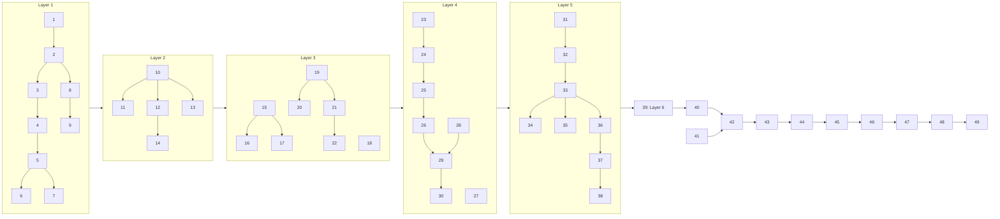

<!-- Written per the `the-loop:writing` skill: front-load each section's
     conclusion, draw it rather than describe it (3+ named parts -> a mermaid
     diagram), and keep the formal registers formal (EARS, abuse cases,
     RFC-2119, API contracts, schema descriptions). No length limit — length
     follows the change; the test is whether a sentence can come out without
     losing information. A gated section stays even when it is empty. -->

# Tasks: tiny-harness: A tiny agent harness

> The last spec artifact (requirements → design → testing plan → tasks). A DAG of
> implementation tasks derived from the approved design and testing plan. MUST be
> reviewed/approved before implementation begins. Once approved, the-loop executes these
> end-to-end with minimal/no intervention.

The work is cut into the nine stacked pull-request layers of `design.md` § Stacked pull
requests (the approver's Q1 answer: one work item, stacked PRs). Each layer is one PR
against the previous layer's branch, merged in order; the tasks inside a layer are the
DAG nodes. Every task names the requirement it satisfies, the testing-plan row that
proves it and the test that goes red first. The design's two open questions were
answered by the approval with no comment, so their defaults stand: Requirement 22.4 is
read as "official A2UI renderer, no agent-side A2UI SDK", and the crash demo's guarantee
is proved at its two kill points.

Conventions for every task: pyright strict with zero errors and no `Any` (T13); the
public interface it introduces is pinned by a contract test in `tests/contract/` (T3)
in the same task; integration tests carry the Gherkin docstring with
`Requirement: docs/specs/issue-3/requirements.md#R<n>` (T2); the commit message
records the test command and its red→green transition.

## Task list

Each task is a checkbox, references the requirement(s) it satisfies, declares its
dependencies so the-loop can build the execution DAG, and names the **test(s) that will
prove it** — a row of `testing-plan.md`'s matrix, so the DAG and the plan cannot describe
different work. Keep tasks small and verifiable. TDD invariant: **no production
code without a failing test that motivates it** — write/adjust the test first, watch it go
red, then make it green. **Security-relevant tasks** (they touch a trust boundary from
`design.md` §Security design) name the **negative test** proving the boundary holds —
abuse cases are tests like any other (`reference/security.md`).

### Layer 1 — entities, hooks, configuration, errors (branch `loop/issue-3-l1-entities`)

- [x] 1. Package layout and dependency baseline
  - Create the module tree of `design.md` § Layers and modules (`interaction/`,
    `service/`, `harness/`, `config.py`, `errors.py`, `builtin/`), each with a docstring;
    add the Layer-1 dependencies to `pyproject.toml` (`pydantic`, `pydantic-settings`,
    `packaging`, `pyyaml` promoted to runtime, `jsonschema`) and the test folders
    `tests/{unit,integration,contract,security,ui,e2e}` with markers (`e2e` skipped
    without `OPENAI_API_KEY`/`TEMPORAL_API_KEY`); add the CI `Any` grep gate to
    `.pre-commit-config.yaml` (`grep -rnE '\bAny\b' tiny_harness` fails the hook).
    Remove the `hello_world` example and its tests.
  - _Depends on:_ none
  - _Requirements:_ R22.1, R22.2, R22.5
  - _Test:_ T13 — `uv run pre-commit run --all-files` green; `tests/unit/test_layout.py::test_modules_mirror_diagram` (red→green)
- [x] 2. Error hierarchy
  - `errors.py`: `TinyHarnessError` and every subclass of `design.md` § Error handling,
    each with a `code` and a `model_dump`-able detail that never carries a secret.
  - _Depends on:_ 1
  - _Requirements:_ R22.3
  - _Test:_ T1 — `tests/unit/test_errors.py` (codes unique, no secret field); T3 — `tests/contract/test_errors_api.py`
- [x] 3. Entity base, `EntityRef`, `TransportProtocol`, `RemoteLocation`
  - `harness/entities/base.py` per the design; `version: str | None`; a remote
    location requires a protocol.
  - _Depends on:_ 2
  - _Requirements:_ R1.1, R1.2, R1.4, R1.5
  - _Test:_ T1 — `tests/unit/entities/test_ref.py` (version None allowed, remote without protocol refused); T3 — API snapshot
- [x] 4. Registry with PEP 440 resolution
  - `harness/entities/registry.py`: `add`/`get`/`remove`/`list`, instance | factory |
    remote entries, sherma's `find_best_match` on `packaging.SpecifierSet`, `*` = latest
    concrete, `EntityNotFoundError`/`VersionNotFoundError`/`RegistryConflictError`.
  - _Depends on:_ 3
  - _Requirements:_ R1.2, R1.3, R1.6, R1.7
  - _Test:_ T1 — `tests/unit/entities/test_registry.py` (resolution matrix from sherma's tests, conflict refused, override order); T3
- [x] 5. Hook points, contexts and `HookManager`
  - `harness/hooks/`: `Operation`, `Phase`, `HookPoint`, `HookContext` and the full
    context catalogue of the design, `HookAbort`, `HookExecutor` protocol with
    `priority`, `HookManager.run` chain semantics (`None` passes through, returned
    context replaces, priority then registration order, `in` default at 1000).
  - _Depends on:_ 4
  - _Requirements:_ R2.1–R2.5, R2.9, R2.10
  - _Test:_ T1 — `tests/unit/hooks/test_manager.py` (order, replacement, abort, single-call veto); T3 — `tests/contract/test_hook_contexts_schema.py` (every context's JSON schema snapshot)
- [x] 6. Remote hook executors (JSON-RPC and MCP)
  - `JsonRpcHookExecutor(url)` and `McpHookExecutor(server)` ported from sherma with
    Pydantic serialisation of contexts; a transport error raises
    `HookTransportError` (no pass-through).
  - _Depends on:_ 5
  - _Requirements:_ R2.6
  - _Test:_ T1 — `tests/unit/hooks/test_remote.py` with a stub JSON-RPC server and a scripted MCP stdio server; `test_unreachable_remote_hook_raises` (negative, fail-closed)
- [x] 7. Providers (HTTP client, clock, random)
  - `harness/hooks/providers.py`: `Providers` with `http_client_factory`, `clock`,
    `random`; a default and a test fake.
  - _Depends on:_ 5
  - _Requirements:_ R2.7
  - _Test:_ T1 — `tests/unit/hooks/test_providers.py`
- [x] 8. Configuration models
  - `config.py`: every model of `design.md` § Configuration (`Settings`,
    `TemporalConfig`, `OpenAIConfig`, `AnthropicConfig`, `ServerConfig`,
    `HeartbeatConfig`, `StoreConfig`, `O11yConfig`, `RetryPolicySpec`,
    `RetryPolicies`, `ContextConfig`, `RetentionConfig`, `push_key`), `extra="forbid"`,
    secrets as `SecretStr`, env-driven; `.env.example` with the two `secret-tool`
    lookups.
  - _Depends on:_ 2
  - _Requirements:_ R21.1–R21.3
  - _Test:_ T1 — `tests/unit/test_config.py` (`test_missing_secret_names_variable`, `test_unknown_key_rejected`); T3 — `Settings` JSON schema snapshot
- [x] 9. Redactor
  - `harness/security/redactor.py`: regexes for bearer tokens, `sk-`/`tmprl` shapes,
    `Authorization` headers, configured secret values; `scrub(model)` for Pydantic
    models and `scrub_text`.
  - _Depends on:_ 8
  - _Requirements:_ R17.6, abuse case 6
  - _Test:_ T8 — `tests/security/test_redactor.py::test_redactor_masks_tokens`

### Layer 2 — plugins, prompts, skills, built-in plugin (branch `loop/issue-3-l2-plugins`)

- [x] 10. Agent Plugins manifest models and loader
  - `harness/plugins/`: `PluginManifest`, `McpServerDef`, `McpHttpServerDef`,
    `HookDef`, `PromptDef`, `Plugin`, `PluginLoader.load_directory`/`load`, `LoadReport`;
    validation against the published 1.0.0 schemas (vendored under
    `harness/plugins/schemas/`), the namespace directory
    `io.github.madarauchiha-314.tiny-harness/`, component-level skip-and-continue.
  - _Depends on:_ 4, 5, 8
  - _Requirements:_ R3.1–R3.5, R3.8
  - _Test:_ T2 — `Feature: Plugins`, `Scenario: a directory plugin registers its skills, MCP tools, hooks and prompts`; `Scenario: a programmatic plugin registers the same components`; T1 — malformed manifest, duplicate `(id, version)`
- [x] 11. Plugin path and expansion rules (security)
  - Path containment for every component and `cwd`; `${PLUGIN_ROOT}`/`${PLUGIN_DATA}`
    expansion in `args`, `env` values, `cwd` only; `${` in `command` is a `PluginError`.
  - _Depends on:_ 10
  - _Requirements:_ R3.6, R3.7, abuse case 3
  - _Test:_ T8 — `test_plugin_path_escape_rejected`, `test_command_with_expansion_rejected`
- [x] 12. Prompt entity and the default system prompt as markdown
  - `harness/prompts/`: `PromptEntity` with `##`-section parsing;
    `builtin/systemprompt.md` (role, task, participants, tools, skills, rules);
    replace-whole-file and extend-section from a plugin.
  - _Depends on:_ 10
  - _Requirements:_ R4.1, R4.2, R4.4
  - _Test:_ T1 — `tests/unit/prompts/test_prompt.py`; T6 — snapshot of the default sections
- [x] 13. Agent Skills loader
  - `harness/skills/`: `SkillFrontMatter` with the specification's constraints,
    `Skill`, `SkillLoader` (YAML front matter, body, resources one level deep), skip
    with reason on invalid front matter.
  - _Depends on:_ 10
  - _Requirements:_ R5.1, R5.2, R5.4, R5.5
  - _Test:_ T1 — `tests/unit/skills/test_loader.py` (name/description rules, invalid skipped); T3
- [x] 14. Built-in plugin skeleton
  - `builtin/plugin.json` and namespace dir loaded first by the same loader; registers
    the default prompt; placeholders for the intrinsics and default bodies filled by
    later tasks.
  - _Depends on:_ 10, 12
  - _Requirements:_ R3.9
  - _Test:_ T2 — `Scenario: the built-in plugin loads first and is overridable by a lower-priority executor`

### Layer 3 — models and tools (branch `loop/issue-3-l3-models-tools`)

- [x] 15. LLM interface, request/response models, `FakeLLM`
  - `harness/models/llm.py`: `LLMRequest`, `LLMResponse`, `Usage`, `LLMModelInfo`,
    `LLM` entity with `invoke`/`stream`; `FakeLLM` scripted for tests.
  - _Depends on:_ 4
  - _Requirements:_ R18.1, R18.6
  - _Test:_ T1 — `tests/unit/models/test_llm_interface.py`; T3 — API snapshot
- [x] 16. OpenAI adapter (Responses API)
  - `OpenAILLM`: `AsyncOpenAI(max_retries=0)`, `responses.create` with
    `instructions` = static prefix, `input` items, tools as function tools,
    `prompt_cache_key`, `store=False`, `max_output_tokens`; parse `output` items into
    `tool_calls` and `Usage` (including `cached_tokens`); structured output via
    `text.format`; `RetryableProviderError` on 429/5xx/network.
  - _Depends on:_ 15, 8
  - _Requirements:_ R18.1, R18.3, R18.5, R10.3
  - _Test:_ T1 — `tests/unit/models/test_openai.py` on recorded fixtures (`tests/fixtures/openai/`), `test_provider_retries_disabled`, `test_cached_tokens_parsed`
- [x] 17. Anthropic adapter (configurable, not exercised e2e)
  - `AnthropicLLM` over `messages.create` with `cache_control` on the static prefix,
    tool use blocks mapped to `ToolCall`.
  - _Depends on:_ 15
  - _Requirements:_ R18.1, R21.4
  - _Test:_ T1 — `tests/unit/models/test_anthropic.py` on recorded fixtures
- [x] 18. System One interface and `FakeSystemOne`
  - `harness/models/system_one.py`: question and answer unions mirroring
    `typesafe-sdk`, `SystemOne.decide(..., timeout)`, `FakeSystemOne`; no Jev client.
  - _Depends on:_ 4
  - _Requirements:_ R18.2
  - _Test:_ T1 — `tests/unit/models/test_system_one.py`; T3 — API snapshot
- [x] 19. Tool definitions, calls, results, validation
  - `harness/tools/`: `Idempotency`, `Execution`, `ToolDefinition`, `ToolCall`,
    `ToolResult(untrusted)`, `WorkflowCommand`, `Tool` entity; `jsonschema` argument
    validation; `ToolNotFoundError`/`ToolArgumentError` as error results.
  - _Depends on:_ 4
  - _Requirements:_ R6.3, R6.4, R6.5, R6.7
  - _Test:_ T8 — `test_unknown_tool_rejected`, `test_injected_tool_call_not_executed`; T1 — argument validation
- [x] 20. MCP tool source
  - `McpToolSource` on `mcp.Client` (stdio via `StdioServerParameters`, streamable
    HTTP via URL): list tools, map `annotations.idempotent_hint`/`read_only_hint` to
    `Idempotency`, schema hash at registration, re-list per iteration and
    `ToolSchemaChangedError` on mismatch, `CallToolResult` → `ToolResult`.
  - _Depends on:_ 19
  - _Requirements:_ R6.1, R6.2, R6.6, abuse case 8
  - _Test:_ T2 — `Feature: MCP tools`, `Scenario: a stdio MCP server's tools are registered with their schemas`; T8 — `test_schema_drift_refuses_invoke`
- [x] 21. Intrinsic tool definitions and argument models
  - The twelve intrinsics' `ToolDefinition`s (`execution=INTRINSIC`) with Pydantic
    argument models and generated JSON schemas committed under `docs/a2a/ext/`;
    registered by the built-in plugin; bodies land in Layer 4.
  - _Depends on:_ 19, 14
  - _Requirements:_ decision-004, R23.1
  - _Test:_ T3 — `tests/contract/test_intrinsic_schemas.py` (schemas match the committed files)
- [x] 22. Skill intrinsics
  - `list_skills`, `load_skill`, `unload_skill`, `list_skill_resources`,
    `load_skill_resource` bodies: read the skill, connect its `mcp.json` servers,
    register their tools, return `skill_loaded`/`skill_unloaded` commands.
  - _Depends on:_ 13, 20, 21
  - _Requirements:_ R5.3, R5.6
  - _Test:_ T2 — `Scenario: a loaded skill's MCP tools appear and disappear with load and unload`

### Layer 4 — core loop, context, persistence (branch `loop/issue-3-l4-core`)

- [x] 23. Task extension, `HarnessTask`, participants, plan and steps
  - `harness/core/`: `Role`, `Participant`, `TaskRef`, `AcceptanceCriterion`,
    `TaskExtensionData`, `TASK_EXT_KEY`, `HarnessTask` view over `a2a.types.Task`
    (`ProtoJson` helper, `participant_of`), `Step`, `Plan` with the acyclic validator;
    extension JSON schema committed under `docs/a2a/ext/task.json`.
  - _Depends on:_ 4, 2
  - _Requirements:_ R8.1, R8.2, R8.3, R9.1, R9.5
  - _Test:_ T1 — `tests/unit/core/test_task.py` (metadata round trip), `test_plan.py` (cycle rejected); T3 — `tests/contract/test_task_extension_schema.py`
- [x] 24. Agent state and schema-validated subsets
  - `AgentState` (history, summary, loaded skills, `data: SchemaValidated`), plugin
    schema registration, validated writes.
  - _Depends on:_ 23
  - _Requirements:_ R10.1
  - _Test:_ T1 — `tests/unit/core/test_state.py` (invalid write rejected)
- [x] 25. Context window manager
  - `ContextWindowManager.assemble` with the stability-ordered sections, tool
    definitions in the static prefix, untrusted-block rendering of tool results,
    token estimation from the previous usage plus the 4-chars estimate.
  - _Depends on:_ 24, 12, 19
  - _Requirements:_ R4.3, R10.2, R10.3, R6.5
  - _Test:_ T1 — `tests/unit/core/test_context.py` (order by stability, static prefix byte-identical across turns, untrusted preamble present)
- [x] 26. Compaction with three `in` policies
  - `compaction.trigger.in`, `compaction.keep.in`, `compaction.summarise.in` defaults
    in the built-in plugin; never-compact set; `CompactionRecord`.
  - _Depends on:_ 25, 15
  - _Requirements:_ R10.4–R10.8
  - _Test:_ T1 — `tests/unit/core/test_compaction.py` (keep set intact, record written, policies replaceable)
- [x] 27. Persistence store interface and `SqliteStore`
  - `harness/persistence/`: `Store` entity, every `Record` kind including
    `PushConfigRecord` with AES-GCM-encrypted token (`cryptography`), `SqliteStore` on
    stdlib `sqlite3` through `asyncio.to_thread`, tables and indexes of the design,
    `retention_sweep`.
  - _Depends on:_ 8, 9
  - _Requirements:_ R11.1–R11.4, retention
  - _Test:_ T1 — `tests/unit/persistence/test_sqlite.py` (put/get/query, write failure surfaces `StoreWriteError`, sweep deletes expired rows); T8 — `test_push_token_encrypted_at_rest`
- [x] 28. Channels: entity, `A2AChannel`, `HelpNeed`/`HelpDecision`
  - `harness/channels/`: `Channel` entity, `ChannelMessage`, membership check
    (`ChannelMembershipError`), `A2AChannel` emitting the channel data part, channel
    extension schema under `docs/a2a/ext/channel.json`; `help.decided.in` default body
    (LLM structured output) and its validator.
  - _Depends on:_ 23, 15, 27
  - _Requirements:_ R12.1, R12.4, R13.1–R13.4
  - _Test:_ T8 — `test_non_member_rejected_without_task_existence`; T1 — help decision validator; T3 — channel schema
- [x] 29. Core loop runner (in-process, no Temporal yet)
  - `harness/core/loop.py`: the five-line loop over an `Operations` port (assemble,
    invoke LLM, invoke tool, compact, persist, emit) so Layer 5 binds it to activities;
    tool-call extraction as a pure function; completion predicate `task.complete.in`
    with the unresolved-sub-task wait; intrinsic bodies for `create_plan`,
    `complete_step`, `ask_participant`, `create_task_for_participant`,
    `spawn_subtask`, `set_participant_role` (admin-only), `emit_ui` placeholder.
  - _Depends on:_ 25, 26, 28, 21
  - _Requirements:_ R8.4, R8.5, R9.2, R9.3, R12.2, R12.3, decision-004
  - _Test:_ T1 — `tests/unit/core/test_loop.py` with `FakeLLM` (loop terminates, plan attached, help request moves to `INPUT_REQUIRED`); T8 — `test_role_change_requires_admin`
- [x] 30. Hook-wrapped operation runner
  - The activity-shaped wrapper that runs `pre`/`in`/`post` around each operation with
    the redactor on inputs and outputs; used by Layer 5's activities and by the
    in-process runner.
  - _Depends on:_ 5, 9, 29
  - _Requirements:_ R2.2–R2.4, R2.11, abuse case 6
  - _Test:_ T1 — `tests/unit/hooks/test_wrapper.py`; T8 — `test_ingress_redacted_before_history` (wrapper variant)

### Layer 5 — durable execution, A2A server, inbox, heartbeat (branch `loop/issue-3-l5-service`)

- [x] 31. Temporal client, worker, data converter, search attributes
  - `service/durable/client.py`, `worker.py`: `Client.connect` with API key, TLS,
    `pydantic_data_converter`, `TracingInterceptor`; worker registration of workflows
    and activities; search attributes `A2AContextId`, `A2ATaskState`,
    `TinyHarnessAgent`; the time-skipping test environment fixture.
  - _Depends on:_ 8, 30
  - _Requirements:_ R19.9–R19.11
  - _Test:_ T2 — `Feature: Durable core loop`, `Scenario: a task runs the loop to completion with recorded activity results` (first scenario, with the activities of task 32)
- [x] 32. Activities
  - `assemble_context`, `invoke_llm`, `invoke_tool`, `compact`, `persist`,
    `send_channel_message`, `emit_event`, `dispatch_hooks`, `intake`,
    `run_remote_agent_turn`, `poll_channels`, `monitor_snapshot`, `retention_sweep`,
    each the hook-wrapped body of task 30 with heartbeats where the design says.
  - _Depends on:_ 31
  - _Requirements:_ R19.1, R19.6
  - _Test:_ T2 — as task 31; T1 — each activity against fakes
- [x] 33. `TaskWorkflow`: loop, mailbox, retries, completion, rollover
  - `run`, `inbox` update, `cancel` signal, `task` and `events_since` queries;
    workflow-managed attempts with hooks between them; `wait_condition` for
    `INPUT_REQUIRED`; `TaskStart` rollover with `all_handlers_finished`; the durable
    event log with monotonic sequence; child workflows for sub-tasks; sandbox
    pass-through list.
  - _Depends on:_ 32, 29
  - _Requirements:_ R19.2–R19.5, R19.7, R19.8, R15.3–R15.5, R8.5
  - _Test:_ T2 — `Scenario: a worker crash mid-activity resumes without a second LLM call`; `Scenario: a non-idempotent tool failure is not retried`; `Scenario: activity.failed and activity.retried hooks run between workflow-managed attempts`; `Scenario: an inbox message to an executing task is drained at the next iteration`; `Scenario: compaction runs before the LLM call when the first message is over budget`; `Scenario: continue-as-new carries the mailbox, event log and pending help request`; `Scenario: a parent waits for an unresolved sub-task before completing`
- [x] 34. Help requests end to end
  - `ask_participant` → channel message → `INPUT_REQUIRED` → reply update → resume;
    `create_task_for_participant` → child workflow linked as sub-task.
  - _Depends on:_ 33, 28
  - _Requirements:_ R12.2, R12.3, R12.5, R12.6
  - _Test:_ T2 — `Feature: Help requests`, `Scenario: a reply on the channel resumes an INPUT_REQUIRED task`; `Scenario: a need that blocks on another participant's work creates a sub-task`
- [x] 35. Remote agents and `RemoteTaskWorkflow`
  - `harness/agents/remote.py` on `a2a-sdk`'s `create_client`/`A2ACardResolver`,
    `A2A-Version` and `A2A-Extensions` headers, required-extension refusal;
    `RemoteTaskWorkflow` relaying status updates into the parent's sub-task record.
  - _Depends on:_ 33
  - _Requirements:_ R7.1–R7.5, abuse case 5
  - _Test:_ T2 — `Feature: Remote agents`, `Scenario: delegation to a remote A2A agent tracks the sub-task state`; T8 — `test_remote_card_with_unknown_required_ext_refused`
- [x] 36. A2A server: app, card, executor, request handler, task store, bridge
  - `service/a2a/`: `create_app` mounting the three route sets, `build_agent_card`
    from the entity with the three extensions, `HarnessExecutor` (redact → update-with-
    start → bridge → `TaskUpdater`), `HarnessRequestHandler` with `on_subscribe_to_task`
    and `AccessPolicy` on every task operation, `TemporalTaskStore`,
    `PollingEventBridge`, size/rate middleware, unadvertised-extension rejection,
    `StorePushConfigStore` + `BasePushNotificationSender`, `EventEnvelope` intake.
  - _Depends on:_ 33, 27
  - _Requirements:_ R14.1–R14.9, R15.1, R15.2, R15.6, abuse cases 2, 4, 7
  - _Test:_ T2 — `Feature: A2A server`: `Scenario: SendStreamingMessage streams a Task then status updates through the bridge`; `Scenario: GetTask and ListTasks read the workflow`; `Scenario: an unadvertised extension is rejected`; `Scenario: returnImmediately returns after the task exists`; `Scenario: push notification configs receive status updates`; `Scenario: cancel emits CANCELED`; `Scenario: SubscribeToTask after a server restart replays the event log`; T8 — `test_foreign_task_get_list_subscribe_cancel_not_found`, `test_oversized_request_not_persisted`, `test_ingress_redacted_before_history`; T6 — agent card snapshot
- [x] 37. Heartbeat schedule and workflow
  - `service/heartbeat.py`: schedule creation (`ScheduleActionStartWorkflow`,
    `ScheduleIntervalSpec`), `HeartbeatWorkflow` running `poll_channels`,
    `monitor_snapshot`, `retention_sweep`; `GET /_monitor`; CLI `schedules delete`.
  - _Depends on:_ 32, 36
  - _Requirements:_ R16.1–R16.5
  - _Test:_ T2 — `Feature: Heartbeat`, `Scenario: a schedule tick forwards a pull-channel message to its task`
- [x] 38. CLI entry points
  - `tiny-harness serve|worker|tui|schedules|tasks purge` (`argparse`, stdlib), wired
    to `Settings`; `tasks purge` deletes rows and terminates the workflow.
  - _Depends on:_ 36, 37
  - _Requirements:_ R21, retention
  - _Test:_ T1 — `tests/unit/test_cli.py` (argument parsing, missing secret exits non-zero with the variable name)

### Layer 6 — observability plugin (branch `loop/issue-3-l6-o11y`)

- [x] 39. o11y plugin
  - `service/o11y/`: one `HookExecutor` on every `pre`/`post` point opening and closing
    spans with GenAI semantic-convention names and attributes, structured logging with
    task/correlation ids, OTLP exporter configuration, Langfuse endpoint option, redactor
    over attributes and fields; MCP and Temporal context propagation verified.
  - _Depends on:_ 33, 36, 9
  - _Requirements:_ R17.1–R17.6
  - _Test:_ T2 — `Feature: Observability`, `Scenario: one span per operation with GenAI attributes crosses the workflow boundary` (in-memory span exporter); T1 — log record shape

### Layer 7 — A2UI and the TUI renderer (branch `loop/issue-3-l7-tui`)

- [x] 40. A2UI models, vendored schemas, `emit_ui`, action intake
  - `interaction/a2ui/`: the six message models, vendored 0.9.1 schemas with
    attribution, `jsonschema` validation, the A2UI extension declaration in the card
    (`supportedCatalogIds`, `acceptsInlineCatalogs`), `emit_ui` body, action intake
    with surface/component registry.
  - _Depends on:_ 29, 36
  - _Requirements:_ R20.5, abuse case 9
  - _Test:_ T1 — `tests/unit/a2ui/test_messages.py` (valid/invalid payloads); T8 — `test_unknown_a2ui_action_discarded`; T6 — card snapshot gains the extension
- [x] 41. Surface and renderer entities
  - `interaction/surface.py`, `renderer.py`: `Modality`, `Surface`, `Renderer` with
    `supported` and placeholder `RenderPlan`.
  - _Depends on:_ 4
  - _Requirements:_ R20.1, R20.4, R20.8
  - _Test:_ T1 — `tests/unit/interaction/test_renderer.py` (placeholder for unsupported kind)
- [x] 42. TUI renderer (Textual)
  - `interaction/tui/`: the app of `design/tui-renderer.html` (conversation pane,
    task/plan/trace tabs, composer, key bindings), an `a2a-sdk` client over JSON-RPC
    with streaming and `A2A-Version: 1.0`, `SubscribeToTask` per open task, the basic
    catalog mapped onto Textual widgets (`RadioSet` for ChoicePicker, placeholder for
    Video/AudioPlayer), `pytest-textual-snapshot` added as a dev dependency.
  - _Depends on:_ 40, 41, 36
  - _Requirements:_ R20.2, R20.3, R20.6
  - _Test:_ T5/T6 — `tests/ui/test_tui_snapshots.py` (each prototype state); T9 — `tests/ui/test_tui_keys.py`

### Layer 8 — web renderer (branch `loop/issue-3-l8-web`)

- [ ] 43. Web renderer scaffold and generated types
  - `renderers/web/` with Vite, TypeScript strict, React 19, Bun; `json-schema-to-
    typescript` generating types from `docs/a2a/ext/*.json` at build; `bun run
    build`/`test`/`test:visual`/`test:a11y` scripts; CI job.
  - _Depends on:_ 23, 28, 40
  - _Requirements:_ R20.2, R22
  - _Test:_ T13 — `bun run --cwd renderers/web build` and `tsc --noEmit` green in CI
- [ ] 44. Web renderer app
  - The app of `design/web-renderer.html`: REST binding with SSE (`message:stream`,
    `tasks/{id}:subscribe`), `A2A-Version: 1.0`, event stream, task/plan/trace pane
    from the task extension, composer, help-request state, placeholder for
    unsupported parts, design tokens as CSS variables.
  - _Depends on:_ 43
  - _Requirements:_ R20.2–R20.4
  - _Test:_ T5 — Playwright visual tests against the prototype states (`test:visual`); T9 — axe-core and keyboard walk (`test:a11y`)
- [ ] 45. A2UI in the web renderer
  - `@a2ui/react` + `@a2ui/web_core`: `MessageProcessor` fed with
    `application/a2ui+json` parts, `A2uiSurface` with `basicCatalog`, actions sent back
    as A2A messages with the A2UI part.
  - _Depends on:_ 44
  - _Requirements:_ R20.5, R20.6
  - _Test:_ T5 — the A2UI card state rendered by the official renderer; T2 — `Scenario: an A2UI action from the web renderer reaches the task`

### Layer 9 — demo, docs, capability docs, verification (branch `loop/issue-3-l9-demo`)

- [ ] 46. Demo plugin and configuration
  - `examples/demo/`: plugin with the `orders` and `policy` stdio MCP servers (the
    `orders.get_order` tool idempotent), a `support-agent` skill, `config.toml`, the
    "refund order #48213" script, `tests/e2e/test_demo.py` and
    `test_crash_recovery.py` (two kill points), both marked `e2e`.
  - _Depends on:_ 38, 42, 45
  - _Requirements:_ R24.1–R24.6, R19.11, R18.5
  - _Test:_ T4, T12 — `uv run pytest tests/e2e -q -m e2e`
- [ ] 47. Deployment and getting-started documentation
  - Docs site pages: getting started with the demo, deployment guide (perimeter
    requirement, Temporal Cloud retention, trace backend retention, the keyring
    lookups), the extension schemas published under `docs/a2a/ext/`; README updated.
  - _Depends on:_ 46
  - _Requirements:_ non-functional Documentation, decision-003
  - _Test:_ T13 — `bun run docs:build` green; markdownlint
- [ ] 48. Capability docs
  - One doc per requirement group under `docs/capabilities/` with history rows to this
    spec and decisions 002–004; `capabilities.md` and `architecture.md` updated;
    `evidence/documentation.md` written.
  - _Depends on:_ 47
  - _Requirements:_ the-loop's capability-docs gate
  - _Test:_ T13 — markdownlint; the `capability-docs` node's gate
- [ ] 49. Verification run and evidence
  - Execute `testing-plan.md`'s activities in order, record each command, outcome and
    evidence under `evidence/` (redacted), tick the activities, fill Verification
    results.
  - _Depends on:_ 46, 48
  - _Requirements:_ all, through the plan
  - _Test:_ every row of `testing-plan.md`

## Dependency graph (DAG)

Order of execution: Layers 1 → 9 in sequence; within a layer, tasks run in the order
listed except where the graph shows independence (for example 8 and 9 beside 3–7; 15–18
beside 19–22; 27 and 28 beside 23–26), which the executor may use to interleave.

## Checkpoints

At which task boundaries the-loop runs tests/validations. Record each task's test command
and its **red→green** transition in the commit that carries it — the harness keeps the
transcript and git keeps the commits, so no progress log is written (issue-365).
After the last task, the **verification** node executes `testing-plan.md` — ticking each
activity and recording its command, outcome and committed evidence — and only then do the
review phases run the self/critic rounds AND the **security review gate**
(recorded in `evidence/security-review.md`) before the work item can be marked ready.

- **Every task:** the task's own test red→green, then `uv run pre-commit run
  --all-files` (ruff, pyright strict, unit tests, markdownlint, the `Any` gate).
- **Every layer (before its PR is opened):** `uv run pytest tests/unit tests/contract
  tests/security -q`, plus `tests/integration` from Layer 5 on, plus `tests/ui` from
  Layer 7 on, plus `bun run --cwd renderers/web test` from Layer 8 on; the layer's PR is
  opened as a stacked PR against the previous layer's branch and recorded in
  `evidence/pull-requests.md`.
- **After Layer 9:** the verification node runs the whole plan, including the e2e demo on
  Temporal Cloud and the crash-recovery run.

## Review comments

> Appended by the-loop's `record-feedback` hook when a human gate approves with
> comments (issue-109). Append-only and attributed: an approval never silently
> discards a reviewer's suggestions, and the feedback travels with the document
> it concerns rather than living in a side-channel tracker.
